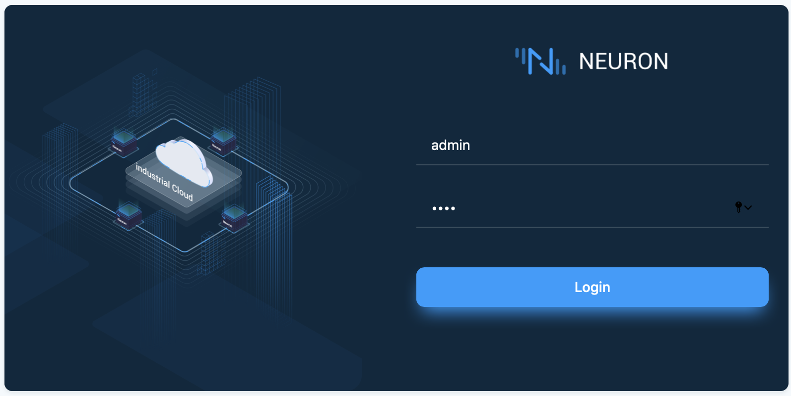
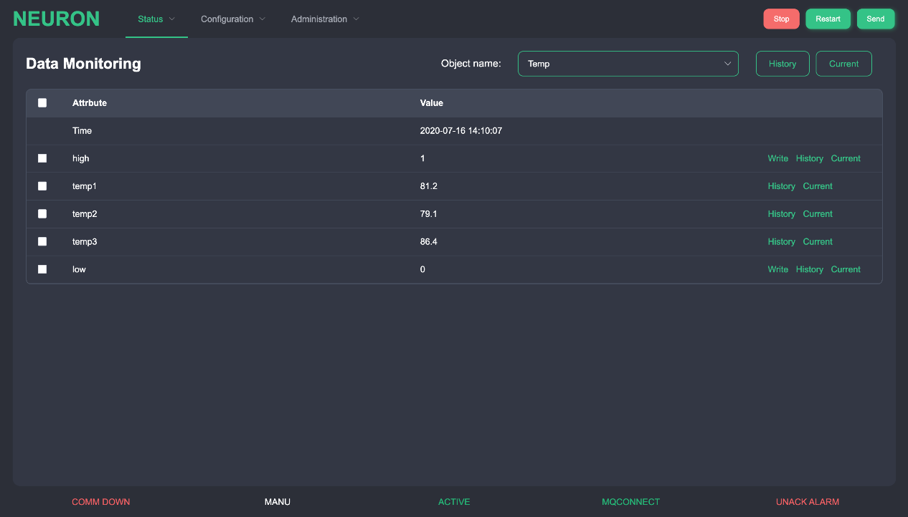

# Web Interface

This section describes to setup Neuron in Web interface. To start the web interface, open a web browser (i.e, Microsoft Edge, Chrome, or Firefox). Enter the address of gateway and port no. will be 7000 for Neuron.

### Login

The first screen shown in the browser will be the login page as following. The superuser account is &quot;admin&quot; and the default password is &quot;0000&quot;. After first login, you should change your superuser password for security.

