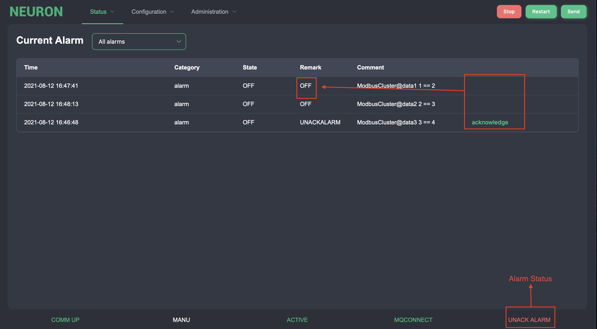

# Event/Alarm Message {#endpoint-alarm-message}

This Event/Alarm message is used to view the current active alarm points. The alarms are sorted the nature of the alarm. This is to easier determine how important an alarm is. The numbers of alarms are application dependent.

### Event/Alarm Current Status {#endpoint-current-status}

This function is used to view the current active alarm points. The alarms are sorted in up to 6 different categories depending of the nature of the alarm. This is to easier determine how important an alarm is.

There are six different show modes in dropdown box. ACTIVE ENABLED shows all enabled alarms that are currently on or unacknowledged. ACTIVE UNACK shows all alarms that are unacknowledged. ACTIVE ALL shows all alarms (including disabled alarms) that are currently on or unacknowledged. ALL ALARMS show all alarms in the system, whether they are on or off. ALL ENABLED shows all alarms in the system that are not disabled, whether they are on or off. ALL DISABLED show all alarms in the system that are disabled, whether they are on or off.

All show modes display the status in real time. In addition, all functions can be performed in all different show modes.

When an alarm occurs, a summary alarm indication lamp is activated. The summary alarm is acknowledged by pressing the acknowledge one by one.

| Column   | Description                                |
| -------- | ------------------------------------------ |
| Time     | Time when alarm starts                     |
| Category | Alarm category.                            |
| Status   | status (ON or OFF)                         |
| Remark   | Alarm condition (Unack, Disabled or blank) |
| Comment  | Alarm text including dynamic values        |

### Event/Alarm Historical Log {#endpoint-historical-log}

This function is used to view the alarm historical log. Every time an alarm is going on or off or ack, the event is logged to an alarm log file.

This report contains date and time, category, status on or off and the alarm text, including dynamic values. The dynamic values will be 0 for alarm events with off status. The report displays the alarm events in time order.

