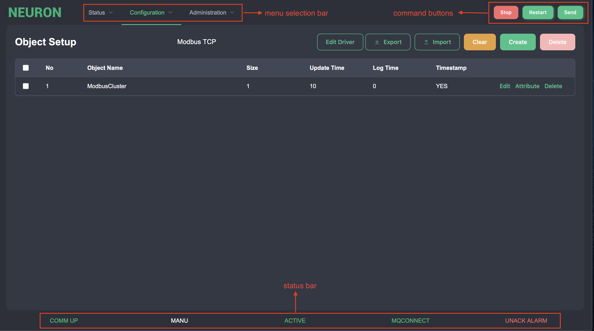
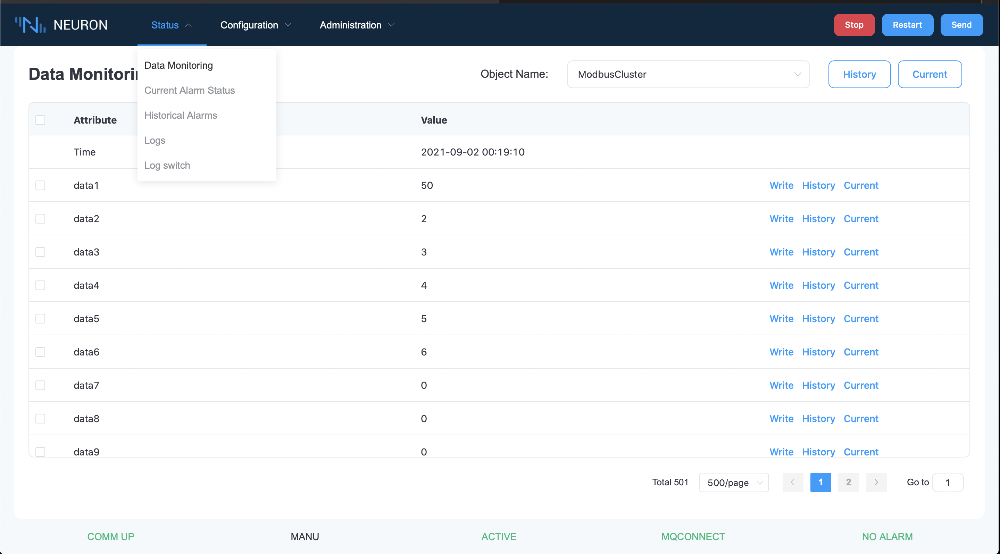
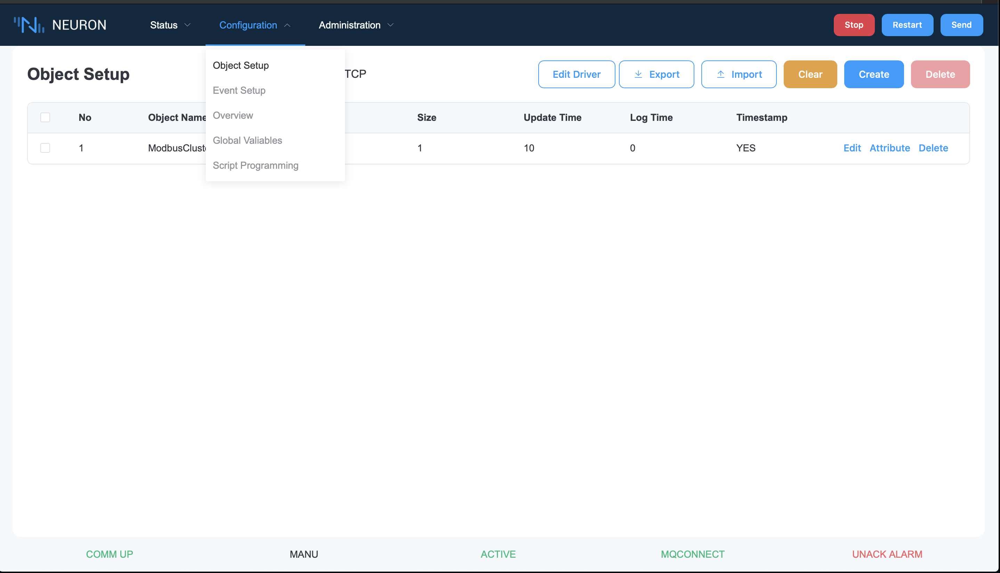
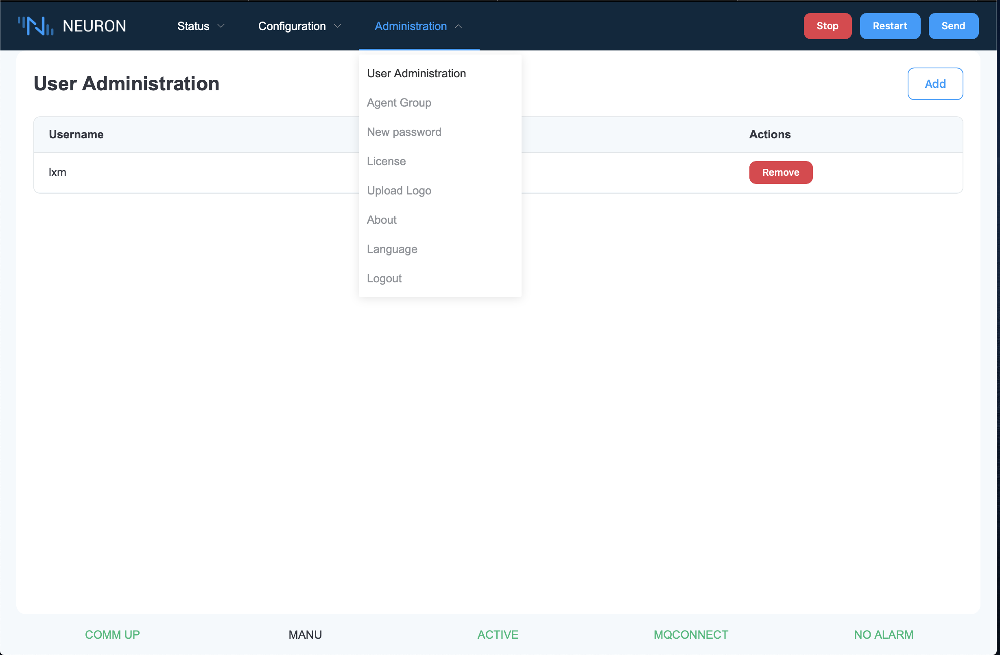

# Screen Layout 
This is the first screen will be displayed when you get in the Neuron. In the upper part, there is a menu selection bar that contains 3 kind of features. First is Status menu which contains the data, event, alarm monitoring features. Second menu is configuration which is used to setup the PLC or device communication details. Last is administration menu. At the top right hand corner, there are three command button which are used to control the Neuron system. The lower part is the status bar that show the current status of Neuron.

### Selection Menu

**Status Menu**

**Configuration Menu**

**Administration Menu**

### Command Button 
There are 3 command buttons at the top right corner to control the Neuron.

<table>
  <tr>
    <td>Stop/Start</td>
    <td>This is start/stop button that can temporarily pause the Neuron. When Neuron is paused. The system status will turn into standby mode and no telemetry data will be sent out.</td>
  </tr>
  <tr>
    <td>Restart</td>
    <td>This button is used to restart the Neuron system.</td>
  </tr>
  <tr>
    <td>Send</td>
    <td>This button is for sending the configuration data to Neuron system after finished the setup configuration data</td>
  </tr>
</table>

### Status Bar 
There are five kinds of system status in Neuron.

| Status                                | Description                                                                                                                          |
| ------------------------------------- | ------------------------------------------------------------------------------------------------------------------------------------ |
| COMM UP COMM DOWN                  | device communication up  device communication down                                                                                |
| MANU AUTO SERV                  | machine in manual mode machine in auto mode machine in service mode                                                            |
| ACTIVE INACTIVE STANDBY SEMI | Neuron system in active mode Neuron system in inactive mode Neuron system in standby mode Neuron system in semi-active mode |
| MQCONNECT MQDISCONNECT             | MQ broker connected MQ broker disconnected                                                                                        |
| NO ALARM ALARM UNACK ALARM      | No alarm found Alarms Unacknowlegde alarms                                                                                     |
