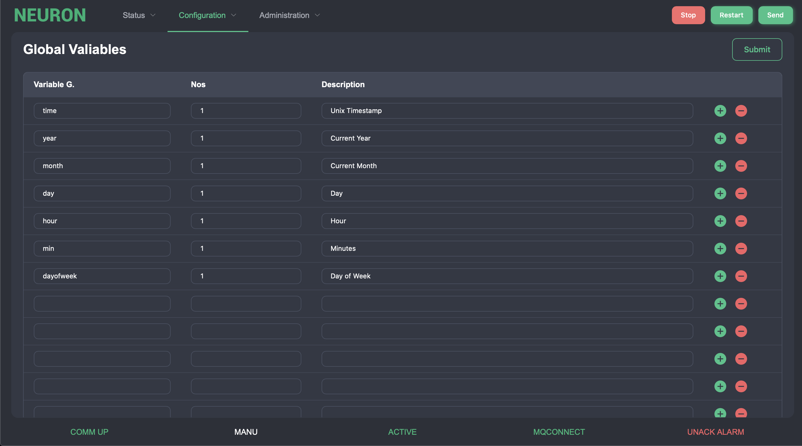
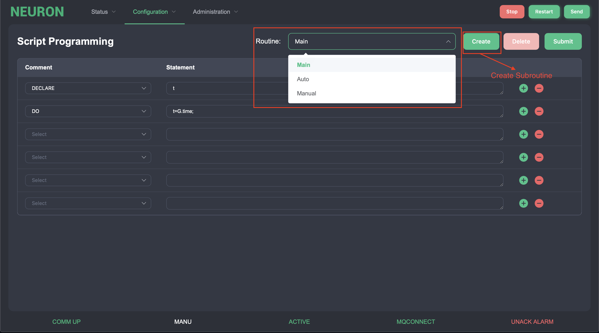

# Script Programming

Neuron has an own programming language, Neuron Script Programming. It contains a script parser that can read a high-level c-like syntax statement to deal with special control demand for the machine.

All changes in the scripts can be made while the machine is running. Of course, there could be some side effect if making an erroneous change.

Script programming is an advanced power can be made control logics, or formulas for the machine without changing the program code. It is completely isolated from underlying programming and implement the customer logic.

## Global Variables

Add the global variables in this page, press &quot;Submit&quot; when finishing.

| Column      | Description                                                                          |
| ----------- | -------------------------------------------------------------------------------------|
| Variable G. | Global variable name (without leading G.).                                           |
| Nos         | Number of words in array. If e.g. using an array variable with one word for each station where the index should be the station number, add one extra word for the index 0 (e.g. 36 stations with first station 1 should reserve 37 words for the variable).     |
| Description | Description of variable. A description (header) can be written leaving Variable G. and Nos blank..                  |

## Script Editing

There is a drop down box &quot;Routine&quot; at the top. Inside there will be 3 basic program which are Main, Auto and Manual. Subroutine could be created by pressing the &quot;Create&quot; button. It shows a dialog box and need to enter a name and subroutine no. If successfully created, this subroutine will be shown in drop down box.

All useless created subroutine in the dropdown box can be deleted by pressing the &quot;Delete&quot; button. After making the necessary scripts, press the &quot;Submit&quot; button to save the scripts to the system.

Note: When assigning a value to a variable with the address format Dummy, the script statement is programmed in the following format.

`object[ix].attribute`

| Name        | Description                                            |
| :-----------| :------------------------------------------------------|
| object      | Object name                                            |
| ix          | Object index number, this number represents the item index of the object and can be a local variable                                     |
| attribute   | Attribute name                                         |

