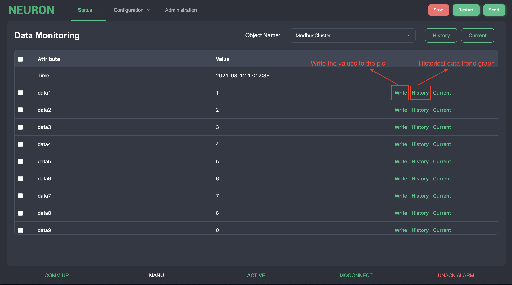
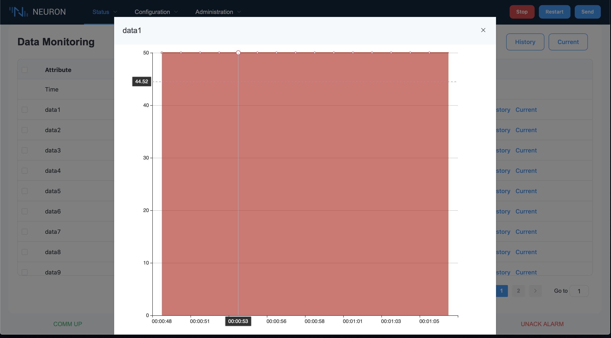
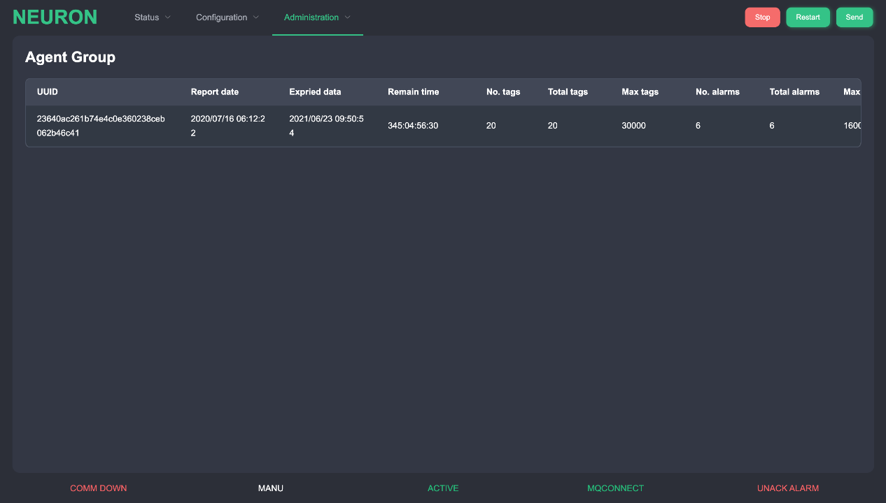

# Status Monitoring 
This function can show data monitoring and alarm status.

### Real-Time Data Monitoring 
This page is used to view and change all object data variables. It will shows the real-time data and for some changeable variables. There is a &quot;Write&quot; command on the right. Press this button and enter the value.

There are also a trend diagram for each variable. By pressing the &quot;History&quot; button, it shows the historical trends for the variable. By pressing the &quot;Current&quot; button, it shows the current trends for the variable.

### Gateway List Monitoring 
This page will list out all Neuron in the same group. It contains the data usage, expired date, maximum allowed objects and attributes for the current project.

