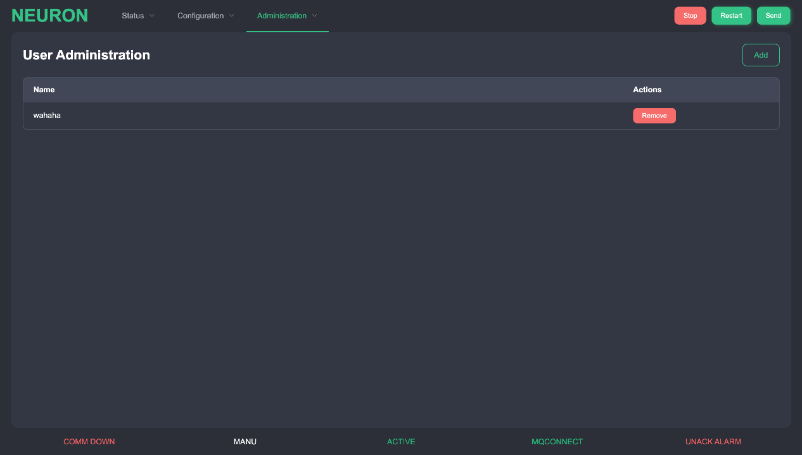
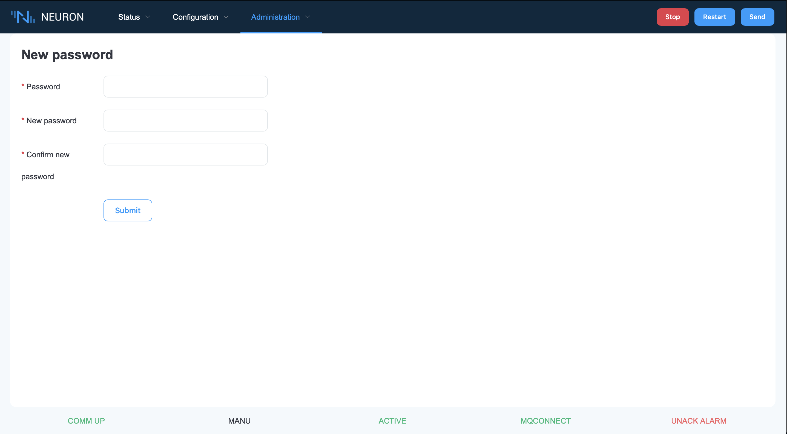

# User Administration 
Multiusers are allowed for Neuron. Each user has its own password and has its own access level, which is a collection of access right the user can perform in the Neuron that the system administrator can assigned to the Neuron. The access levels do not necessarily have to be in order. A user can at any time reduce its access level to a lower access level, and later raise it again. Each function in the Neuron has a set of valid access levels.

When creating a user, the system administrator selects a username, and assign a password. The user can later change his password. In addition, a time-out time in minutes can be set. The purpose of this time-out time is if the user, after logging in, does not touch the keyboard, the access level will be set to 0 (VIEW). Then, to be able to get a higher access level, the operator has to raise its access level, using his password. At any time, if the user does not have the access level set to the level required for the current function but has permission to change to the required access level, the Neuron will ask for the password. Then after entering the correct password, the user will get temporary access to this function. After exiting this function, to do the same again, the user has to raise the access level or enter the password again. If a time-out occurs, also this temporary access will no longer be valid.

There is one predefined user, (admin), which is the same as the Neuron administrator. The super user has its password set to a default at delivery, which for security reason, should be changed after installation. Normally, no one should be logged in as super user to run the Neuron, this should only be done when doing administration tasks.

### User Setup 
This page is used to manage the user. Press the &quot;Add&quot; button to add a user. To delete user, press the &quot;Delete&quot; to remove the current row.

When pressing the &quot;Add&quot; button, a Add New User dialog box will be shown. Enter the name and password. Pick the access level for this user

### New Password 
This function provides a possibility to change the password for the user currently logged in.

