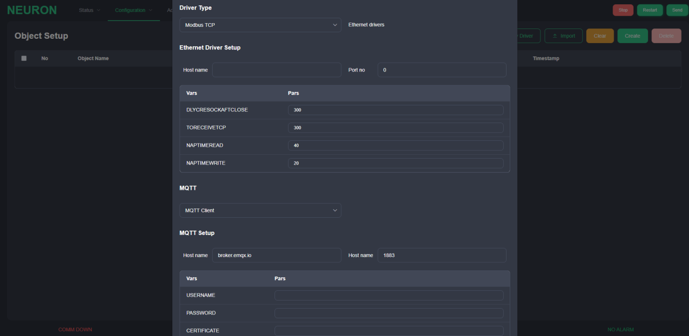
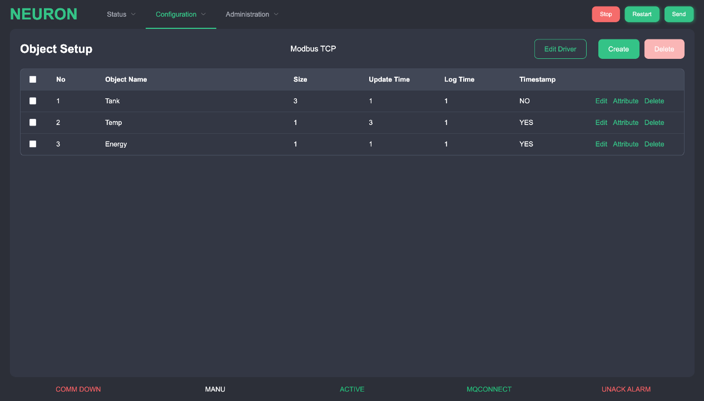
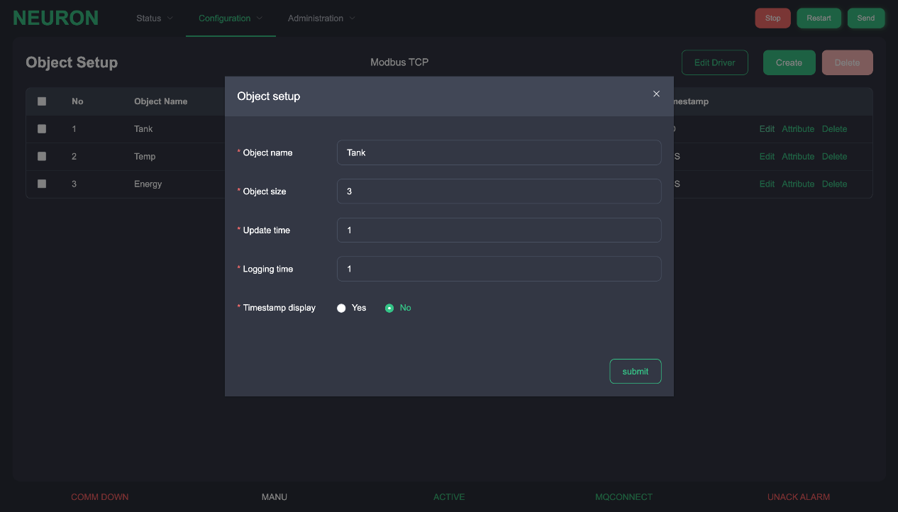
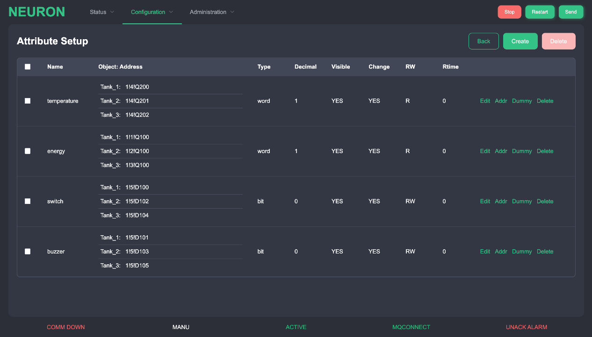
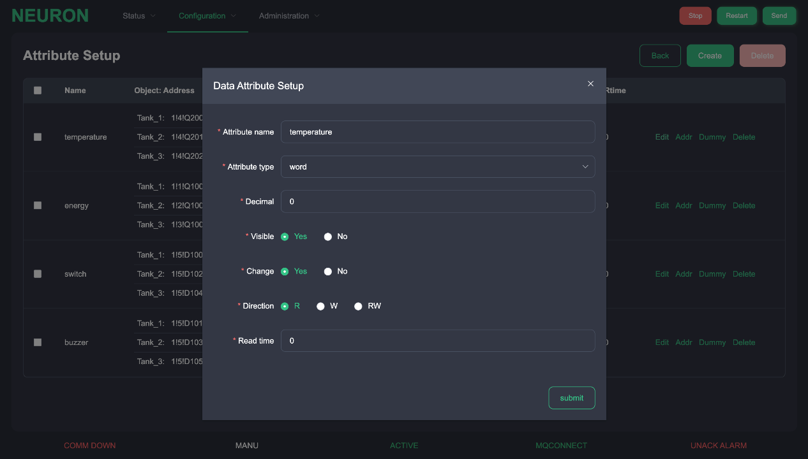
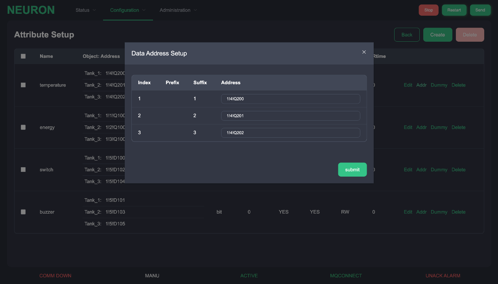
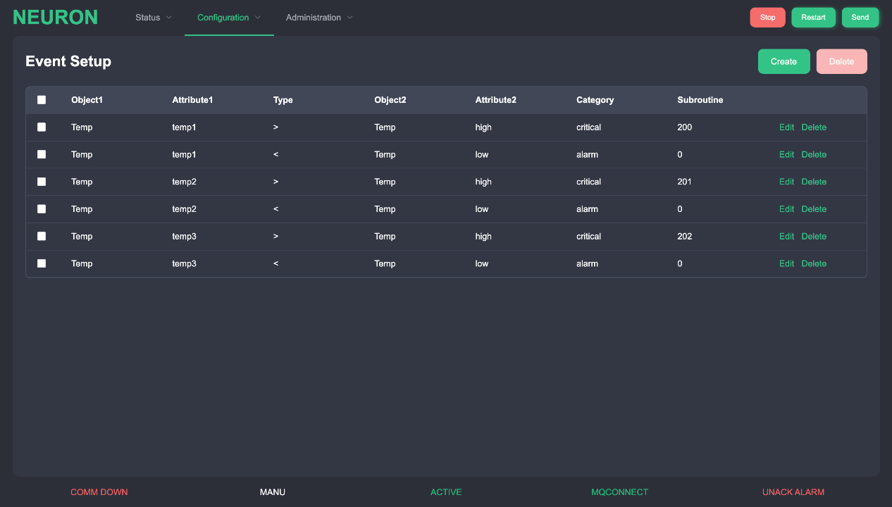

# 配置设置 {#endpoint-configuration-setup}

这些功能用于设置通道、对象、属性和标签地址方面的协议通信细节，以便与机器进行数据交换。事件和报警也在配置中定义为高级功能。

## 通道/对象/属性/标签设置 {#endpoint-tag-setup}

按 "新建驱动" 按钮，有两种通道，硬件通信通道和云平台通信通道，如图所示。

驱动程序通信用于设置硬件设备或 PLC 通信的细节。云通讯用于设置与云平台的通讯。MQTT 是目前唯一的选择。但是，在列表框中，这两个通道都有自己特定的通信参数。

对于驱动通信，有两种类型的通信驱动。

| 类型         | 描述                                             |
| ------------ | ------------------------------------------------ |
| 以太网驱动   | IP 地址/主机名和端口号                           |
| 串行驱动程序 | 设备文件位置、波特率、数据位、停止位和奇偶校验位 |

以下是一些关于每个驱动程序的具体参数的例子

| 变量/参数             | 说明                       |
| --------------------- | -------------------------- |
| USERNAME=neuron       | 用户名                     |
| PASSWORD=**\*\*\*\*** | 密码                       |
| DLYCRESOCKAFTCLOSE=0  | 关闭后创建套接字的小延时   |
| TORECEIVETCP=300      | TCP 接收响应的超时         |
| NAPTIMEREAD=40        | 读取数据轮询的小型睡眠时间 |
| NAPTIMEWRITE=40       | 写数据轮询的小睡眠时间     |
| SRC_ABKG=8            | AB 驱动参数                |
| S7P_SCRTSAP=0x10      | 西门子 S7 驱动参数         |
| S7P_DSTTSAP=0x0020    | 西门子 S7 驱动参数         |

完成 Channel 的设置后，开始设置对象的详细信息。

要将对象添加到列表中，按右侧的 "创建" 按钮。将会出现一个对象设置对话框。

| 栏目        | 说明                                       |
| ----------- | ------------------------------------------ |
| 名称        | 对象名称 (30 个字符)                       |
| <u>尺寸</u> | 具有相同属性和特征的对象的数量             |
| 时间        | 数据传输速率的时间间隔 (单位：秒)          |
| 日志时间    | 在磁盘上记录数据的时间间隔 (单位：秒)      |
| 时间戳      | 一个标志，表示是否传输时间戳与数据 (是/否) |

完成对象设置后，按属性键进入属性设置。

按 "创建" 按钮，将显示一个属性设置的输入对话框。设置名称、属性类型和细节。可以通过 "编辑" 按钮进行修改。修改后，按 "提交" 键保存修改内容。

提示进入地址设置对话框后，设置或更改属性的地址。地址的数量取决于对象的数量。

| 栏目     | 说明                                                                                                                                                                                                                   |
| -------- | ---------------------------------------------------------------------------------------------------------------------------------------------------------------------------------------------------------------------- |
| 名称     | 属性名称                                                                                                                                                                                                               |
| 类型     | 属性的数据类型。包括： word - 2 个字节的整数 uword - 2 个字节的无符号整数 dword - 4 个字节的整数 udword - 4 个字节的无符号整数 bit - 布尔型（Y/N） datetime - Unix 时间戳值 float - IEEE 浮动值 double - IEEE 双浮动值 |
| 小数点   | 这是数据类型的小数点，只适用于 word、uword、dword、udword。其他数据类型将显示 '-'                                                                                                                                      |
| 传输标志 | 表示整个对象数据将被传输到平台 (Y/N)                                                                                                                                                                                   |
| 改变     | 这是一个可改变的标志，表示该属性在操作过程中是否可以改变 (Y/N)                                                                                                                                                         |
| RW       | PLC 的读/写方向，这代表了 PLC 的读或写方向，或同时读/写的方向                                                                                                                                                          |
| Rtime    | 这是 PLC 在读取 RW 时的读取轮询时间间隔，也是 RW 的读取时间间隔                                                                                                                                                        |

点击 "地址" 按钮后，会提示一个对话框。在此对话框中设置硬件地址。请参考地址设置文档，了解各驱动程序的地址字符串详情。如果没有指定地址或者是虚地址，请用 "-" 来表示，在该字段中会显示 '-'。

## 报警/事件信息设置 {#endpoint-message-setup}

一些对象属性值可以设置为通过检查其状态或将其自身的值与其他预设值进行比较来触发报警或事件。

| 栏目   | 描述                                                                        |
| ------ | --------------------------------------------------------------------------- |
| 对象 1 | 消息的第一个对象                                                            |
| 属性 1 | 消息的第一个属性                                                            |
| 类型   | 消息的操作类型，表示报警的位操作、值操作或文本操作                          |
| 对象 2 | 消息的第二个属性                                                            |
| 属性 2 | 如果该字段有 Tag 类型，则存储该标签在运行模式下发生变化时被调用的子程序编号 |
| Cat    | 该栏用于区分每个报警的重要程度，如报警、警告、事件、日志、命令等            |
| Sub    | 如果该字段有 Tag 类型，则存储该标签在运行模式下发生变化时被调用的子程序编号 |

## 配置概述 {#endpoint-configuration-overview}

配置概览页面仅用于整体配置检查。

## 保存新配置 {#endpoint-new-configuration}

完成配置设置后，按 "发送" 按钮，传输配置设置，Neuron 系统会进行检查，如果通过检查，会重新启动系统，启动新的配置。如果通过检查，则重新启动系统，启动新的配置。系统重启后，Web 界面将被强制注销。
