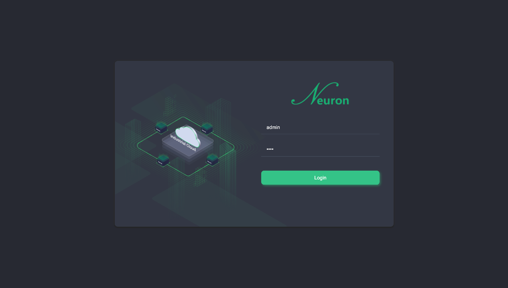
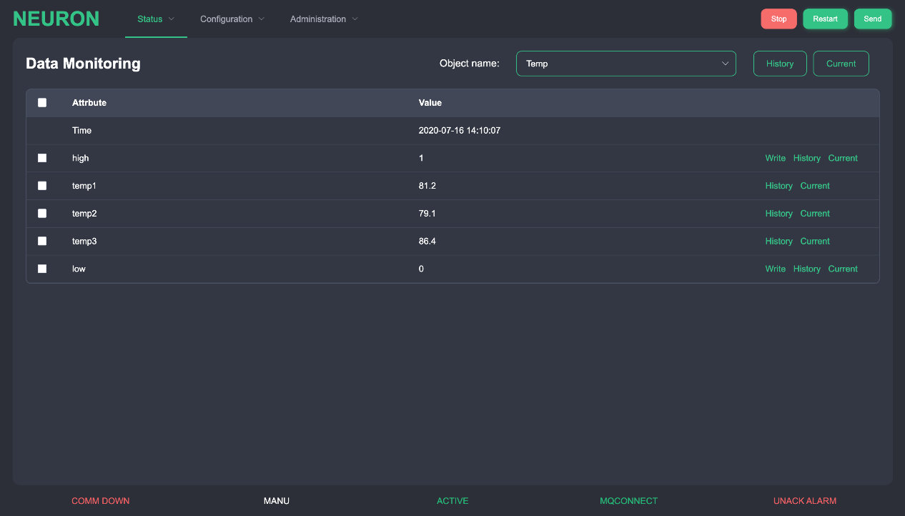

# 网页使用介绍

本章节说明如何在 Web 界面中设定 Neuron。要启动 Web 界面，请打开 Web 浏览器（即 Microsoft Edge，Chrome 或 Firefox）。输入网关地址和端口号 Neuron 的端口号将会是 7000。 例如：

## 登录

浏览器中显示的第一个画面就是登录页面，如下图。超级用户账号为 "admin"，默认密码为 "0000"。第一次登录后，为了安全起见，应该修改超级用户的密码。

