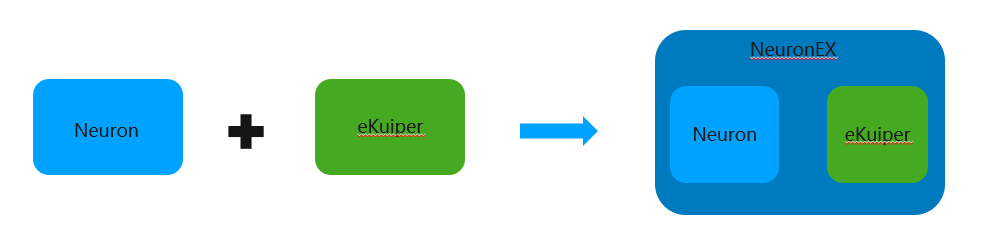

# 产品概览

## 什么是 Neuron？

Neuron 是一款现代的工业物联网连接服务器，可以连接多种使用标准协议或者设备专有协议的工业设备，实现了工业物联网平台与各种设备的互联互通。

Neuron 是一款轻量级的工业软件，运行在各种有限资源的物联网边缘硬件设备上。旨在解决以数据为中心的自动化设备数据难以统一访问的问题，为智能制造提供基础支撑。

## 什么是 NeuronEX?

NeuronEX 是 Neuron 集成数据流处理引擎 eKuiper 的版本。在 NeuronEX 界面可以便捷地进行创建数据流等流处理操作。

NeuronEX 是另一个发布版本，通过集成 eKuiper 基于规则的数据流处理引擎，实现在边缘端进行数据流处理。LF Edge eKuiper 是一个运行在资源受限边缘设备上的轻量级物联网数据分析和流处理引擎。 前往 [LF Edge ekuiper](ekuiper.org) 了解更多详情。

NeuronEX 被设计为一个完整的边缘服务器，可以同时进行数据采集和数据流处理，作为一个完整的边缘计算。

NeuronEX 替代 Neuron 与 eKuiper 分开部署的优势：

* 在 Neuron 和 eKuiper 之间建立直接的数据通道，而不是使用代理作为中间件间接传输数据；
* 单个 Web UI 界面可以让用户在不切换用户界面的情况下轻松地操作 Neuron 和 eKuiper；
* 一个安装包就包含了 Neuron 和 eKuiper 的安装和配置；
* 一个 NeuronEX 镜像包含了 Neuron 和 eKuiper 的镜像，实现一次镜像拉取。

## 边缘原生

Neuron 是一个实时异步处理的服务器，充分利用边缘的低延迟网络方法实现 100 毫秒响应时间。

## 多设备连接

Neuron 提供多种插件模块，例如 Modbus，OPC UA，Ethernet/IP，IEC104，BACnet，Siemens，Mitsubishi 等。这些插件某块被广泛应用于楼宇自动化、数控机床、机器人、电力以及各种 PLC 通信中。

## 大规模并发

Neuron 可以同时与不同的工业设备建立无限的连接。得益于解耦的模块化架构设计，可以单独运行每个连接。并发连接的数量取决于分配的资源。

## 便携式部署

Neuron 具有非常低的内存占用，启动时占用不到 7M，适合在低配置架构设备上运行，如 X86、ARM 和 RISC-V 等。Neuron 还支持类似 Docker 的容器化部署，在 K8s 环境中与其他共存容器一起运行。

## 更好的集成

Neuron 与工业物联网应用、大数据和 AI/ML 分析软件的无缝集成，使得 Neuron 可以通过 API 和 MQTT 连接私有云、EMQX Cloud、AWS、Microsoft Azure 或本地服务器。

## 统一的数据化操作

Neuron 帮助传统工业设备以异步方式传递数据消息，作为 SparkplugB 标准中指定的边缘节点。SparkPlugB 是一种开放、统一、互操作的工业数据交换标准，通过 MQTT 代理在工业信息系统（如 ERP、MES、SCADA 和历史记录）之间进行数据交换。

## 身份验证和安全性

Neuron 支持 API 服务的 TLS 和 HTTPS 加密，以确保数据在传输中的安全性，并使用 JWT 身份验证机制来验证数据所有者。

## 数据流处理引擎（仅限 NeuronEX）

NeuronEX 集成基于规则的处理引擎 eKuiper，可以通过边缘端的流式 SQL 语句实现 AI/ML 分析、数据过滤、数据操作、设备控制和时间序列数据库中的数据持久化。