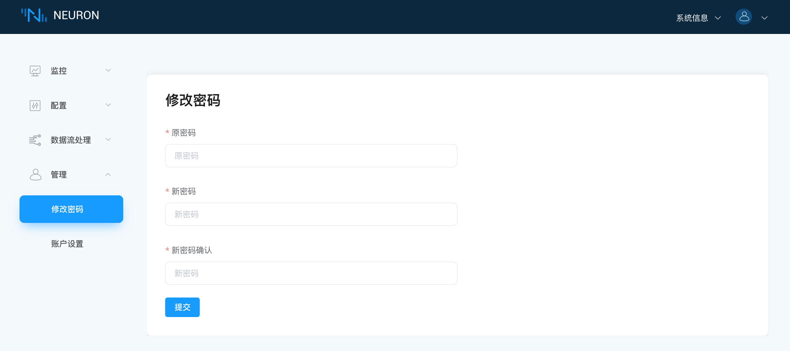
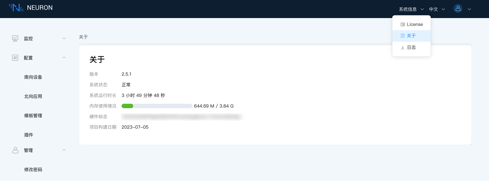

# 运维指南

本章主要介绍 Neuron 运维相关的一些操作，包括登录、修改密码、日志管理，查看许可证和系统信息等。

## 登录

打开 Web 浏览器，输入运行 Neuron 的网关地址和端口号，即可进入到管理控制台页面，默认端口号为 7000。

```bash
http://x.x.x.x:7000 
```

其中，x.x.x.x 代表安装 Neuron 的网关地址。

页面打开后，进入登录界面，用户可使用初始用户名与密码登录

- 初始用户名：admin
- 初始密码：0000

如果页面无法打开，请在终端执行以下指令进行检测：

* 使用 ping 命令测试网络是否能通。

   ```bash
   $ ping hostname
   ```

* 使用 telnet 命令测试端口 7000 能否访问。

   ```bash
   $ telnet hostname 7000
   ```

* 执行如下指令查看 neuron 的进程状态。
   ```bash
   $ systemctl status neuron
   ```

## 修改密码

进入**管理 -> 修改密码**页面，可修改登录密码，如下图所示。



## 重置密码

若用户忘记密码，可通过执行指令重置密码（默认0000）。

```shell
./neuron --reset-password
```

## 查看系统使用

登录 Neuron 后，点击页面顶部工具栏的 **系统信息** -> **关于**，可以查看系统版本、状态、运行时常、内容使用、硬件标志以及项目构建日期等信息，如下图所示。



## 数据统计

Neuron 支持基于 Prometheus 的数据模型的南北向节点数据统计功能，用于监测节点运行状态。有关具体的统计指标，请阅读[数据统计](./data-statistics.md)。

## 管理日志

用户可在 Neuron Web 页面一键下载 Neuron 相关日志，关于日志文件的文件夹层级、日志配置文件，请阅读 [管理日志](./log-management.md)。