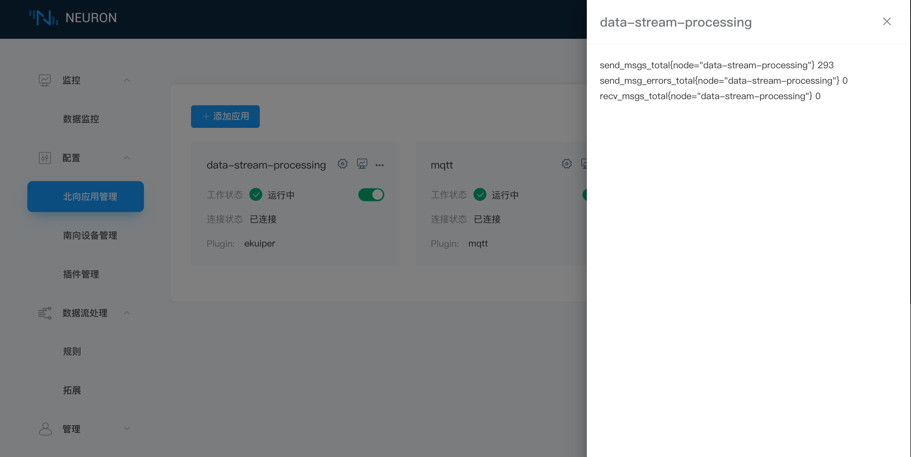
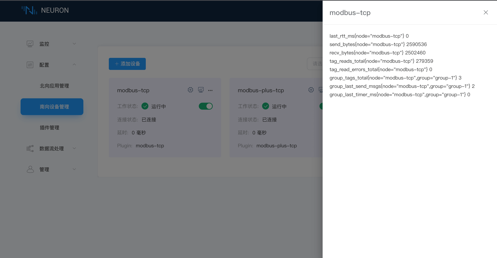

# 数据统计

Neuron 支持基于 Prometheus 的数据模型的南北向节点数据统计功能，用于监测节点运行状态。Prometheus 的基本原理是通过 HTTP 协议周期性抓取被监控组件的状态，任意组件只要提供对应的 HTTP 接口就可以接入监控，Neuron 提供对应的接口，可以顺利接入 Prometheus 进行监控。

每个节点卡片都有一个 `数据统计` 的操作按键，用于显示该节点统计的信息。目前，Neuron 已实现一些全局字段和南北向字段的统计，后续会根据需求持续增加统计字段。

## 全局字段统计

部分全局字段说明如下。

| 参数             | 说明                                     |
| --------------- | --------------------------------------- |
| uptime_seconds  | 显示 Neuron 运行时长，页面上以 5 s 的频率刷新 |
| core_dumped     | 显示系统运行状态是否有异常                   |

## 北向节点统计

北向应用节点已支持一些字段的统计，但每个应用需要统计的字段会有些差异，后面版本有计划不断更新每个应用的统计字段，部分字段说明如下。

| 参数                     | 说明               |
| ----------------------- | ----------------- |
| send_msgs_total         | 发送消息总条数       |
| send_msg_errors_total   | 消息发送失败的总条数  |
| recv_msgs_total         | 接收消息的总条数     |
| link_state              | 节点连接状态： · DISCONNECTED = 0 · CONNECTED = 1 |
| running_state           | 节点状态 ： · INIT = 1 · READY = 2 · RUNNING = 3 · STOPPED = 4 |

## 南向节点统计

南向驱动节点已支持一些字段的统计，但每个驱动需要统计的字段会有些差异，后面版本有计划不断更新每个驱动的统计字段。部分字段说明如下。

| 参数                    | 说明                                    |
| ---------------------- | --------------------------------------- |
| last_rtt_ms            | 收发一次指令的时间间隔，以毫秒为单位          |
| send_bytes             | 发送指令的总字节数                         |
| recv_bytes             | 接收指令的总字节数                         |
| tag_reads_total        | 读取点位的总指令数，包括读失败               |
| tag_read_errors_total  | 读取点位失败的总指令数                      |
| group_tags_total       | 组的总点位数                               |
| group_last_send_msgs   | 调用一次 group timer 发送的消息数           |
| group_last_timer_ms    | 调用一次 group timer 的时间，以毫秒为单位     |
| link_state              | 节点连接状态  DISCONNECTED = 0 CONNECTED = 1     |
| running_state           | 节点状态  INIT = 1 READY = 2 RUNNING = 3 STOPPED = 4        |
