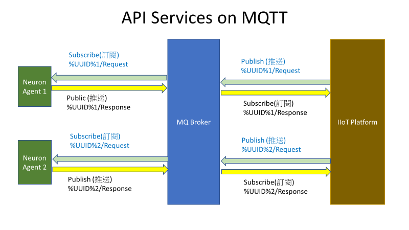

# API 功能服务

Neuron将为IIoT平台提供一系列的API服务，以查询基本信息，控制网关行为或设置轮询配置。IIoT平台必须通过发送请求消息的方式发给Neuron。通过返回，Neuron将返回所需的信息或执行相应的动作。如果有错，就会返回一个错误代码来说明失败的原因。

**_Neuron平台的MQTT主题_**

订阅（Subscribe）: Neuron/Request/%UUID%

发布（Publish）: Neuro/Response/%UUID%

**_IIoT平台的MQTT主题_**

订阅（Subscribe）: Neuron/Response/%UUID%

发布（Publish）: Neuron/Request/%UUID%




## Function 10 登录

**_HTTP API Header_**

(GET)

Resource Path: /api/v1/funcno10

Content-Type: application/json

**_HTTP API 或者 Websockets 或者 MQTT 通信_**

请求body的句式

```json
{
  "func": 10,
  "wtrm": "DEMO-Neuron-1001_1532421778824_1",
  "name": "admin",
  "pass": "0000"
}
```

响应body的句式

```json
{
  "func": 10,
  "wtrm": "DEMO-Neuron-1001_1532421778824_1",
  "errc": 0,
  "tout": 15,
  "defl": -1,
  "nalw": 3,
  "alwl": [
    {
      "atxt": "VIEW",
      "anum": 0
    },
    {
      "atxt": "MANAGER",
      "anum": 1
    },
    {
      "atxt": "ALL",
      "anum": -1
    }
  ]
}
```

| 请求       | 字段说明                  |
| :-------- | :----------------------- |
| **func** | 功能代码 10                 |
| **wtrm** | 复制到响应信息的水印信息          |
| **name** | 用户名                      |
| **pass** | 用户密码                    |

| 响应      |  字段说明                   |
| :-------- | :------------------------ |
| **func** | 功能代码 10                 |
| **wtrm** | 从请求信息中复制的水印        |
| **errc** | 编译器错误代码               |
| **tout** | 超时时间(分钟)               |
| **defl** | 默认登录级别                 |
| **nalw** | 允许的级别数                 |
| **alwl** | 允许的等级                   |
| **atxt** | 允许的文本 </br>ALL(-1) </br>VIEW(0) </br>OPERATOR(1) </br>FOREMAN(2) </br>MAINTENANCE(3) </br>SUPERVISOR(4) </br>ENGINEER(5) </br>DESIGNER(6) </br>MANAGER(7)                                 |
| **anum** | 允许序号 </br>-1 </br> 0</br> 1</br> 2</br> 3</br> 4</br> 5</br> 6</br> 7 |

| 功能                     | 允许的等级                |
| :---------------------- | :---------------------- |
| 退出                     | 4,5,7                   |
| 重启/重新启动/关机         | 2,3,4,5,6,7             |
| 登录/注销                 | 0,1,2,3,4,5,6,7         |
| 新密码                    | 0,1,2,3,4,5,6,7        |
| 用户管理                  | 4,5,7                   |
| 浏览系统ID                | 4,5,7                   |
| 状态控制                  | 2,3,4,5,7               |
| 向对象写入值               | 4,5,7                   |
| 读取实例列表               | 4,5,7                   |
| 设置配置                   | 4,5,7                  |
| 读取配置                   | 4,5,7                  |
| 读取全局变量                | 4,5,7                  |
| 列出所有子程序              | 4,5,7                   |
| 读取一个子程序              | 4,5,7                   |
| 创建一个子程序              | 4,5,7                   |
| 删除一个子程序              | 4,5,7                   |
| 编译一个子程序              | 4,5,7                   |
| 在子程序中搜索字符串         | 4,5,7                   |
| 检查报警状态                | 1,2,3,4,5,7             |
| 报警确认                   | 2,3,4,5,7               |
| 改变报警模式                | 2,3,4,5,7               |
| 报警日志报告                | 4,5,7                   |
| 读取趋势数据                | 2,3,4,5,7               |
| 读取对象屏幕                | 2,3,4,5,7               |
| 读取许可证信息              | 4,5,7                   |

## Function 11 注销

**_HTTP API Header_**

(GET)

Resource Path: /api/v1/funcno11

Content-Type: application/json

Authorization: Bearer \<token\>

**_HTTP API 或者 Websockets 或者 MQTT 通信_**

请求body的句式

```json
{
  "func": 11,
  "wtrm": "DEMO-Neuron-1001_1532419775357_240",
  "name": "admin"
}
```

响应body的句式

```json
{
  "func": 11,
  "wtrm": "DEMO-Neuron-1001_1532419775357_240",
  "errc": 0
}
```

| 请求       |      字段说明                              |
| :-------- | :---------------------------------------- |
| **func** | 功能代码 11                                 |
| **wtrm** | 复制到响应信息的水印信息                          |
| **name** | 用户名                                      |

| 响应      | 字段说明                                     |
| :-------- | :----------------------------------------- |
| **func** | 功能代码 11                                  |
| **wtrm** | 从请求信息中复制的水印                         |
| **errc** | 编译器错误代码                                |

## Function 12 新密码

**_HTTP API Header_**

(POST)

Resource Path: /api/v1/funcno12

Content-Type: application/json

Authorization: Bearer \<token\>

| **HTTP状态代码** | **说明**        |
| :-------------- | :------------- |
| 200             | 操作成功        |
| 400             | 无效操作        |

**_HTTP API 或者 Websockets 或者 MQTT 通信_**

请求body的句式

```json
{
  "func": 12,
  "wtrm": "DEMO-Neuron-1001_1532419775357_240",
  "name": "admin",
  "pass": "0000",
  "npwd": "1234"
}
```

响应body的句式

```json
{
  "func": 12,
  "wtrm": "DEMO-Neuron-1001_1532419775357_240",
  "errc": 0
}
```

| 请求      | 字段说明                          |
| :------- | :------------------------------- |
| **func** | 功能代码 12                       |
| **wtrm** | 复制到响应信息的水印信息                |
| **name** | 用户名                            |
| **pass** | 用户密码                          |
| **npwd** | 新密码                            |

| 响应      | 字段说明                          |
| :------- | :------------------------------- |
| **func** | 功能代码 12                       |
| **wtrm** | 从请求信息中复制的水印              |
| **errc** | 编译器错误代码                     |

## Function 13 读用户列表

**_HTTP API Header_**

(PUT)

Resource Path: /api/v1/funcno13

Content-Type: application/json

Authorization: Bearer \<token\>

| **HTTP状态代码** | **说明**        |
| :-------------- | :------------- |
| 200             | 操作成功        |
| 400             | 无效操作        |

**_HTTP API 或者 Websockets 或者 MQTT 通信_**

请求body的句式

```json
{
  "func": 13,
  "wtrm": "DEMO-Neuron-1001_1532419775357_240"
}
```

请求body的句式

```json
{
  "func": 13,
  "wtrm": "DEMO-Neuron-1001_1532419775357_240",
  "errc": 0,
  "nusr": 3,
  "user": [
    "joey",
    "peter",
    "ruby"
  ]
}
```

| 请求      | 字段说明                   |
| :------- | :------------------------- |
| **func** | 功能代码 13                |
| **wtrm** | 复制到响应信息的水印信息         |

| 响应      | 字段说明                   |
| :------- | :------------------------ |
| **func** | 功能代码 13                |
| **wtrm** | 从请求信息中复制的水印       |
| **errc** | 编译器错误代码              |
| **nusr** | 用户数                     |
| **user** | 用户名称列表                |

## Function 14 读用户信息

**_HTTP API header_**

(PUT)

Resource Path: /api/v1/funcno14

Content-Type: application/json

Authorization: Bearer \<token\>

| **HTTP状态代码** | **说明**        |
| :-------------- | :------------- |
| 200             | 操作成功        |
| 400             | 无效操作        |

**_HTTP API 或者 Websockets 或者 MQTT 通信_**

请求body的句式

```json
{
  "func": 14,
  "wtrm": "DEMO-Neuron-1001_1532421778824_1",
  "name": "joey"
}
```

响应body的句式

```json
{
  "func": 14,
  "wtrm": "DEMO-Neuron-1001_1532421778824_1",
  "errc": 0,
  "usrn": "joey",
  "tout": 15,
  "defl": -1,
  "nalw": 3,
  "alwl": [
    {
      "atxt": "VIEW",
      "anum": 0
    },
    {
      "atxt": "MANAGER",
      "anum": 1
    },
    {
      "atxt": "ALL",
      "anum": -1
    }
  ]
}
```

| 请求      | 字段说明                      |
| :------- | :--------------------------- |
| **func** | 功能代码 14                   |
| **wtrm** | 复制到响应信息的水印信息            |
| **name** | 用户名                        |

| 响应      | 字段说明                      |
| -------- | ---------------------------- |
| **func** | 功能代码 14                   |
| **wtrm** | 从请求信息中复制的水印           |
| **errc** | 编译器错误代码                 |
| **usrn** | 用户名                        |
| **tout** | 超时时间（分钟）                |
| **defl** | 默认登录级别                    |
| **nalw** | 允许的级别数                    |
| **alwl** | 允许的等级                      |
| **atxt** | 允许的文本 </br>ALL(-1)</br>VIEW(0)</br>OPERATOR(1)</br>FOREMAN(2)</br>MAINTENANCE(3)</br>SUPERVISOR(4)</br>ENGINEER(5)</br>DESIGNER(6)</br>MANAGER(7)               |
| **anum** | 允许序号 </br>-1</br> 0</br> 1</br> 2</br> 3</br> 4</br> 5</br> 6</br> 7                                                 |

## Function 15 保存用户信息

**_HTTP API Header_**

(POST)

Resource Path: /api/v1/funcno15

Content-Type: application/json

Authorization: Bearer \<token\>

| **HTTP状态代码** | **说明**        |
| :-------------- | :------------- |
| 200             | 操作成功        |
| 400             | 无效操作        |

**_HTTP API 或者 Websockets 或者 MQTT 通信_**

请求body的句式

```json
{
  "func": 15,
  "wtrm": "DEMO-Neuron-1001_1532419775357_240",
  "cusr": 1,
  "name": "joey",
  "pass": "0000",
  "tout": 15,
  "defl": 7,
  "nalw": 3,
  "alwl": [
    0,
    6,
    7
  ]
}
```

响应body的句式

```json
{
  "func": 15,
  "wtrm": "DEMO-Neuron-1001_1532419775357_240",
  "errc": 0
}
```

| 请求      | 字段说明                              |
| :-------- | :---------------------------------- |
| **func** | 功能代码 15                            |
| **wtrm** | 复制到响应信息的水印信息                     |
| **cusr** | 检查用户是否已经存在，如果存在，返回错误     |
| **name** | 用户名 User name                       |
| **pass** | 新密码 New password                    |
| **tout** | 超时时间 （0-999（分钟），0表示永不超时     |
| **defl** | 默认登录级别                             |
| **nalw** | 允许等级数                               |
| **alwl** | 允许等级的序号                            |

| 响应      | 字段说明                                |
| :------- | :------------------------------------- |
| **func** | 功能代码 15                              |
| **wtrm** | 从请求信息中复制的水印                     |
| **errc** | 编译器错误代码                            |

## Function 16 移除用户

**_HTTP API Header_**

(DELETE)

Resource Path: /api/v1/funcno16

Content-Type: application/json

Authorization: Bearer \<token\>

| **HTTP状态代码** | **说明**        |
| :-------------- | :------------- |
| 200             | 操作成功        |
| 400             | 无效操作        |

**_HTTP API 或者 Websockets 或者 MQTT 通信_**

请求body的句式

```json
{
  "func": 16,
  "wtrm": "DEMO-Neuron-1001_1532419775357_240",
  "name": "user"
}
```

响应body的句式

```json
{
  "func": 16,
  "wtrm": "DEMO-Neuron-1001_1532419775357_240",
  "errc": 0
}
```

| 请求      | 字段说明                       |
| :------- | :---------------------------- |
| **func** | 功能代码 16                    |
| **wtrm** | 复制到响应信息的水印信息             |
| **name** | 用户名                         |

| 响应      | 字段说明                      |
| :------- | :--------------------------- |
| **func** | 功能代码 16                   |
| **wtrm** | 从请求信息中复制的水印           |
| **errc** | 编译器错误代码                  |

## Function 21 配置

**_HTTP API Header_**

(POST)

Resource Path: /api/v1/funcno21

Content-Type: application/json

Authorization: Bearer \<token\>

| **HTTP状态代码** | **说明**        |
| :-------------- | :------------- |
| 200             | 操作成功        |
| 400             | 无效操作        |

**_HTTP API 或者 Websockets 或者 MQTT 通信_**

Request boy syntax

```json
{
  "func":21,
  "wtrm":"neuron",
  "chnl":[
    {
      "chdv":"mbstcp",
      "tcph":"192.168.50.177",
      "tcpp":502,
      "ttyc":"",
      "ttyb":0,
      "ttyd":0,
      "ttys":"",
      "ttyp":"N",
      "parm":[
        {
          "vars":"TCPSERVER",
          "pars":"0"
        },
        {
          "vars":"BYTEORDER",
          "pars":"1"
        },
        {
          "vars":"DLYCRESOCKAFTCLOSE",
          "pars":"50"
        },
        {
          "vars":"TORECEIVETCP",
          "pars":"1000"
        },
        {
          "vars":"NAPTIMEREAD",
          "pars":"10"
        },
        {
          "vars":"NAPTIMEWRITE",
          "pars":"10"
        }
      ]
    },
    {
      "chdv":"pahomq",
      "tcph":"broker.emqx.io",
      "tcpp":1883,
      "ttyc":"",
      "ttyb":0,
      "ttyd":0,
      "ttys":"",
      "ttyp":"N",
      "parm":[
        {
          "vars":"TOPICHEADER",
          "pars":"Neuron"
        },
        {
          "vars":"USERNAME",
          "pars":""
        },
        {
          "vars":"PASSWORD",
          "pars":""
        },
        {
          "vars":"CLIENTID",
          "pars":""
        },
        {
          "vars":"TOPIC",
          "pars":""
        },
        {
          "vars":"CERTIFICATE",
          "pars":""
        },
        {
          "vars":"KEYFILE",
          "pars":""
        }
      ]
    }
  ],
  "objd":[
    {
      "objn":"test",
      "obsz":1,
      "updt":10,
      "logt":1,
      "disp":1,
      "logs":1,
      "tstd":1,
      "oatt":[
        {
          "attn":"t",
          "attt":"word",
          "deci":3,
          "attr":"R",
          "rtim":10,
          "achg":1,
          "adis":1,
          "aadd":[
            {
              "obix":0,
              "pref":"",
              "suff":"",
              "addr":"1!400001"
            }
          ]
        },
        {
          "attn":"t2",
          "attt":"word",
          "deci":0,
          "attr":"R",
          "rtim":10,
          "achg":1,
          "adis":1,
          "aadd":[
          {
            "obix":0,
            "pref":"",
            "suff":"",
            "addr":"1!400005"
          }
        ]
      }
    ]
  },
  {
    "objn":"my",
    "obsz":1,
    "updt":10,
    "logt":1,
    "disp":1,
    "logs":1,
    "tstd":1,
    "oatt":[
      {
        "attn":"m",
        "attt":"word",
        "deci":0,
        "attr":"R",
        "rtim":10,
        "achg":1,
        "adis":1,
        "aadd":[
          {
            "obix":0,
            "pref":"",
            "suff":"",
            "addr":"1!400010"
          }
        ]
      }
    ]
  }
],
"msgd":[
  {
    "subr":0,
    "sobj":"test",
    "satt":"t",
    "msgt":">",
    "cobj":"test",
    "catt":"t2",
    "acat":"alarm"
  }
]
}
```

响应body的句式

```json
{
  "func": 21,
  "wtrm": "neuron",
  "errc": 0
}
```

| 请求      | 字段说明                                                      |
| :------- | :----------------------------------------------------------- |
| **func** | 功能代码 21                                                   |
| **wtrm** | 复制到响应信息的水印信息                                            |
| **chnl** | 通道信息                                                      |
| **chdv** | 通道驱动程序名称                                               |
| **tcph** | PLC/硬件设备的主机名或IP地址                                    |
| **tcpp** | 设备端口号                                                    |
| **ttyc** | Linux设备文件名(ttyS0, ttyS1)                                 |
| **ttyb** | 波特率 </br>4800 </br>9600 </br>19200 </br>38400 </br>57600 </br>115200  |
| **ttyd** | 数据位 </br> 5</br> 6</br> 7</br> 8                           |
| **ttys** | 停止位(string) </br> 1</br> 1.5</br> 2                        |
| **ttyp** | 奇偶校验位(char)</br> E - Even</br> O - Odd</br> N - None      |
| **parm** | 参数列表详细信息                                                |
| **vars** | 变量名称                                                       |
| **pars** | 参数值                                                        |
| **objd** | 一个对象的详情                                                 |
| **objn** | 对象名称                                                      |
| **obsz** | 相同对象的数量                                                 |
| **updt** | 数据传输到云平台的时间间隔                                       |
| **logt** | 数据被记录到文件的时间                                          |
| **disp** | 是否需要显示所有对象属性 </br> 0 (不显示)</br> 1 (显示)           |
| **logs** | 是否需要记录一次连续下降的情况 </br> 0 (不需要)</br> 1 (需要)      |
| **tstd** | 是否需要显示时间戳 </br>0 (不显示)</br>1 (显示))                 |
| **oatt** | 对象属性列表详情                                               |
| **attn** | 属性名称                                                      |
| **attt** | 属性值的类型：</br> word</br> uword</br> dword</br> udword</br> float</br> double</br> bit                                                           |
| **deci** | 小数点位数                                                     |
| **attr** | 属性读/写标志 </br> R</br> W</br> R/W</br>S</br>SW             |
| **rtim** | 读的时间间隔 （只针对读属性）                                     |
| **achg** | 属性是否可以被改变 </br> 0 (不允许)</br> 1 (允许)                 |
| **adis** | 属性是否需要被传到平台 </br> 0 (不需要)</br> 1 (需要)              |
| **aadd** | 属性地址详情                                                    |
| **obix** | 从0开始的索引号                                                 |
| **pref** | 对象名称前缀                                                    |
| **suff** | 对象名称后缀                                                    |
| **addr** | 标签地址 （设备地址）</br> 注意：对于内部寄存器tagaddr和tagattr都用"-" |
| **msgd** | 报警信息详情                                                    |
| **subr** | 子程序编号 (1-999)                                              |
| **sobj** | 源对象名称                                                      |
| **satt** | 源属性名称                                                      |
| **msgt** | 信息比较类型 </br> < </br> <= </br> > </br> >= </br> == </br> != </br> & </br> \^ </br> \| |
| **cobj** | 被比较对象的名称                                                 |
| **catt** | 被比较属性名称                                                   |
| **acat** | 报警类型 </br> critical</br> alarm</br> warning</br> event</br> view |

| 响应      | 字段说明                       |
| -------- | ----------------------------- |
| **func** | 功能代码 21                    |
| **wtrm** | 从请求信息中复制的水印           |
| **errc** | 编译器错误代码                  |

## Function 22 读配置

**_HTTP API Header_**

(PUT)

Resource Path: /api/v1/funcno22

Content-Type: application/json

Authorization: Bearer \<token\>

| **HTTP状态代码** | **说明**        |
| :-------------- | :------------- |
| 200             | 操作成功        |
| 400             | 无效操作        |

**_HTTP API 或者 Websockets 或者 MQTT 通信_**

请求body的句式

```json
{
  "func": 22,
  "wtrm": "DEMO-Neuron-1001_1532419775357_240"
}
```

请求body的句式

```json
{
  "func": 22,
  "wtrm": "DEMO-Neuron-1001_1532419775357_240",
  "errc": 0
//  The structure is same as Function 21 request message
//   Not repeat here
}
```

## Function 23 读驱动程序

**_HTTP API Header_**

(PUT)

Resource Path: /api/v1/funcno23

Content-Type: application/json

Authorization: Bearer \<token\>

| **HTTP状态代码** | **说明**        |
| :-------------- | :------------- |
| 200             | 操作成功        |
| 400             | 无效操作        |

**_HTTP API 或者 Websockets 或者 MQTT 通信_**

请求body的句式

```json
{
  "func": 23,
  "wtrm": "DEMO-Neuron-1001_1532421778824_1",
  "type": 1
}
```

响应body的句式

```json
{
  "func": 23,
  "wtrm": "DEMO-Neuron-1001_1532421778824_1",
  "errc": 0,
  "nrow": 3,
  "rows": [
    {
      "name": "mbsrtu",
      "desc": "Modbus RTU",
      "type": "tty",
      "attr": [
        "R",
        "W",
        "RW"
      ]
    },
    {
      "name": "mbstcp",
      "desc": "Modbus TCP",
      "type": "tcp",
      "attr": [
        "R",
        "W",
        "RW"
      ]
    },
    {
      "name": "mbsrot",
      "desc": "Modbus RTU over TCP",
      "type": "tcp",
      "attr": [
        "R",
        "W",
        "RW"
      ]
    },
    {
      "name": "opcua",
      "desc": "OPC UA",
      "type": "tcp",
      "attr": [
        "R",
        "W",
        "RW"
        "S",
        "SW"
      ]
    }
  ]
}
```

| 请求      | 字段说明                                                 |
| -------- | ------------------------------------------------------- |
| **func** | 功能代码 23                                               |
| **wtrm** | 复制到响应信息的水印信息                                        |
| **type** | 1:  驱动程序通道 </br> 2:  服务器通道                       |

| 响应      | 字段说明                                                 |
| -------- | ------------------------------------------------------- |
| **func** | 功能代码 23                                              |
| **wtrm** | 从请求信息中复制的水印                                     |
| **errc** | 编译器错误代码                                            |
| **nrow** | 行数                                                    |
| **name** | 驱动程序的缩写                                            |
| **desc** | 驱动程序的完整描述                                         |
| **type** | 驱动程序的类型 </br> tty表示串行驱动 </br> tcp表示网络驱动    |
| **attr** | 属性读/写指示器 </br> R </br> W </br> RW </br> S </br>SW   |

## Function 24 读驱动程序参数

**_HTTP API Header_**

(PUT)

Resource Path: /api/v1/funcno24

Content-Type: application/json

Authorization: Bearer \<token\>

| **HTTP状态代码** | **说明**        |
| :-------------- | :------------- |
| 200             | 操作成功        |
| 400             | 无效操作        |

**_HTTP API 或者 Websockets 或者 MQTT 通信_**

请求body的句式

```json
{
  "func": 24,
  "wtrm": "DEMO-Neuron-1001_1532421778824_1",
  "drvn": "i61850"
}
```

响应body的句式

```json
{
  "func": 24,
  "wtrm": "DEMO-Neuron-1001_1532421778824_1",
  "errc": 0,
  "drvn": "i61850",
  "parm": [
    {
      "vars": "DLYCRESOCKAFTCLOSE",
      "pars": "300"
    },
    {
      "vars": "TORECEIVETCP",
      "pars": "300"
    },
    {
      "vars": "NAPTIMEREAD",
      "pars": "40"
    },
    {
      "vars": "NAPTIMEWRITE",
      "pars": "20"
    },
    {
      "vars": "USERNAME",
      "pars": ""
    },
    {
      "vars": "PASSWORD",
      "pars": ""
    },
    {
      "vars": "CERTIFICATE",
      "pars": ""
    },
    {
      "vars": "KEYFILE",
      "pars": ""
    },
    {
      "vars": "ADDRSUFFIX",
      "pars": ""
    }
  ]
}
```

| 请求      | 字段说明                            |
| :------- | :--------------------------------- |
| **func** | 功能代码 24                         |
| **wtrm** | 从请求信息中复制的水印                |
| **drvn** | 驱动器名称                          |

| 响应      | 字段说明                          |
| :------- | :------------------------------- |
| **func** | 功能代码 24                        |
| **wtrm** | 从请求信息中复制的水印               |
| **errc** | 编译器错误代码                      |
| **drvn** | 驱动器名称                         |
| **parm** | 参数数组                          |
| **vars** | 变量名称                          |
| **pars** | 参数值                            |

## Function 25 检查PLC地址

**_HTTP API Header_**

(PUT)

Resource Path: /api/v1/funcno25

Content-Type: application/json

Authorization: Bearer \<token\>

| **HTTP状态代码** | **说明**        |
| :-------------- | :------------- |
| 200             | 操作成功        |
| 400             | 无效操作        |

**_HTTP API 或者 Websockets 或者 MQTT 通信_**

请求body的句式

```json
{
  "func": 25,
  "wtrm": "d0fdb943-cff1-44bc-887d-0a3b3ba856b0",
  "chdv": "mbtcp",
  "attt": "word",
  "deci": 0,
  "attr": "R",
  "addr": "1!400002"
}
```

响应body的句式

```json
{
  "func": 25,
  "wtrm": "d0fdb943-cff1-44bc-887d-0a3b3ba856b0",
  "errc": 0
}
```

| 请求      | 字段说明                                                              |
| -------- | ------------------------------------------------------------- |
| **func** | 功能代码 25                                              |
| **wtrm** | 从请求信息中复制的水印             |
| **chdv** | 通道驱动器名称 Channel driver name                                           |
| **attt** | 属性值的数据类型，允许的数据类型：</br> word </br> uword </br> dword </br> udword </br> float </br> double </br> bit </br>                                   |
| **deci** | 小数位数                                           |
| **attr** | 属性读/写指示器，允许的标志：</br> R</br> W</br> R/W                  |
| **addr** | 标签地址（设备地址） </br>注：对于内部寄存器，tagaddr和tagattr都用"-"    |

| 响应      | 字段说明                                           |
| :------- | :------------------------------------------------- |
| **func** | 功能代码 25                                        |
| **wtrm** | 从请求信息中复制的水印                                |
| **errc** | 编译器错误代码                                      |

## Function 26 读设备列表

**_HTTP API Header_**

(GET)

Resource Path: /api/v1/funcno25

Content-Type: application/json

Authorization: Bearer \<token\>

**_HTTP API 或者 Websockets 或者 MQTT 通信_**

请求body的句式

```json
{
  "func": 26,
  "wtrm": "d0fdb943-cff1-44bc-887d-0a3b3ba856b0"
}
```

响应body的句式

```json
{
  "func": 26,
  "wtrm": "d0fdb943-cff1-44bc-887d-0a3b3ba856b0",
  "rows": [
    {
      "name": "/dev/tty",
      "fdrw": 0
    },
    {
      "name": "/dev/ttyS0",
      "fdrw": 0
    },
    {
      "name": "/dev/ttyS1",
      "fdrw": -1
    },
    {
      "name": "/dev/ttyUSB0",
      "fdrw": -1
    }
  ],
  "errc": 0
}
```

| 请求      |  字段说明                         |
| :------- | :------------------------------- |
| **func** | 功能代码 26                        |
| **wtrm** | 从请求信息中复制的水印               |

| 响应           | 字段说明                                            |
| :------------- | :------------------------------------------------ |
| **func** | 功能代码 26                                               |
| **wtrm** | 从请求信息中复制的水印                                      |
| **rows** | 设备列表                                                  |
| **name** | 设备名称                                                  |
| **fdrw** | 文件描述符的读写权限  </br>0: 获得许可,</br>-1: 没有许可       |
| **errc** | 编译器错误代码                                             |

## Function 30 读全局变量

**_HTTP API Header_**

(PUT)

Resource Path: /api/v1/funcno30

Content-Type: application/json

Authorization: Bearer \<token\>

| **HTTP状态代码** | **说明**        |
| :-------------- | :------------- |
| 200             | 操作成功        |
| 400             | 无效操作        |

**_HTTP API 或者 Websockets 或者 MQTT 通信_**

请求body的句式

```json
{
  "func": 30,
  "wtrm": "DEMO-Neuron-1001_1532421778824_1"
}
```

响应body的句式

```json
{
  "func": 30,
  "wtrm": "DEMO-Neuron-1001_1532421778824_1",
  "errc": 0,
  "nrow": 7,
  "rows": [
    {
      "glov": "time",
      "leng": 1,
      "comt": "unix timestamp"
    },
    {
      "glov": "year",
      "leng": 1,
      "comt": "current year"
    },
    {
      "glov": "month",
      "leng": 1,
      "comt": "current month"
    },
    {
      "glov": "day",
      "leng": 1,
      "comt": "day of the month"
    },
    {
      "glov": "hour",
      "leng": 1,
      "comt": "hour of the day"
    },
    {
      "glov": "min",
      "leng": 1,
      "comt": "minute of the hour"
    },
    {
      "glov": "dayofweek",
      "leng": 1,
      "comt": "day of the week"
    }
  ]
}
```

| 请求      |  字段说明                                                |
| :-------- | :------------------------------------------------ |
| **func** | 功能代码 30                                 |
| **wtrm** | 复制到响应信息的水印信息          |

| 响应      | 字段说明                                            |
| :------- | :------------------------------------------------- |
| **func** | 功能代码 30                                  |
| **wtrm** | 从请求信息中复制的水印                         |
| **errc** | 编译器错误代码                                |
| **nrow** | 行数                                        |
| **rows** | 行数组                                      |
| **glov** | 全局变量名称                                 |
| **leng** | 变量大小                                    |
| **comt** | 注释                                        |

## Function 31 保存全局变量

**_HTTP API Header_**

(POST)

Resource Path: /api/v1/funcno31

Content-Type: application/json

Authorization: Bearer \<token\>

| **HTTP状态代码** | **说明**        |
| :-------------- | :------------- |
| 200             | 操作成功        |
| 400             | 无效操作        |

**_HTTP API 或者 Websockets 或者 MQTT 通信_**

请求body的句式

```json
{
  "func": 31,
  "wtrm": "DEMO-Neuron-1001_1532421778824_1",
  "nrow": 7,
  "rows": [
    {
      "glov": "time",
      "leng": 1,
      "comt": "unix timestamp"
    },
    {
      "glov": "year",
      "leng": 1,
      "comt": "current year"
    },
    {
      "glov": "month",
      "leng": 1,
      "comt": "current month"
    },
    {
      "glov": "day",
      "leng": 1,
      "comt": "day of the month"
    },
    {
      "glov": "hour",
      "leng": 1,
      "comt": "hour of the day"
    },
    {
      "glov": "min",
      "leng": 1,
      "comt": "minute of the hour"
    },
    {
      "glov": "dayofweek",
      "leng": 1,
      "comt": "day of the week"
    }
  ]
}
```

响应body的句式

```json
{
  "func": 31,
  "wtrm": "DEMO-Neuron-1001_1532421778824_1",
  "errc": 0
}
```

| 请求      | 字段说明                  |
| :------- | :----------------------- |
| **func** | 功能代码 31               |
| **wtrm** | 复制到响应信息的水印信息        |
| **nrow** | 行数                     |
| **glov** | 全局变量名称               |
| **leng** | 变量大小                  |
| **comt** | 注释                     |

| 响应      | 字段说明                  |
| -------- | ------------------------ |
| **func** | 功能代码 31               |
| **wtrm** | 从请求信息中复制的水印      |
| **errc** | 编译器错误代码             |

## Function 32 读子程序列表

**_HTTP API Header_**

(PUT)

Resource Path: /api/v1/funcno32

Content-Type: application/json

Authorization: Bearer \<token\>

| **HTTP状态代码** | **说明**        |
| :-------------- | :------------- |
| 200             | 操作成功        |
| 400             | 无效操作        |

**_HTTP API 或者 Websockets 或者 MQTT 通信_**

请求body的句式

```json
{
  "func": 32,
  "wtrm": "DEMO-Neuron-1001_1532421778823_1"
}
```

响应body的句式

```json
{
  "func": 32,
  "wtrm": "DEMO-Neuron-1001_1532421778823_1",
  "errc": 0,
  "nsub": 3,
  "msub": 999,
  "rows": [
    {
      "subr": 200,
      "name": "SR200 TEMPERATURE ALARM HANDLER"
    },
    {
      "subr": 201,
      "name": "SR201 TEMPERATURE ALARM HANDLER"
    },
    {
      "subr": 202,
      "name": "SR202 TEMPERATURE ALARM HANDLER"
    }
  ]
}
```

| 请求      | 字段说明                        |
| :------- | :----------------------------- |
| **func** | 功能代码 32                     |
| **wtrm** | 复制到响应信息的水印信息              |

| 响应      | 字段说明                        |
| -------- | ------------------------------ |
| **func** | 功能代码 32                      |
| **wtrm** | 从请求信息中复制的水印             |
| **errc** | 编译器错误代码                    |
| **nsub** | 子程序的数量                      |
| **msub** | 子程序数最大值                    |
| **subr** | 子程序编号                       |
| **name** | 子程序名称                       |

## Function 33 读子程序

**_HTTP API Header_**

(PUT)

Resource Path: /api/v1/funcno33

Content-Type: application/json

Authorization: Bearer \<token\>

| **HTTP状态代码** | **说明**        |
| :-------------- | :------------- |
| 200             | 操作成功        |
| 400             | 无效操作        |

**_HTTP API 或者 Websockets 或者 MQTT 通信_**

请求body的句式

```json
{
  "func": 33,
  "wtrm": "DEMO-Neuron-1001_1532421778827_1",
  "subr": 200
}
```

响应body的句式

```json
{
  "func": 33,
  "wtrm": "DEMO-Neuron-1001_1532421778827_1",
  "errc": 0,
  "subr": 200,
  "name": "SR200 TEMPERATURE ALARM TIRGGER HANDLER",
  "nrow": 5,
  "rows": [
    {
      "stmt": "COMMENT",
      "expr": "TEMPERATURE HANDLER"
    },
    {
      "stmt": "",
      "expr": ""
    },
    {
      "stmt": "IF",
      "expr": "Tank[0].buzzer == 0"
    },
    {
      "stmt": "THEN",
      "expr": "Tank[0].buzzer = 1;"
    },
    {
      "stmt": "",
      "expr": ""
    }
  ]
}
```

| 请求      | 字段说明                                   |
| :------- | :---------------------------------------- |
| **func** | 功能代码 33                                 |
| **wtrm** | 复制到响应信息的水印信息                          |
| **subr** | 子程序编号                                  |

| 响应      | 字段说明                                   |
| :------- | :---------------------------------------- |
| **func** | 功能代码 33                                 |
| **wtrm** | 从请求信息中复制的水印                        |
| **errc** | 编译器错误代码                               |
| **subr** | 子程序编号 </br> MAIN是-10</br> MANUAL是-20</br> AUTO是-22   |
| **name** | 子程序名称                                  |
| **nrow** | 行数                                       |
| **stmt** | 语句                                       |
| **expr** | 表达式                                      |

## Function 34 保存子程序

**_HTTP API Header_**

(POST)

Resource Path: /api/v1/funcno34

Content-Type: application/json

Authorization: Bearer \<token\>

| **HTTP状态代码** | **说明**        |
| :-------------- | :------------- |
| 200             | 操作成功        |
| 400             | 无效操作        |

**_HTTP API 或者 Websockets 或者 MQTT 通信_**

请求body的句式

```json
{
  "func": 34,
  "wtrm": "DEMO-Neuron-1001_1532421778827_1",
  "csub": 0,
  "subr": 200,
  "name": "SR200 TEMPERATURE ALARM TIRGGER HANDLER",
  "nrow": 5,
  "rows": [
    {
      "stmt": "COMMENT",
      "expr": "TEMPERATURE HANDLER"
    },
    {
      "stmt": "",
      "expr": ""
    },
    {
      "stmt": "IF",
      "expr": "Tank[0].buzzer == 0"
    },
    {
      "stmt": "THEN",
      "expr": "Tank[0].buzzer = 1;"
    },
    {
      "stmt": "",
      "expr": ""
    }
  ]
}
```

响应body的句式

```json
{
  "func": 34,
  "wtrm": "DEMO-Neuron-1001_1532421778827_1",
  "errc": 0
}
```

| 请求      | 字段说明                                          |
| :------- | :----------------------------------------------- |
| **func** | 功能代码 34                                        |
| **wtrm** | 复制到响应信息的水印信息                                 |
| **csub** | 保存前检查子程序是否存在 (0：不检查，1：检查)           |
| **subr** | 子程序编号</br> MAIN是-10</br> MANUAL是-20</br> AUTO是-22</br> 或者是任何数字(1-999)的子程序编号                   |
| **name** | 子程序名称                                        |
| **nrow** | 行数                                             |
| **stmt** | 语句                                             |
| **expr** | 表达式                                           |

| 响应      | 字段说明                               |
| :------- | :------------------------------------ |
| **func** | 功能代码 34                            |
| **wtrm** | 从请求信息中复制的水印                    |
| **errc** | 编译器错误代码                           |

## Function 35 移除子程序

**_HTTP API Header_**

(DELETE)

Resource Path: /api/v1/funcno35

Content-Type: application/json

Authorization: Bearer \<token\>

| **HTTP状态代码** | **说明**        |
| :-------------- | :------------- |
| 200             | 操作成功        |
| 400             | 无效操作        |

**_HTTP API 或者 Websockets 或者 MQTT 通信_**

请求body的句式

```json
{
  "func": 35,
  "wtrm": "DEMO-Neuron-1001_1532421778827_1",
  "subr": 200
}
```

响应body的句式

```json
{
  "func": 35,
  "wtrm": "DEMO-Neuron-1001_1532421778827_1",
  "errc": 0
}
```

| 请求      | 字段说明                                     |
| :------- | :------------------------------------------ |
| **func** | 功能代码 35                                 |
| **wtrm** | 复制到响应信息的水印信息                          |
| **subr** | 子程序编号                                  |

| 响应      | 字段说明                          |
| :------- | :-------------------------------- |
| **func** | 功能代码 35                       |
| **wtrm** | 从请求信息中复制的水印               |
| **errc** | 编译器错误代码                     |

## Function 36 测试子程序

**_HTTP API Header_**

(POST)

Resource Path: /api/v1/funcno36

Content-Type: application/json

Authorization: Bearer \<token\>

| **HTTP状态代码** | **说明**        |
| :-------------- | :------------- |
| 200             | 操作成功        |
| 400             | 无效操作        |

**_HTTP API 或者 Websockets 或者 MQTT 通信_**

请求body的句式

```json
{
  "func": 36,
  "wtrm": "DEMO-Neuron-1001_1532421778827_1",
  "nrow": 5,
  "rows": [
    {
      "stmt": "COMMENT",
      "expr": "TEMPERATURE HANDLER"
    },
    {
      "stmt": "",
      "expr": ""
    },
    {
      "stmt": "IF",
      "expr": "Tank[0].buzzer == 0"
    },
    {
      "stmt": "THEN",
      "expr": "Tank[0].buzzer = 1;"
    },
    {
      "stmt": "",
      "expr": ""
    }
  ]
}
```

响应body的句式

```json
{
  "func": 36,
  "wtrm": "DEMO-Neuron-1001_1532421778827_1",
  "errc": 0
}
```

| 请求      | 字段说明                                   |
| :------- | :---------------------------------------- |
| **func** | 功能代码 36                                |
| **wtrm** | 复制到响应信息的水印信息                         |
| **nrow** | 行数                                      |
| **stmt** | 语句                                      |
| **expr** | 表达式                                    |

| 响应      | 字段说明                              |
| :------- | :----------------------------------- |
| **func** | 功能代码 36                           |
| **wtrm** | 从请求信息中复制的水印                   |
| **errc** | 编译器错误代码                         |

## Function 37 在子程序中搜索

**_HTTP API Header_**

(PUT)

Resource Path: /api/v1/funcno37

Content-Type: application/json

Authorization: Bearer \<token\>

| **HTTP状态代码** | **说明**        |
| :-------------- | :------------- |
| 200             | 操作成功        |
| 400             | 无效操作        |

**_HTTP API 或者 Websockets 或者 MQTT 通信_**

请求body的句式

```json
{
  "func": 37,
  "wtrm": "DEMO-Neuron-1001_1532421778827_1",
  "srhm": "main",
  "upca": 0,
  "wwrd": 0,
  "srhs": "temperature"
}
```

响应body的句式

```json
{
  "func": 37,
  "wtrm": "DEMO-Neuron-1001_1532421778827_1",
  "errc": 0,
  "rows": [
    {
      "modu": "main",
      "line": 1,
      "chnu": 8,
      "desc": "COMMENT MAIN - TEMPERATURE CONTROL"
    },
    {
      "modu": "main",
      "line": 7,
      "chnu": 9,
      "desc": "IF Tank[i].temperature > Temp[0].high && Tank[i].switch == 1"
    },
    {
      "modu": "main",
      "line": 9,
      "chnu": 9,
      "desc": "ELSE IF Tank[i].temperature < Temp[0].low && Tank[i].switch == 0"
    }
  ]
}
```

| 请求      | 字段说明                                          |
| :------- | :------------------------------------------------ |
| **func** | 功能代码 37                                       |
| **wtrm** | 复制到响应信息的水印信息                                |
| **srhm** | 以全局变量模式搜索子程序 </br> main</br> man</br> auto</br>    |
| **upca** | 是否需要匹配大小写 (1：匹配， 0：不匹配)               |
| **wwrd** | 是否需要匹配整个单词(1：匹配整体， 0：匹配部分）         |
| **srhs** | 搜索字符串                                         |

| 响应      | 字段说明                                           |
| :------- | :------------------------------------------------ |
| **func** | 功能代码 37                                         |
| **wtrm** | 从请求信息中复制的水印                                |
| **errc** | 编译器错误代码                                       |
| **rows** | 行号索引                                            |
| **modu** | 全局变量子程序模块 </br> main</br> man</br> auto</br> |
| **subr** | 子程序编号                                           |
| **line** | 行号                                                |
| **chnu** | 字符开始位置                                          |
| **desc** | 描述                                                |

## Function 38 执行脚本

**_HTTP API Header_**

(PUT)

Resource Path: /api/v1/funcno38

Content-Type: application/json

Authorization: Bearer \<token\>

| **HTTP状态代码** | **说明**        |
| :-------------- | :------------- |
| 200             | 操作成功        |
| 400             | 无效操作        |

**_HTTP API 或者 Websockets 或者 MQTT 通信_**

请求body的句式

```json
{
  "func": 38,
  "wtrm": "d0fdb943-cff1-44bc-887d-0a3b3ba856b0",
  "subr": 200
}
```

响应body的句式

```json
{
  "func": 38,
  "wtrm": "d0fdb943-cff1-44bc-887d-0a3b3ba856b0",
  "errc": 0
}
```

| 请求      | 字段说明                                    |
| :------- | :----------------------------------------- |
| **func** | 功能代码 38                                  |
| **wtrm** | 从请求信息中复制的水印                         |
| **subr** | 子程序编号 (1-999)                           |

| 响应      | 字段说明                                    |
| :------- | :----------------------------------------- |
| **func** | 功能代码 38                                  |
| **wtrm** | 从请求信息中复制的水印                         |
| **errc** | 编译器错误代码                               |

## Function 50 读寄存器

**_HTTP API Header_**

(PUT)

Resource Path: /api/v1/funcno50

Content-Type: application/json

Authorization: Bearer \<token\>

| **HTTP状态代码** | **说明**        |
| :-------------- | :------------- |
| 200             | 操作成功        |
| 400             | 无效操作        |

**_HTTP API 或者 Websockets 或者 MQTT 通信_**

请求body的句式

```json
{
  "func": 50,
  "wtrm": "DEMO-Neuron-1001_1532421778827_1",
  "srcn": "Tank[0]"
} 
```

请求body的句式

```json
{
  "func": 50,
  "wtrm": "DEMO-Neuron-1001_1532421778827_1",
  "errc": 0,
  "tele": [
    {
      "objn": "Tank_1",
      "tstp": 1552532233,
      "temperature": 81.2,
      "energy": 2181.8,
      "switch": 1,
      "buzzer": 0
    },
    {
      "objn": "Tank_2",
      "tstp": 1552532233,
      "temperature": 79.1,
      "energy": 3176.2,
      "switch": 1,
      "buzzer": 0
    },
    {
      "objn": "Tank_3",
      "tstp": 1552532233,
      "temperature": 86.4,
      "energy": 1146.3,
      "switch": 0,
      "buzzer": 1
    }
  ]
}
```

| 请求      | 字段说呢                                    |
| :------- | :----------------------------------------- |
| **func** | 功能代码 50                                 |
| **wtrm** | 复制到响应信息的水印信息                          |
| **srcn** | 带有前缀和后缀的对象名称                       |

| 响应      | 字段说明                                    |
| :------- | :----------------------------------------- |
| **func** | 功能代码 50                                  |
| **wtrm** | 从请求信息中复制的水印                         |
| **errc** | 错误编码                                     |
| **tele** | 遥测阵列                                     |
| **objn** | 对象名称                                     |
| **tstp** | 时间戳                                       |

## Function 51 写寄存器

**_HTTP API Header_**

(POST)

Resource Path: /api/v1/funcno51

Content-Type: application/json

Authorization: Bearer \<token\>

| **HTTP状态代码** | **说明**        |
| :-------------- | :------------- |
| 200             | 操作成功        |
| 400             | 无效操作        |

**_HTTP API 或者 Websockets 或者 MQTT 通信_**

请求body的句式

```json
{
  "func": 51,
  "wtrm": "DEMO-Neuron-1001_1532421778827_1",
  "srcn": "Temp",
  "attn": "high",
  "valn": 860
}
```

请求body的句式

```json
{
  "func": 51,
  "wtrm": "DEMO-Neuron-1001_1532421778827_1",
  "errc": 0
}
```

| 请求      | 字段说明                                  |
| -------- | ---------------------------------------- |
| **func** | 功能代码 51                               |
| **wtrm** | 复制到响应信息的水印信息                        |
| **srcn** | 带有前缀和后缀的对象名称                     |
| **attn** | 属性名称                                   |
| **valn** | 值                                        |

| 响应      | 字段说明                                   |
| :------- | :---------------------------------------- |
| **func** | 功能代码 51                                  |
| **wtrm** | 从请求信息中复制的水印 |
| **errc** | 编译器错误代码                               |

## Function 60 对象列表

**_HTTP API Header_**

(PUT)

Resource Path: /api/v1/funcno60

Content-Type: application/json

Authorization: Bearer \<token\>

| **HTTP状态代码** | **说明**        |
| :-------------- | :------------- |
| 200             | 操作成功        |
| 400             | 无效操作        |

**_HTTP API 或者 Websockets 或者 MQTT 通信_**

请求body的句式

```json
{
  "func": 60,
  "wtrm": "DEMO-Neuron-1001_1532421778827_1"
}
```

响应body的句式

```json
{
  "func": 60,
  "wtrm": "DEMO-Neuron-1001_1532421778827_1",
  "errc": 0,
  "tele": [
    {
      "objn": "Tank_1",
      "logs": 0,
      "temperature": 0,
      "energy": 0,
      "switch": 1,
      "buzzer": 1
    },
    {
      "objn": "Tank_2",
      "logs": 0,
      "temperature": 0,
      "energy": 0,
      "switch": 1,
      "buzzer": 1
    },
    {
      "objn": "Tank_3",
      "logs": 0,
      "temperature": 0,
      "energy": 0,
      "switch": 1,
      "buzzer": 1
    },
    {
      "objn": "Temp",
      "logs": 1,
      "high": 1,
      "temp1": 0,
      "temp2": 0,
      "temp3": 0,
      "low": 1
    },
    {
      "objn": "Energy",
      "logs": 1,
      "energy1": 0,
      "energy2": 0,
      "energy3": 0
    }
  ]
}
```

| 请求      | 字段说明                                    |
| :------- | :----------------------------------------- |
| **func** | 功能代码 60                                 |
| **wtrm** | 复制到响应信息的水印信息                          |

| 响应      | 字段说明                                    |
| :------- | :----------------------------------------- |
| **func** | 功能代码 60                                  |
| **wtrm** | 从请求信息中复制的水印                          |
| **errc** | 错误编码                                     |
| **tele** | 遥测对象屏幕描述                              |
| **objn** | 对象名称                                     |
| **logs** | 是否记录 (Y/N)                               |

## Function 61 系统状态

**_HTTP API Header_**

(PUT)

Resource Path: /api/v1/funcno61

Content-Type: application/json

Authorization: Bearer \<token\>

| **HTTP状态代码** | **说明**        |
| :-------------- | :------------- |
| 200             | 操作成功        |
| 400             | 无效操作        |

**_HTTP API 或者 Websockets 或者 MQTT 通信_**

请求body的句式

```json
{
  "func": 61,
  "wtrm": "DEMO-Neuron-1001_1532421778827_1",
  "actn": "act_en"
}
```

响应body的句式

```json
{
  "func": 61,
  "wtrm": "DEMO-Neuron-1001_1532421778827_1",
  "errc": 0,
  "tstp": 1581515618,
  "comm": "UP",
  "mach": "MANU",
  "mode": "ACTIVE",
  "mqcn": "MQCONNECT",
  "dalm": "NON-EXIST",
  "galm": "UNACKNOWLEDGE",
  "ngal": 4,
  "grow": [
    {
      "acat": "alarm",
      "astt": "OFF",
      "amod": "UNACKALARM",
      "atim": 1581513580,
      "alid": 1,
      "comt": "temp1@Temp (812) < low@Temp (800)"
    },
    {
      "acat": "alarm",
      "astt": "ON",
      "amod": "UNACKALARM",
      "atim": 1581515415,
      "alid": 3,
      "comt": "temp2@Temp (791) < low@Temp (800)"
    },
    {
      "acat": "critical",
      "astt": "ON",
      "amod": "UNACKALARM",
      "atim": 1581515415,
      "alid": 4,
      "comt": "temp3@Temp (864) > high@Temp (850)"
    },
    {
      "acat": "alarm",
      "astt": "OFF",
      "amod": "UNACKALARM",
      "atim": 1581513592,
      "alid": 5,
      "comt": "temp3@Temp (864) < low@Temp (800)"
    }
  ]
}
```

| 请求      | 字段说明                                    |
| :------- | :----------------------------------------- |
| **func** | 功能代码 61                                 |
| **wtrm** | 复制到响应信息的水印信息                          |
| **actn** | 可以执行一下任何一种操作: </br>
act_en：主动启用的警报 </br>
act_unack：主动撤消警报  </br>
act_all：激活所有警报 </br>
all_alm：所有警报  </br>
all_en：所有启用的警报器 </br>
all_dis：所有禁用的警报                                    |

| 响应      | 字段说明                                    |
| :------- | :----------------------------------------- |
| **func** | 功能代码 61                                 |
| **wtrm** | 从请求信息中复制的水印                         |
| **errc** | 错误编码                                     |
| **tstp** | 时间戳                                       |
| **comm** | PLC或者硬件设备通信状态</br> UP</br> DOWN      |
| **mach** | 机器模式 </br> AUTO</br> MANU</br> SERV   |
| **mode** | 请参考部分状态模式：</br>Inactive Mode（不活动模式）</br>Standby Mode / Semi-Standby Mode（待机/半待机模式）</br>Active Mode / Semi-Active Mode（活动/半活动模式）         |
| **mqcn** | MQTT代理连接状态</br> MQCONNECT（已连接）</br> MQDISCONNECT（未连接）   |
| **dalm** | 设备报警，指定哪个设备有通信问题                                        |
| **galm** | 用户可以定义自己的一般报警和触发器                                      |
| **ngal** | 一般报警的数量                                  |
| **grow** | 一般报警的行数                                       |
| **acat** | 报警类别 </br> critical</br> alarm</br> warning</br> event</br> view                                                     |
| **astt** | 报警状态 </br> ON</br> OFF                                                      |
| **amod** | 报警模式</br> UNACKALARM（撤消报警）</br> DISABLE（禁用报警）    |
| **atim** | 报警时间戳                                         |
| **alid** | 当用户使用80接口功能确认报警时，报警ID必须被复制下来                      |
| **comt** | 报警条件描述                                           |
| **ndal** | 设备报警的数量                                  |
| **drow** | 设备报警的行数                                         |
| **chnl** | 设备的通道数                                |
| **addr** | 设备地址                                      |

## Function 62 Ping

**_HTTP API Header_**

(GET)

Resource Path: /api/v1/funcno62

Content-Type: application/json

Authorization: Bearer \<token\>

## Function 70 网关控制

**_HTTP API header_**

(POST)

Resource Path: /api/v1/funcno70

Content-Type: application/json

Authorization: Bearer \<token\>

| **HTTP状态代码** | **说明**        |
| :-------------- | :------------- |
| 200             | 操作成功        |
| 400             | 无效操作        |

**_HTTP API 或者 Websockets 或者 MQTT 通信_**

请求body的句式

```json
{
  "func": 70,
  "wtrm": "DEMO-Neuron-1001_1532419775357_240",
  "acts": "restartnew"
}
```

响应body的句式

```json
{
  "func": 70,
  "wtrm": "DEMO-Neuron-1001_1532419775357_240",
  "errc": 0
}
```

| 请求      | 字段说明                                            |
| :------- | :--------------------------------------------------- |
| **func** | 功能代码 70                                    |
| **wtrm** | 复制到响应信息的水印信息    |
| **acts** | 请求的行为：</br> restart：重新启动网关y</br> restartnew：用新的配置重新启动网关</br> shutdown：关闭网关                       |

| 响应      | 字段说明                                                   |
| :------- | :------------------------------------------------- |
| **func** | 功能代码 70                                  |
| **wtrm** | 从请求信息中复制的水印 |
| **errc** | 编译器错误代码                               |

## Function 71 状态控制

**_HTTP API Header_**

(POST)

Resource Path: /api/v1/funcno71

Content-Type: application/json

Authorization: Bearer \<token\>

| **HTTP状态代码** | **说明**        |
| :-------------- | :------------- |
| 200             | 操作成功        |
| 400             | 无效操作        |

**_HTTP API 或者 Websockets 或者 MQTT 通信_**

请求body的句式

```json
{
  "func": 71,
  "wtrm": "DEMO-Neuron-1001_1532419775357_240",
  "stat": "standby"
}
```

响应body的句式

```json
{
  "func": 71,
  "wtrm": "DEMO-Neuron-1001_1532419775357_240",
  "errc": 0
}
```

| 请求      | 字段说明                                            |
| :------- | :------------------------------------------------ |
| **func** | 功能代码 71                                 |
| **wtrm** | 复制到响应信息的水印信息 |
| **stat** | 请求的行为：</br> standby：待机模式（遥测将停止）</br> active：主动模式                             |

| 响应      | 字段说明                                            |
| :------- | :------------------------------------------------- |
| **func** | 功能代码 71                                  |
| **wtrm** | 从请求信息中复制的水印       |
| **errc** | 编译器错误代码                               |

## Function 73 实例信息

**_HTTP API Header_**

(PUT)

Resource Path: /api/v1/funcno73

Content-Type: application/json

Authorization: Bearer \<token\>

| **HTTP状态代码** | **说明**        |
| :-------------- | :------------- |
| 200             | 操作成功        |
| 400             | 无效操作        |

**_HTTP API 或者 Websockets 或者 MQTT 通信_**

请求body的句式

```json
{
  "func": 73,
  "wtrm": "DEMO-Neuron-1001_1532419775357_240"
}
```

响应body的句式

```json
{
  "func": 73,
  "wtrm": "DEMO-Neuron-1001_1532419775357_240",
  "errc": 0,
  "agts": [
    {
      "uuid": "16538d28-4592-11e9-a787-00e067109f12",
      "time": "2019/11/10 13:42:17",
      "expd": "2070/01/01 08:00:00",
      "rest": "00:00:00:00",
      "data": "2.113112",
      "natt": "34",
      "nalr": "10",
      "tatt": "50",
      "talr": "102",
      "tusg": "10.3426",
      "matt": "100",
      "malr": "500",
      "musg": "1000",
      "self": "Y"
    },
    {
      "uuid": "87244d28-4592-11e9-a787-00e097109f12",
      "time": "2019/11/10 13:42:17",
      "expd": "2070/01/01 08:00:00",
      "rest": "00:00:00:00",
      "data": "0.1276532",
      "natt": "19",
      "nalr": "13",
      "tatt": "50",
      "talr": "102",
      "tusg": "10.3426",
      "matt": "100",
      "malr": "500",
      "musg": "1000",
      "self": "N"
    },
    {
      "uuid": "11133d28-4592-11e9-a787-00e077109f12",
      "time": "2019/11/10 13:42:17",
      "expd": "2070/01/01 08:00:00",
      "rest": "00:00:00:00",
      "data": "1.2367209",
      "natt": "21",
      "nalr": "8",
      "tatt": "50",
      "talr": "102",
      "tusg": "10.3426",
      "matt": "100",
      "malr": "500",
      "musg": "1000",
      "self": "N"
    }
  ],
  "nagt": 3
}
```

| 请求      | 字段说明                                            |
| :------- | :------------------------------------------------ |
| **func** | 功能代码 73                                 |
| **wtrm** | 复制到响应信息的水印信息                          |

| 响应      | 字段说明                                            |
| :------- | :------------------------------------------------- |
| **func** | 功能代码 73                                         |
| **wtrm** | 从请求信息中复制的水印                                 |
| **errc** | 编译器错误代码                                       |
| **agts** | Neuron实例列表                                      |
| **uuid** | UUID                                               |
| **time** | 最后信息更新的时间                                    |
| **expd** | 系统过期时间                                         |
| **rest** | 系统不活动的时间间隔                                   |
| **data** | 数据使用情况                                         |
| **natt** | 属性的数量                                           |
| **nalr** | 报警点的数量                                          |
| **tatt** | 总的属性数                                           |
| **talr** | 总的报警数                                           |
| **tusg** | 总的数据使用量                                        |
| **matt** | 最大的属性数                                          |
| **malr** | 最大的报警数                                          |
| **musg** | 最大的数据使用量                                       |
| **self** | 自身标志 (Y/N)                                        |
| **nagt** | 实例的数量 Number of instances                        |

## Function 74 关于信息

**_HTTP API Header_**

(PUT)

Resource Path: /api/v1/funcno74

Content-Type: application/json

Authorization: Bearer \<token\>

| **HTTP状态代码** | **说明**        |
| :-------------- | :------------- |
| 200             | 操作成功        |
| 400             | 无效操作        |

**_HTTP API 或者 Websockets 或者 MQTT 通信_**

请求body的句式

```json
{
  "func": 74,
  "wtrm": "DEMO-Neuron-1001_1532419775357_240"
}
```

响应body的句式

```json
{
  "func": 74,
  "wtrm": "DEMO-Neuron-1001_1532419775357_240",
  "errc": 0,
  "sysn": "NEURON SYSTEM v1.1.1",
  "cpyr": "Copyright (C) 2020, EMQ Technologies Co., Ltd. All rights</br>reserved.",
  "modl": "ENT-x86_64-1-0101",
  "srno": "SN010101200227",
  "bver": " 1.1.1",
  "pver": 1,
  "host": "Instance 0",
  "expd": "2020/12/30 11:59:00",
  "rest": "306:23:03:07",
  "tatt": 2,
  "matt": 10000,
  "talr": 2,
  "malr": 1600,
  "tusg": 0.00010799,
  "musg": 100000000,
  "cont": "Joey Cheung (joey@emqx.io)",
  "uuid": "16538d28-4592-11e9-a787-00e067109f12"
}
```

| 请求      | 字段说明                                            |
| :------- | :------------------------------------------------ |
| **func** | 功能代码 74                                 |
| **wtrm** | 复制到响应信息的水印信息 |

| 响应      | 字段说明                                            |
| :------- | :------------------------------------------------- |
| **func** | 功能代码 74                                  |
| **wtrm** | 从请求信息中复制的水印                         |
| **errc** | 编译器错误代码                               |
| **sysn** | 系统名称                                    |
| **cpyr** | 版权信息                                    |
| **modl** | 系统型号                                    |
| **modl** | 系统序列号                                  |
| **srno** | 序列号                                     |
| **bver** | 软件构建版本                                |
| **pver** | 协议号                                     |
| **host** | 主机名                                     |
| **expd** | 过期时间                                   |
| **rest** | 剩余可用时间                                |
| **tatt** | 使用中的属性总数                             |
| **matt** | 允许的最大属性数                             |
| **talr** | 使用中的报警总数                             |
| **malr** | 允许的最大报警数                             |
| **tusg** | 总的数据使用量                               |
| **musg** | 允许使用的最大数据使用量                       |
| **cont** | 联系信息                                    |
| **uuid** | UUID                                       |

## Function 79 显示报警

**_HTTP API Header_**

(PUT)

Resource Path: /api/v1/funcno79

Content-Type: application/json

Authorization: Bearer \<token\>

| **HTTP状态代码** | **说明**        |
| :-------------- | :------------- |
| 200             | 操作成功        |
| 400             | 无效操作        |

**_HTTP API 或者 Websockets 或者 MQTT 通信_**

请求body的句式

```json
{
  "func": 79,
  "wtrm": "DEMO-Neuron-1001_1532421778827_1",
  "actn": "act_en"
}
```

响应body的句式

```json
{
  "func": 79,
  "wtrm": "DEMO-Neuron-1001_1532421778827_1",
  "errc": 0
}
```

| 请求      | 字段说明                                            |
| :------- | :------------------------------------------------ |
| **func** | 功能代码 79                                 |
| **wtrm** | 复制到响应信息的水印信息 |
| **actn** | 可以是以下任意一种操作：</br> act_en：主动启用警报 </br> act_unack：主动解除警报 </br> act_all：激活所有警报 </br> all_alm：所有警报 </br> all_en：所有启用的警报 </br> all_dis：    |

| 响应      | 字段说明                                            |
| :------- | :------------------------------------------------- |
| **func** | 功能代码 79                                  |
| **wtrm** | 从请求信息中复制的水印 |
| **errc** | 编译器错误代码                               |

## Function 80 报警确认

**_HTTP API Header_**

(POST)

Resource Path: /api/v1/funcno80

Content-Type: application/json

Authorization: Bearer \<token\>

| **HTTP状态代码** | **说明**        |
| :-------------- | :------------- |
| 200             | 操作成功        |
| 400             | 无效操作        |

**_HTTP API 或者 Websockets 或者 MQTT 通信_**

请求body的句式

```json
{
  "func": 80,
  "wtrm": "DEMO-Neuron-1001_1532421778827_1",
  "alid": 0,
  "actn": "acknowledge"
}
```

响应body的句式

```json
{
  "func": 80,
  "wtrm": "DEMO-Neuron-1001_1532421778827_1",
  "errc": 0
}
```

| 请求      | 字段说明                                                |
| :------- | --------------------------------------------- |
| **func** | 功能代码 80                                    |
| **wtrm** | 复制到响应信息的水印信息                             |
| **alid** | 这个ID是由网关在心跳信息中给出的。复制正在确认的报警的ID。 |
| **actn** | 可以是以下任意一种操作：</br> acknowledge（确认）</br> enable（启用）</br> disable（禁用）   |

| 响应      | 字段说明                                            |
| :------- | :------------------------------------------------- |
| **func** | 功能代码 80                                  |
| **wtrm** | 从请求信息中复制的水印 |
| **errc** | 编译器错误代码                               |

## Function 81 读历史报警

**_HTTP API Header_**

(PUT)

Resource Path: /api/v1/funcno81

Content-Type: application/json

Authorization: Bearer \<token\>

| **HTTP状态代码** | **说明**        |
| :-------------- | :------------- |
| 200             | 操作成功        |
| 400             | 无效操作        |

**_HTTP API 或者 Websockets 或者 MQTT 通信_**

请求body的句式

```json
{
  "func": 81,
  "wtrm": "DEMO-Neuron-1001_1532421778827_1",
  "srch": "FromFirst",
  "sett": "",
  "tokn": "",
  "ofst": 0,
  "frti": 1607335939,
  "toti": 1607335950,
  "cate": "alarm",
  "patn": "Temp"
}
```

响应body的句式

```json
{
  "func": 81,
  "wtrm": "DEMO-Neuron-1001_1532421778827_1",
  "errc": 0,
  "frti": 1577930400,
  "toti": 1582552859,
  "nalm": 10,
  "ordr": "ascending",
  "rows": [
    {
      "anum": 1,
      "tstp": 1581482963,
      "uack": "",
      "cate": "alarm",
      "stat": "on",
      "comt": "temp2@Temp (791) < low@Temp (800)"
    },
    {
      "anum": 2,
      "tstp": 1581484493,
      "uack": "",
      "cate": "alarm",
      "stat": "off",
      "comt": "temp2@Temp (0) < low@Temp (0)"
    },
    {
      "anum": 3,
      "tstp": 1581485070,
      "uack": "",
      "cate": "alarm",
      "stat": "ack",
      "comt": "temp2@Temp (791) < low@Temp (790)"
    },
    {
      "anum": 4,
      "tstp": 1581513521,
      "uack": "",
      "cate": "alarm",
      "stat": "on",
      "comt": "temp1@Temp (0) < low@Temp (790)"
    },
    {
      "anum": 5,
      "tstp": 1581513521,
      "uack": "",
      "cate": "alarm",
      "stat": "on",
      "comt": "temp2@Temp (0) < low@Temp (790)"
    },
    {
      "anum": 6,
      "tstp": 1581513521,
      "uack": "",
      "cate": "alarm",
      "stat": "on",
      "comt": "temp3@Temp (0) < low@Temp (790)"
    },
    {
      "anum": 7,
      "tstp": 1581513580,
      "uack": "",
      "cate": "alarm",
      "stat": "off",
      "comt": "temp1@Temp (0) < low@Temp (0)"
    },
    {
      "anum": 8,
      "tstp": 1581513584,
      "uack": "",
      "cate": "alarm",
      "stat": "off",
      "comt": "temp2@Temp (0) < low@Temp (0)"
    },
    {
      "anum": 9,
      "tstp": 1581513592,
      "uack": "",
      "cate": "alarm",
      "stat": "off",
      "comt": "temp3@Temp (0) < low@Temp (0)"
    },
    {
      "anum": 10,
      "tstp": 1581515415,
      "uack": "",
      "cate": "alarm",
      "stat": "on",
      "comt": "temp2@Temp (791) < low@Temp (800)"
    }
  ],
  "tokn": "5e44029700000003"
}
```

| 请求      | 字段说明                                                |
| :------- | :----------------------------------------------------- |
| **func** | 功能代码 81                                              |
| **wtrm** | 复制到响应信息的水印信息                                       |
| **srch** | 搜索方法 Search Method                                   |
|          | FromFirst -- 表示向前搜索                                    |
|          | FromLast -- 表示向后搜索                                     |
|          | UseID -- 用于连续搜索                                     |
|          | Blank -- 表示使用FromYear                                 |
| **sett** | Today</br> Yesterday</br> ThisWeek</br> LastWeek</br> ThisMonth</br> LastMonth</br> 如果使用下面的FromYear或者是ToYear，则为空，且只能与UseID的搜索方法一起使用，或在上面的搜索方法中的第一个为空                                                  |
| **tokn** | 前一次请求的ID字符串，用于下次搜索。（仅与UseID的搜索方法一起使用）      |
| **ofst** | 下次搜索的偏移量。正向或者负向，仅与UseID的搜索方法一起使用，仍使用下面的搜索模式     |
| **frti** | 开始日期（时间戳）                           |
| **toti** | 结束日期（时间戳）                           |
| **cate** | 报警类别                                   |
| **patn** | 搜索模式-在报警文本的任何地方检查匹配字符串。    |

| 响应      | 字段说明                                               |
| :------- | :-------------------------------------------- |
| **func** | 功能代码 81                              |
| **wtrm** | 从请求信息复制的水印A string that copied from the request message |
| **errc** | 编译器错误代码                           |
| **frti** | 开始日期 (时间戳)                     |
| **toti** | 结束日期 (时间戳)                       |
| **nalm** | Total number of alarms found                  |
| **ordr** | Order </br> ascending </br> descending                                    |
| **anum** | Alarm index number                            |
| **tstp** | Alarm happening time                          |
| **uack** | User who acknowledge this alarm               |
| **cate** | Alarm Category                                |
| **stat** | Status</br> on -- alarm on time</br> off -- alarm off time</br> ack -- alarm ack time                         |
| **comt** | Alarm message                                 |
| **tokn** | ID string for next search                     |

## Function 82 读历史趋势

**_HTTP API Header_**

(PUT)

Resource Path: /api/v1/funcno82

Content-Type: application/json

Authorization: Bearer \<token\>

| **HTTP状态代码** | **说明**        |
| :-------------- | :------------- |
| 200             | 操作成功        |
| 400             | 无效操作        |

**_HTTP API 或者 Websockets 或者 MQTT 通信_**

请求body的句式

```json
{
  "func": 82,
  "wtrm": "DEMO-Neuron-1001_1532421778827_1",
  "scrn": "test",
  "attn": "data1",
  "fend": 0,
  "tokn": -1,
  "frti": 1632978564,
  "toti": 1632982164
}
```

响应body的句式

```json
{
  "func": 82,
  "wtrm": "DEMO-Neuron-1001_1532421778827_1",
  "errc": 0,
  "frti": 1632978564,
  "toti": 1632982164,
  "npts": 500,
  "itvl": 1,
  "tokn": 500,
  "ntps": 500,
  "tele": [
        {
            "objn": "test",
            "tstp": 1632980285,
            "t": 1
        },
        {
            "objn": "test",
            "tstp": 1632980286,
            "t": 1
        },
        {
            "objn": "test",
            "tstp": 1632980287,
            "t": 1
        }
  ]
}
```

| 请求      | 字段说明                                           |
| :------- | :------------------------------------------------ |
| **func** | 功能代码 82                                         |
| **wtrm** | 复制到响应信息的水印信息                                  |
| **srcn** | 带前缀和后缀的对象名称                                |
| **attn** | 属性名称（空着表示所有属性）                           |
| **fend** | 是否包含最后一个点 </br> 1 -- 包含</br> 0 -- 不包含    |
| **tokn** | 用于下次搜索的文件索引号                              |
| **frti** | 开始时间（时间戳）                                   |
| **toti** | 结束时间（时间戳）                                   |

| 响应      | 字段说明                                            |
| :------- | :------------------------------------------------  |
| **func** | 功能代码 82                                         |
| **wtrm** | 从请求信息中复制的水印                                |
| **errc** | 编译器错误代码                                       |
| **frti** | 开始时间（时间戳）                                   |
| **toti** | 结束时间（时间戳）                                   |
| **itvl** | 趋势点之间的时间间隔                                 |
| **npts** | 找到趋势点的数量                                    |
| **tokn** | 根据Token去实现下一次的搜索                          |
| **tele** | 遥测数组                                           |
| **objn** | 对象名称                                           |
| **tstp** | 时间戳                                             |

## Function 83 读日志

**_HTTP API Header_**

(PUT)

Resource Path: /api/v1/funcno83

Content-Type: application/json

Authorization: Bearer \<token\>

**_HTTP API 或者 Websockets 或者 MQTT 通信_**

请求body的句式

```json
{
  "func": 83,
  "wtrm": "DEMO-Neuron-1001_1532419775357_240",
  "logl": "all",
  "srtt": 1604311512,
  "stpt": 1604311517,
  "srtl": 0,
  "proc": "all"
}
```

响应body的句式

```json
{
  "func": 83,
  "wtrm": "DEMO-Neuron-1001_1532419775357_240",
  "nrow": 500,
  "rows": [
    {
      "tstp": 1532419775,
      "logl": "warning",
      "proc": "CORE",
      "data": "extractlicense: loading certificate into memory"
    },
    {
      "tstp": 1532419775,
      "logl": "debug",
      "proc": "DRVR",
      "data": "debuglog: Cannot connect"
    },
    {
      "tstp": 1532419775,
      "logl": "err",
      "proc": "SERV",
      "data": "serverdisconnect: send disconnection request failed return code -3"
    },
    {
      "tstp": 1532419775,
      "logl": "warning",
      "proc": "CORE",
      "data": "update_process: process /home/neuron/ /bin/neuron_o_mbstcp was killed by uncaught signal 9 "
    }
  ],
  "last": 400,
  "errc": 0
}
```

| 请求      | 字段说明                                                 |
| :------- | :------------------------------------------------------ |
| **func** | 功能代码 83                                              |
| **wtrm** | 复制到响应信息的水印信息                                       |
| **logl** | 日志等级,</br> 允许等级 :</br> all,</br> debug,</br> info,</br> warning,</br> err                                                                  |
| **srtt** | 开始的时间戳，默认为无。 Sart timestamp(s), default none                   |
| **stpt** | 结束的时间戳，默认为无。如果"stpt"设置了值，则必须有一个非空的"srtt"。           |
| **srtl** | 日志文件的起始行号，也可以从响应信息的 "last "中获取，默认为0。                 |
| **proc** | 进程名称                                                                |

| 响应      | 字段说明                                            |
| :------- | :------------------------------------------------- |
| **func** | 功能代码 83                                         |
| **wtrm** | 从请求信息中复制的水印                                |
| **nrow** | 行数， 值 <= 500                                    |
| **rows** | 日志内容的行数，json数组                              |
| **tstp** | 日志时间戳（s）                                      |
| **logl** | 日志等级                                            |
| **proc** | 进程名称                                            |
| **data** | 日志字符串数组                                       |
| **last** | 最后的行号，对请求信息的"strl"很有用                    |
| **errc** | 编译器错误代码                                       |

## Function 84 日志切换

**_Websockets or MQTT Communication_**

请求body的句式

```json
{
  "func": 84,
  "wtrm": "DEMO-Neuron-1002_1532419775357_240",
  "logn": "SCRIPTLOG",
  "vars": 100
} 
```

响应body的句式

```json
{
  "func": 84,
  "wtrm": "DEMO-Neuron-1002_1532419775357_240",
  "errc": 0
}
```

| 请求            | 字段说明                                           |
| :------------- | :------------------------------------------------ |
| **func** | 功能代码 84                                              |
| **wtrm** | 复制到响应信息的水印信息                                       |
| **logn** | 日志名称:</br>SCRIPTLOG</br>DRIVERLOG</br>SERVICELOG     |
| **vars** | 可报告的最大日志行数的变量                                  |

| 响应            | 字段说明                                           |
| :------------- | :------------------------------------------------ |
| **func** | 功能代码 84                                  |
| **wtrm** | 从请求信息中复制的水印                         |
| **errc** | 编译器错误代码                               |

## 仅限文件更新HTTP API

(POST)

Resource Path: /api/v1/{NAME}

Content-Type: multipart/form-data

Authorization: Bearer \<token\>

| 名称     | 描述                       |
| ------- | -------------------------- |
| 许可证   | neuron 许可证文件            |
| 标志     | neuron 前端标志文件          |

| **HTTP状态代码** | **说明**        |
| :-------------- | :------------- |
| 200             | 操作成功        |
| 400             | 无效操作        |

## 错误响应

The above gateway responses are assumed the request function are
successfully handled. In case of failure to process the request, the
gateway will return the following error message to the response topic.

**_Error 响应body的句式_**

```json
{
  "func": 14,
  "wtrm": "DEMO-Neuron-1001_1532419203896_239",
  "errc": 1001,
  "emsg": " Statement expected for this row "
}
```

| Response Compiler Error |                                                               |
| ----------------------- | ------------------------------------------------------------- |
| **func**                | 功能代码                                                 |
| **wtrm**                | 从请求信息复制的字符串                                     |
| **errc**                | 编译器错误代码                                           |
| **emsg**                | 错误代码 Error text </br>0 , "No Error"</br>2 , "Function no has not found!"</br>3 , "Missing JSON item"</br>4 , "Invalid JSON structure"</br>10 , "Object locked"</br>11 , "Object not found"</br>12 , "Attribute locked"</br>13 , "Attribute not found"</br>14 , "Object number invalid"</br>15 , "Modification not allowed"</br>16 , "Attribute type invalid"</br>20 , "Operation not allowed"</br>21 , "Wrong password"</br>22 , "Wrong user name"</br>23 , "Not super user account"</br>24 , "System function error"</br>25 , "User not found"</br>26 , "Time out"</br>27 , "Default level"</br>28 , "Wrong number of levels"</br>29 , "User already exist"</br>30 , "Too many users"</br>40 , "Alarm not found"</br>41 , "Report empty"</br>42 , "Data format error"</br>43 , "Wrong revision"</br>44 , "Need rebuild file"</br>50 , "Too many global variables"</br>51 , "Global variable name length exceed"</br>52 , "Duplicated Global variables found"</br>53 , "Subroutine number not found"</br>54 , "Subroutine already exist"</br>55 , "No disk space for subroutine"</br>56 , "Search program number error"</br>57 , "No search string"</br>70 , "Wrong status change request"</br>71 , "Wrong gateway control request"</br>72 , "Wrong key"</br>73 , "Function not allowed in SEMI mode"</br>80 , "Attribute read only"</br>81 , "Object name error"</br>82 , "Data range error"</br>502 , "Too many channels"</br>503 , "Channel driver length size exceed maximum"</br>504 , "Channel driver invalid"</br>505 , "Channel driver type invalid"</br>506 , "Too many dummy variables"</br>507 , "Hostname length exceed maximum"</br>508 , "Port number is invalid"</br>509 , "Device file length too long"</br>510 , "Baud rate number is invalid"</br>511 , "Data bit invalid"</br>512 , "Stop bit invalid"</br>513 , "Parity bit invalid"</br>514 , "Too many objects"</br>515 , "Object ID length exceed maximum"</br>516 , "Object name length exceed maximum"</br>517 , "Duplicated object ID found"</br>518 , "Duplicated object name found"</br>519 , "Object size incorrect"</br>520 , "Update time incorrect"</br>521 , "Logging time incorrect"</br>522 , "Object status invalid"</br>523 , "Too many attributes"</br>524 , "Attribute status invalid"</br>525 , "Attribute type incorrect"</br>526 , "Attribute ID length exceed maximum"</br>527 , "Attribute name length exceed maximum"</br>528 , "Duplicated attribute ID found"</br>529 , "Duplicated attribute name found"</br>530 , "Decimal value invalid"</br>531 , "Attribute R/W length exceed maximum"</br>532 , "Attribute object number is not  match"</br>533 , "Attribute object index is not  match"</br>534 , "Prefix length exceed maximum"</br>535 , "Suffix length exceed maximum"</br>536 , "Prefix and Suffix string empty"</br>537 , "Tag address length exceed maximum"</br>538 , "Tag address invalid"</br>539 , "Tag address delimiter invalid"</br>540 , "Dummy sign invalid"</br>541 , "Tag address overlap"</br>542 , "Tag RW direction invalid"</br>543 , "Tag attribute is not match"</br>544 , "Tag bit type is not match"</br>545 , "Tag bit type error"</br>546 , "Tag ix exceed limit"</br>547 , "Tag array member invalid"</br>548 , "Alarm object name length exceed"</br>549 , "Alarm attribute name length  exceed"</br>550 , "Alarm subroutine number not  found"</br>551 , "Alarm category not found"</br>552 , "Alarm attribute not match"</br>553 , "Alarm ID not found"</br>554 , "Alarm type not found"</br>555 , "Alarm object name not found"</br>556 , "Tag name length exceed maximum"</br>557 , "Tag name invalid"</br>558 , "Duplicated tag name found"</br>559 , "Attribute tag length exceed"</br>560 , "Attribute tag not found"</br>561 , "Attribute tag index invalid"</br>562 , "Tag array invalid"</br>563 , "Tag type invalid"</br>564 , "Tag R/W direction invalid"</br>1001, "Statement expected for this row"</br>1002, "Statement does not exist"</br>1003, "INIT follows a normal statement (except REM, INIT)"</br>1004, "THEN expected after test statement"</br>1005, "Unexpected THEN, not a test above"</br>1006, "Unexpected ELIF/ELSE, not a THEN above"</br>1007, "Unknown statement"</br>1008, "GOTO undefined position (POSxxx)"</br>1009, "Error in POSxxx statement"</br>1010, "FATAL! Cannot solve all jump instruction"</br>2001, "Too many local variables in one file"</br>2002, "Syntax error in INIT (only assign local vars)"</br>2003, "INIT: assign (=) expected"</br>2004, "INIT: assign value expected"</br>2005, "INIT: expression delimiter (;) expected"</br>2006, "Syntax error in token"</br>2007, "Too long local variable name"</br>2008, "Syntax error in local variable"</br>2009, "Syntax error in constant"</br>2010, "Too long DB variable name"</br>2011, "Syntax error in [..] construction"</br>2012, "Syntax error in DB variable"</br>2013, "Syntax error in object variable"</br>2014, "Illegal label number"</br>2015, "Illegal subroutine number"</br>2016, "Too long global variable name"</br>2017, "Syntax error in global variable"</br>2018, "Syntax error in [index] construction"</br>2019, "Too long [index] name"</br>2020, "Syntax error in GOTO POSxxx instruction"</br>2021, "Syntax error in CALL SRxxx instruction"</br>2023, "Declaring a control variable"</br>2024, "Declaring too many local variables"</br>2025, "Local variable not declared/not a control variable"</br>2029, "Too long object name"</br>2030, "Too long field name"</br>2101, "Not an executable instruction/variable"</br>2102, "; expected after instruction"</br>2103, "No statement should follow RETURN/GOTO"</br>2104, "= expected after variable for assign"</br>2105, "; not allowed in test or inside parenthesis"</br>2106, "Instruction not allowed in test or inside parenthesis"</br>2107, "Operand expected"</br>2108, "Instruction should be first token in expression"</br>2109, "Operand/expression not expected"</br>2110, "Assign not allowed after test"</br>2111, "Assign variable is read-only"</br>2112, ") unexpected"</br>2113, "Object variable does not exist"</br>2114, "Index of Object variable not inside array"</br>2115, "Tag variable does not exist"</br>2116, "Index of Tag variable not inside array"</br>2117, "Unary used twice on same operand"</br>2118, "Unrecognized operator"</br>2119, "Application part for station does not exist"</br>2120, "Global variable does not exist"</br>2121, "Index of global variable not inside array"</br>2122, ", expected after variable declaration"</br>2123, "Index must be used on variable array"</br>2124, "Index cannot be used on single variable"</br>2125, "Operator is not allowed in double calculation"</br>2132, "Local variable as index is not used before"</br>2201, "Expression not completed"</br>2202, "Expression ended before resolving last parenthesis"</br>2300, "Global variable name too long"</br>2301, "Global variable name have capital letter"</br>2302, "Global variable length too large < 1000"</br>2303, "Global variable comment too long"|
