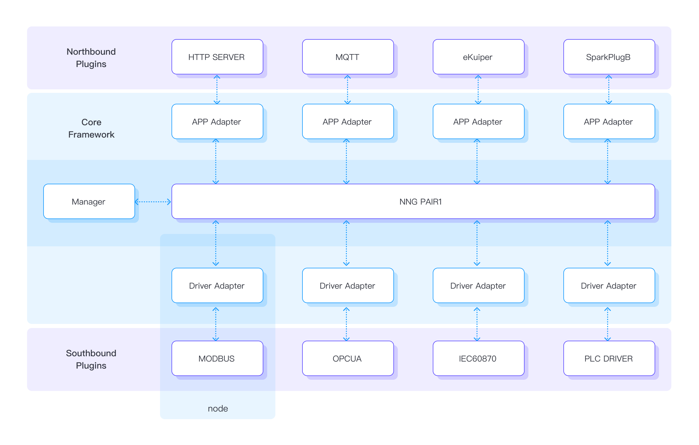

# 配置

## 配置键概念

配置键概念旨在帮助理解如何在 Neuron 中设置各种工业协议转换。

### 核心

Neuron 核心框架旨在为各种不同的工业通信协议提供插件构建和应用的基础。这个核心框架包括 NNG 高速总线、数据管理器以控制数据流，以及插件集成的适配器。

### 插件

Neuron 可以分为核心框架和多种可插拔模块。可插拔意味着这些模块可以动态地添加和移除，甚至支持在运行状态下的热插拔。插件可以分为北向应用和南向驱动程序。北向插件通常用于连接到云平台或像处理引擎这样的外部应用程序。南向插件是实现特定协议以访问外部设备的通信驱动程序。

所有这些模块都是用 C 语言编写的，并为那些有兴趣进行二次开发的用户提供 SDK。插件只是由 SDK 构建的动态链接库(.so)文件。为了实现协议格式转换，至少需要一个北向插件和一个南向插件分别用于数据传递和数据采集。

### Adapter

适配器是为插件数据交换提供两个接口的通信例程。一方面，它有一个用于 NNG 高速总线的通信接口，可以与其他适配器交换数据消息。另一方面，它提供了插件接口，用于集成插件模块。这使得两个不相关的组件，NNG 高速总线和插件，可以一起工作。 

有两种适配器。驱动程序适配器用于与南向驱动插件集成。应用程序适配器用于与北向应用插件集成。应用程序适配器和驱动程序适配器不同，因为它们在处理数据消息交换时具有不同的逻辑。

### Node 节点

当一个插件插入核心框架中时，会创建一个连接节点来与外部设备或应用程序通信。节点在 Neuron 中被定义为将框架接口与通信例程合并的实体。在单个运行实例中可能会创建多个节点，用于与各方通信。核心框架负责管理这些节点之间的消息路由。

A node is simply a combination of an adapter and a plugin module. Message exchange between nodes is based on NNG high-speed bus.

简单来说，一个节点就是适配器和插件模块的组合。节点之间的消息交换基于 NNG 高速总线。

该图展示了一个松耦合的设计架构。所有节点独立工作，相互交换数据，并根据其实现的工业协议与外部设备或云进行通信。

### Tag 点位

点位是分配给一条信息的非分层唯一关键字，该信息包括设备中的数据存储位置和数据操作属性，这有助于描述项目，并允许在设备中找到该项目或对其进行处理以自动读取/写入。用户将识别设备中那些感兴趣的点位，以从设备中读取数据或向设备写入数据。

### Group 组

设备中用户感兴趣的点位集合被分成几个组以便更好地管理。路由机制基于这些组作为信息单元在节点之间进行交换。北向节点可以订阅任何南向节点中的任何组。这些订阅将用于在节点之间路由数据消息。此外，还有一个组轮询频率用于控制设备轮询的时间间隔。

## 配置流程

这个流程是关于如何设置 Neuron 进行各种工业协议转换的工作流程。

### 第一步，查看所有可用插件

使用各种工业插件可以实现 Neuron 数据采集和传递。只有安装并激活相应插件的许可证后，才能使用特定的驱动插件。由于Neuron 是一个松散耦合的架构，每个插件都作为独立的进程线程运行，不会相互干扰。

[Check over the available plugins](./plugin-management/plugin-management.md)

### 第二步，创建一个南向驱动

在查看所有可用的插件后，根据工业协议为设备通信选择所有必需的南向插件。每个南向插件根据协议规范只有一个与设备或多个设备总线的连接。

[创建一个南向驱动](./south-devices/south-devices.md)

### 第三步，创建组和点位

在此步骤中，向南向驱动程序添加组和点位。点位是定位设备中数据存储位置的唯一关键字。点位还包含有关数据的一些元数据信息，如缩放、精确度和读/写属性。这些点位将被分配到组中。每个组都有独立的轮询频率以从设备中读取数据。

[创建组和点位](./groups-tags/groups-tags.md)

通常在 Neuron 中会有非常多的标签需要处理。为了避免在仪表板中一个一个地添加组和标签，这些组和标签可以在离线的 Excel 表格中准备好，然后导入到 Neuron 中。

[导入/导出组和点位](./import-export/import-export.md)

一旦创建了组和点位，即可从数据监控中获取点位的实时值。

[监控数据](../usage/monitoring.md)

:::tip

重复步骤 2 和 3，直到创建了所有必要的驱动程序、组和点位。
:::

### 第四步，创建一个北向应用

选择需要的北向插件以实现数据传送的目的地。每个北向插件只能连接到一个目的地，如代理或应用程序。

[创建一个北向应用](./north-apps/north-apps.md)

### 第五步，订阅组

在此步骤中，不需要设置组和点位。相反，北向节点可以订阅在南向节点中创建的任何组。一旦建立了订阅，相应组的数据将按照组的频率持续发布到北向节点。

[订阅组](./subscription/subscription.md)

## 配置相关 API

另外，提供一组配置 API，用于工业物联网平台、MES 或其他控制系统集成。