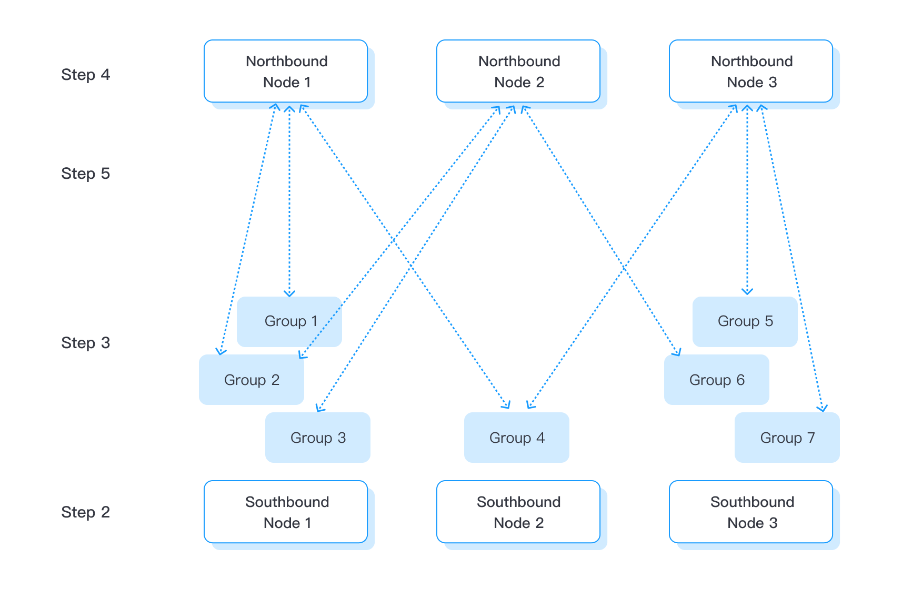

# 数采及转发流程

Neuron 是一款开源且轻量级的工业协议网关软件，赋予工业设备在工业 4.0 时代的关键物联网连接能力。它支持一站式设备连接、数据接入，以及数十种工业协议的MQTT协议转换。Neuron 的设计理念强调边缘计算，能在边缘设备上部署，实时运行，充分利用边缘的超低延迟进行工业数据处理。其强大的性能使得它能够连接数百个工业设备，轻松处理超过 10,000 个数据点。

## 数据采集

1. [**查看可用插件**](../introduction/plugin-list/plugin-list.md)：各种工业插件可以帮助实现 Neuron 的数据采集和传递。只有安装并激活相应插件的许可证后，才能使用特定的驱动插件，具体可查看[许可证政策](../introduction/license/license-policy.md)。由于Neuron 是一个松散耦合的架构，每个插件都作为独立的进程线程运行，不会相互干扰。目前 Neuron 预安装的插件列表如下：

   Neuron 内置的插件列表如下。不同设备所需的配置参数有所不同，您可点击表格链接快速了解不同南向设备的参数说明。

   | 应用领域       | 插件名称                                                     | 应用领域     | 插件名称                                                     |
   | -------------- | ------------------------------------------------------------ | ------------ | ------------------------------------------------------------ |
   | **全球标准**   | [Modbus TCP  Modbus TCP QH](./south-devices/modbus-tcp/modbus-tcp.md) | **PLC 驱动** | [Siemens S7 ISO TCP](./south-devices/siemens-s7/s7.md)       |
   |                | [Modbus RTU](./south-devices/modbus-rtu/modbus-rtu.md)       |              | [Siemens S5 FetchWrite](./south-devices/siemens-fetchwrite/fetchwrite.md) |
   |                | [OPC UA](./south-devices/opc-ua/overview.md)                 |              | <!--Allen-Bradley DF1 with doc to be added-->                |
   |                | [OPC DA](./south-devices/opc-da/overview.md)                 |              | [Mitsubishi 3E](./south-devices/mitsubishi-3e/overview.md)   |
   |                | [EtherNet/IP(CIP)](./south-devices/ethernet-ip/ethernet-ip.md) |              | [Mitsubishi 1E](./south-devices/mitsubishi-1e/mitsubishi-1e.md) |
   | **电力**       | [IEC60870-5-104](./south-devices/iec-104/iec-104.md)         |              | [Mitsubishi FX](./south-devices/mitsubishi-fx/overview.md)   |
   |                | [IEC61850](./south-devices/iec61850/overview.md)             |              | [Omron FINS TCP](./south-devices/omron-fins/omron-fins.md)   |
   |                | [DL/T645-2007](./south-devices/dlt645-2007/dlt645-2007.md)   |              | [Omron FINS UDP](./south-devices/omron-fins/omron-fins-udp.md) |
   |                | [DL/T645-1997](./south-devices/dlt645-1997/dlt645-1997.md)   |              | [Beckhoff ADS](./south-devices/ads/ads.md)                   |
   | **楼宇自动化** | [BACnet/IP](./south-devices/bacnet-ip/bacnet-ip.md)          |              | [Panasonic Mewtocol](./south-devices/panasonic-mewtocol/overview.md) |
   |                | [KNXnet/IP](./south-devices/knxnet-ip/knxnet-ip.md)          |              | [Profinet IO](./south-devices/profinet/profinet.md)          |
   | **环境监测**   | [HJ212-2017](./south-devices/hj212-2017/hj212-2017.md)       | **石油行业** | [NON A11](./south-devices/nona11/nona11.md)                  |

2. [**创建南向驱动**](./south-devices/south-devices.md)：根据工业协议为设备通信选择所有必需的南向插件。根据协议规范，每个南向插件只能与一个设备或关联多个设备的一条消息总线建立连接。用户可选择通过插件或[模版](./templates/templates.md)的方式连接南向设备。

3. [**连接南向设备**](./south-devices/south-devices.md#设置组和点位)：通过创建组和点位连接南向设备，创建好组和点位后，即可从数据监控中获取点位的实时值。为方便用户操作，Neuron 支持通过离线 Excel 文件[批量导入](http://localhost:8080/zh/emqx-ecp/latest/config/import-export.html)相关配置信息。

::: tip

重复步骤 2 和 3，直到创建了所有必要的驱动程序、组和点位。
:::

### 数据转发

[**创建北向应用**](./north-apps/north-apps.md)：选择需要的北向插件以实现数据的传送。每个北向插件只能连接到一个目的地，如代理或应用程序。目前 Neuron 支持以下北向应用：

- [eKuiper](./north-apps/ekuiper/overview.md)
- [MQTT](./north-apps/mqtt/overview.md)
- [SparkPlugB](./north-apps/sparkplugb/ignition.md)
- [WebSocket](./north-apps/websocket/websocket.md)
- [Monitor](./north-apps/monitor/overview.md)

[**订阅南向设备**](./north-apps/north-apps.md#订阅南向数据)

创建北向设备后，还需订阅组。在此步骤中，不需要设置组和点位。北向节点可以订阅在南向节点中创建的任何组。建立订阅后，相应组的数据将按照组的频率持续发布到北向节点。

具体流程如下图所示：

### [API](../http-api/http-api.md)

Neuron 还提供一组配置 API，用于工业物联网平台、MES 或其他控制系统集成。
