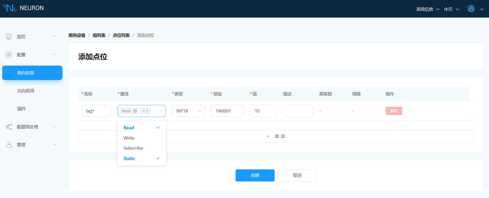
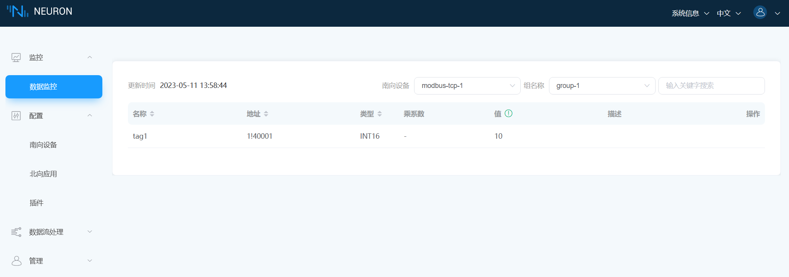
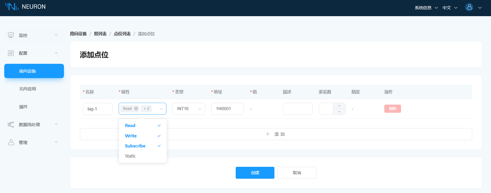
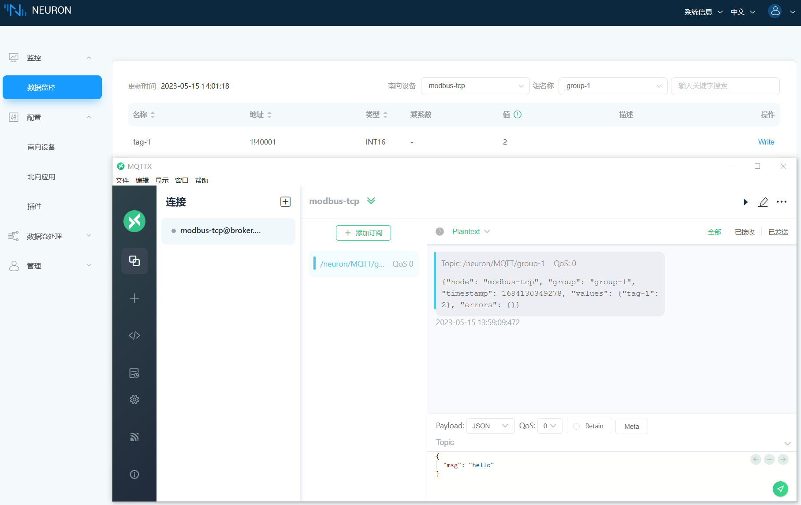

# 配置点位

## 点位属性

### 静态点位

在点位配置属性时，在下拉框中选择 `Static`。

静态点位在配置时赋值，例如。

在数据监控中如下图所示。

### 订阅点位

在点位配置属性时，在下拉框中选择 `Subscribe`，例如。

选择`subscribe`属性则数据变化时发送消息，无变化时不发送消息。
例如，默认数据为 0，改为 2。
在 MQTTX 中订阅主题并查看，数据变化后只发送一条消息，如下图所示。

