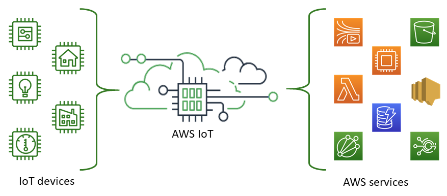
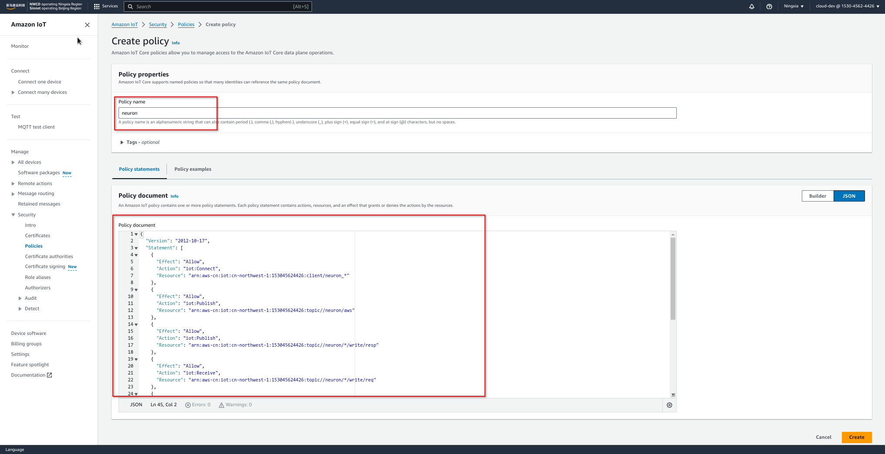
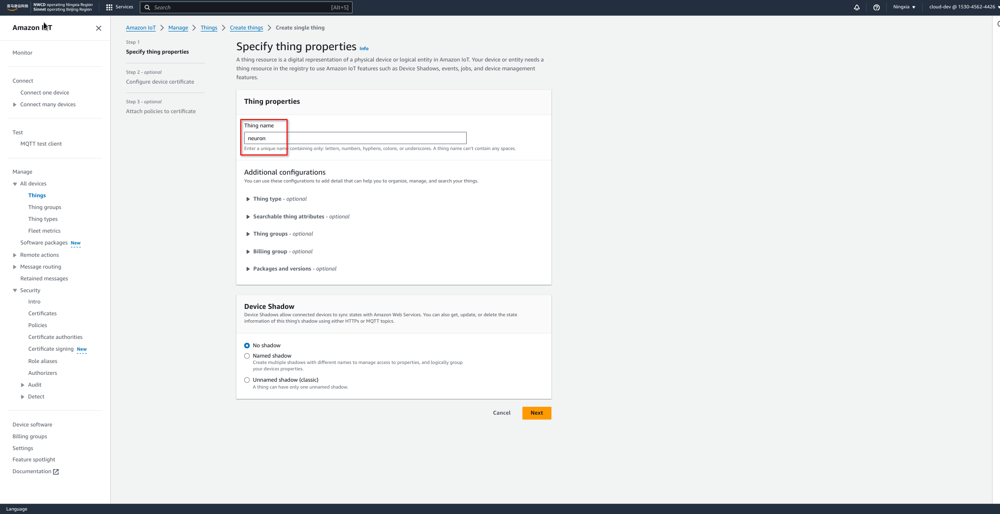
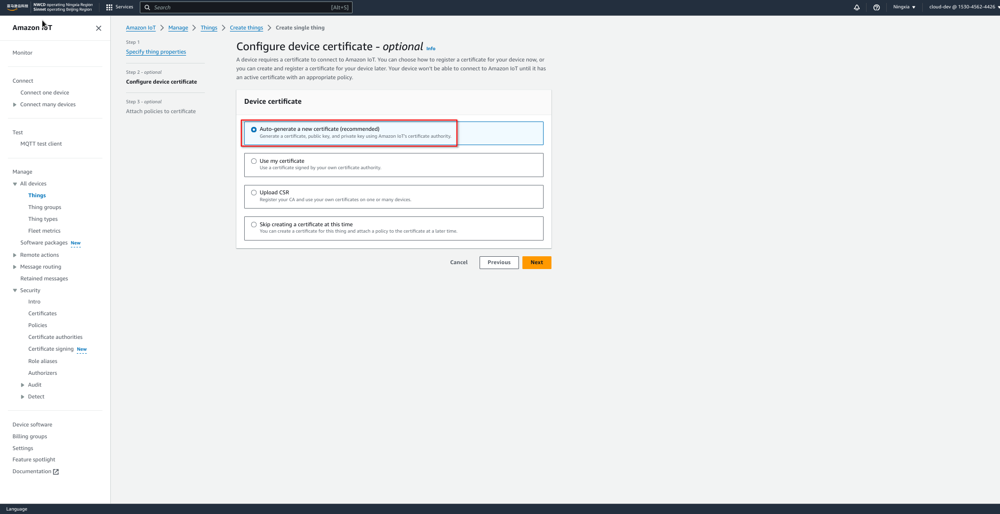
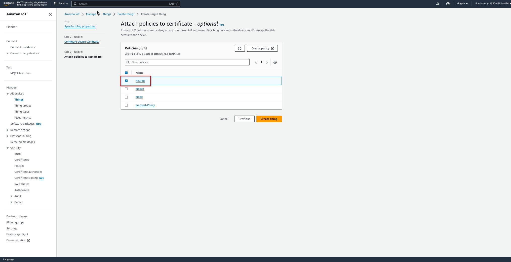
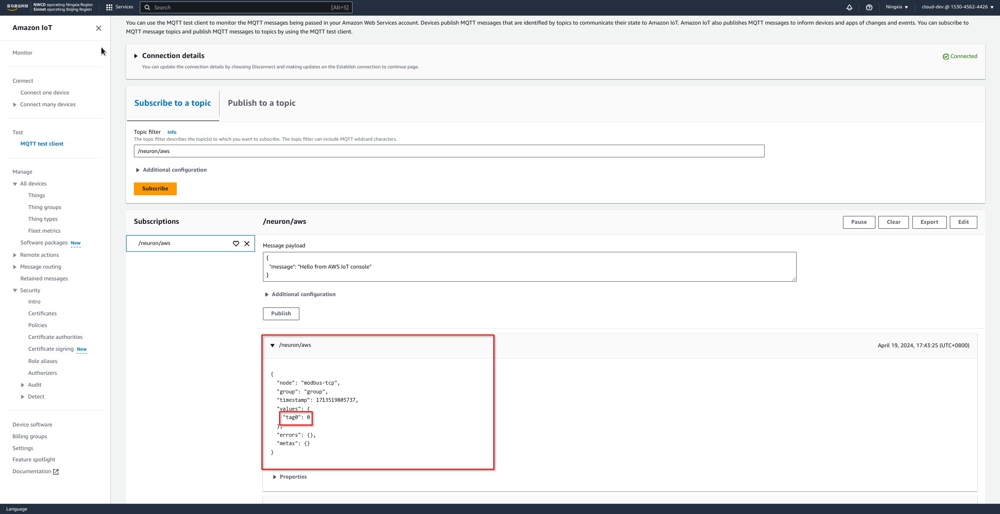
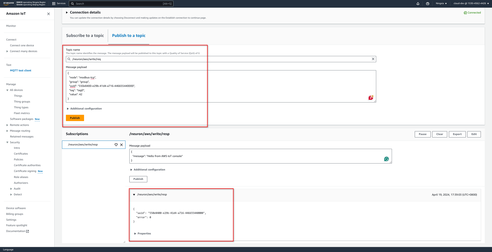

# 使用 Neuron 将数据桥接到 AWS IoT

本文将介绍如何使用 Neuron 通过公网桥接数据到 AWS IoT，从而借助 AWS IoT 轻松构建 IoT 应用程序。

## AWS IoT 简介

### 什么是 AWS IoT

Amazon IoT Core 是一种托管的云平台，让互联设备可以轻松安全地与云应用程序和其他设备交互。Amazon IoT 可以支持数十亿台设备和数万亿条消息，并能处理这些消息并将其安全可靠地路由至亚马逊云科技终端节点和其他设备。借助 Amazon IoT，您的应用程序可以随时跟踪您的所有设备并与其通信，即使这些设备未处于连接状态也不例外。

<figure align="center">
  
</figure>

### AWS IoT 平台的优势

1. 广泛而深入：AWS 拥有从边缘到云端的广泛而深入的 IoT 服务，提供本地数据收集和分析能力以及云上专为 IoT 设计的数据管理和丰富分析集成服务。
2. 多层安全性：包括预防性安全机制（如设备数据的加密和访问控制）、持续监控和审核安全配置等。
3. 卓越的 AI 集成：AWS 将 AI 和 IoT 结合在一起，使设备更为智能化。支持多种机器学习框架。
4. 大规模得到验证：AWS IoT 构建于可扩展、安全且经过验证的云基础设施之上，可扩展到数十亿种不同的设备和数万亿条消息。

## 配置 AWS IoT

### 1. 创建策略

找到**安全 -> 策略**，创建名为 _neuron_ 的策略，编写策略，相关配置如下。
<figure align="center">
  
</figure>

```json
{
  "Version": "2012-10-17",
  "Statement": [
    {
      "Effect": "Allow",
      "Action": "iot:Connect",
      "Resource": "arn:aws-cn:iot:cn-northwest-1:153045624426:client/neuron_*"
    },
    {
      "Effect": "Allow",
      "Action": "iot:Publish",
      "Resource": "arn:aws-cn:iot:cn-northwest-1:153045624426:topic//neuron/aws"
    },
    {
      "Effect": "Allow",
      "Action": "iot:Publish",
      "Resource": "arn:aws-cn:iot:cn-northwest-1:153045624426:topic//neuron/*/write/resp"
    },
    {
      "Effect": "Allow",
      "Action": "iot:Receive",
      "Resource": "arn:aws-cn:iot:cn-northwest-1:153045624426:topic//neuron/*/write/req"
    },
    {
      "Effect": "Allow",
      "Action": "iot:Subscribe",
      "Resource": "arn:aws-cn:iot:cn-northwest-1:153045624426:topicfilter//neuron/*/write/req"
    },
    {
      "Effect": "Allow",
      "Action": "iot:Publish",
      "Resource": "arn:aws-cn:iot:cn-northwest-1:153045624426:topic//neuron/*/read/resp"
    },
    {
      "Effect": "Allow",
      "Action": "iot:Receive",
      "Resource": "arn:aws-cn:iot:cn-northwest-1:153045624426:topic//neuron/*/read/req"
    },
    {
      "Effect": "Allow",
      "Action": "iot:Subscribe",
      "Resource": "arn:aws-cn:iot:cn-northwest-1:153045624426:topicfilter//neuron/*/read/req"
    }
  ]
}
```

### 2. 创建事物

进入 AWS IoT 控制面板，找到**管理 -> 事物**，点击**创建事物**，即可创建一个名为 _neuron_ 的事物。
<figure align="center">
  
</figure>

选择 **Auto-generate a new certificate**.
<figure align="center">
  
</figure>

证书创建完成以后，需要在该页面下载证书，用于设备连接时的双向认证。
<figure align="center">
  
</figure>

最后，需要关联到前一步创建好的策略。
<figure align="center">
  
</figure>

### 3. 获取 AWS IoT 的设备数据终端节点

在**设置**标签页, 找到 AWS IoT 的设备数据终端节点。
<figure align="center">
  
</figure>


## 配置 Neuron

### 创建南向设备

本文使用 [Modbus TCP 插件]创建南向设备，采集数据。

#### 添加 *modbus-tcp* 节点

在控制面板，点击**南向设备 -> 添加设备**，选择 Modbus TCP 插件添加节点 *modbus-tcp* 。配置节点，连接到位于端口 `60502` 的 Modbus 模拟器。
<figure align="center">
  
</figure>

#### 创建组

点击 *modbus-tcp* 节点，创建组，设置组名为 *group*，间隔为 *1000* 。
<figure align="center">
  
</figure>

#### 添加点位

添加一个点位，名字为 *tag0*，类型为 *INT16* 。
<figure align="center">
  
</figure>

配置完成后，*modbus-tcp* 节点显示处于连接状态。
<figure align="center">
  
</figure>

### 创建北向应用

#### 添加 *aws* 节点

点击**北向应用 -> 添加应用**，选择 AWS IoT 插件。
<figure align="center">
  
</figure>

在**应用配置**标签页，使用上文准备的 AWS 设备数据终端端点和证书对 *aws* 节点进行配置。
<figure align="center">
  
</figure>

配置完成后，*aws* 节点将成功连接 AWS IoT Core 。
<figure align="center">
  
</figure>

#### 订阅 *modbus-tcp* 节点

点击 *aws* 节点，然后点击**添加订阅**，选择 *modbus-tcp* 节点和 *group* 组。将南向设备数据上报的 MQTT 主题设置为 */neuron/aws* 。
<figure align="center">
  
</figure>

<figure align="center">
  
</figure>


## 监控数据

订阅 *modbus-tcp* 节点的 *group* 组后，*aws* 节点会将数据推送到 AWS IoT Core。点击**数据监控**，选择 *modbus-tcp* 节点和 *group* 组。可以看到 Neuron 报告了 *tag0* 的值为 *0* 。
<figure align="center">
  
</figure>

在 AWS IoT console, 使用 **MQTT test client** 订阅主题 */neuron/aws* ，可以确认 AWS IoT Core 正确地受到了上报的数据。
<figure align="center">
  
</figure>

## 写入数据

在 AWS IoT console, 使用 **MQTT test client** 发送写请求到主题 */neuron/aws/write/req* ，写入点位 *tag0* 为 *42* 。
<figure align="center">
  
</figure>

在**数据监控**标签页，可以看到 Neuron 将点位 *tag0* 的值更新为写入的值 *42* 。
<figure align="center">
  
</figure>

并且 AWS IoT Core 也收到了更新后的点位值 *42*。
<figure align="center">
  
</figure>

[Modbus TCP 插件]: ../../south-devices/modbus-tcp/modbus-tcp.md
