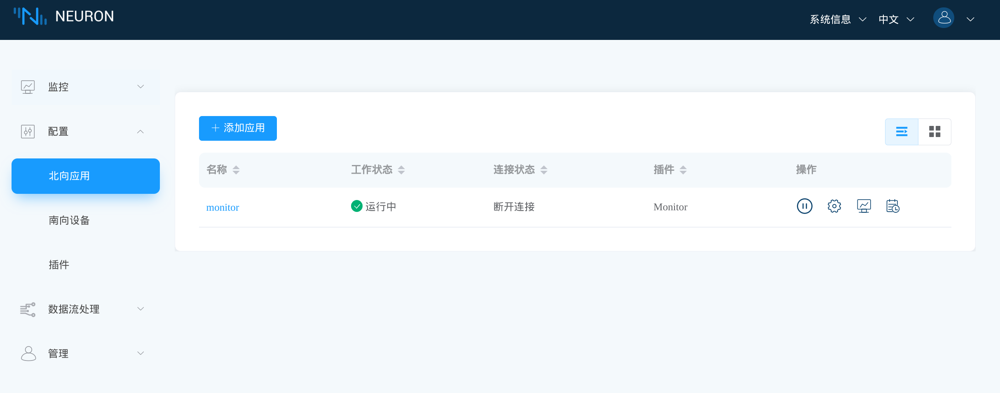
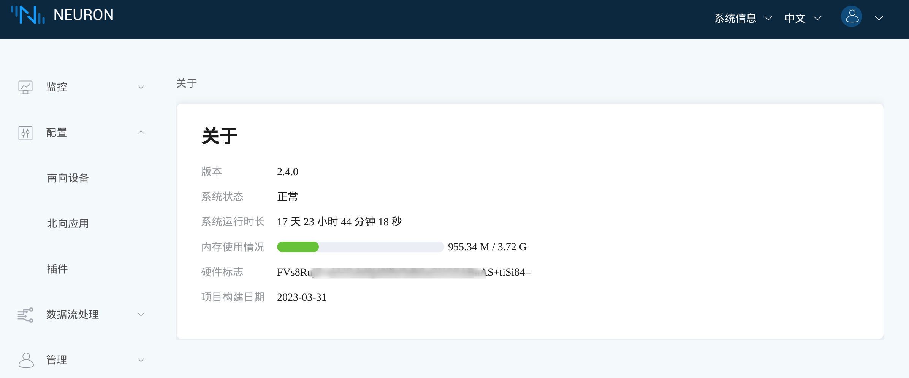
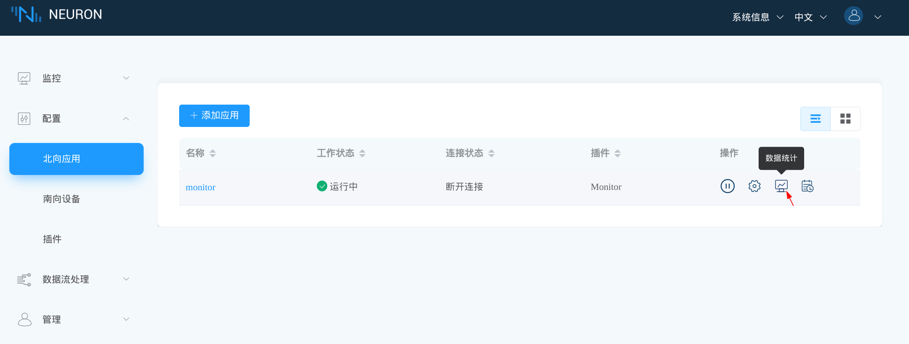
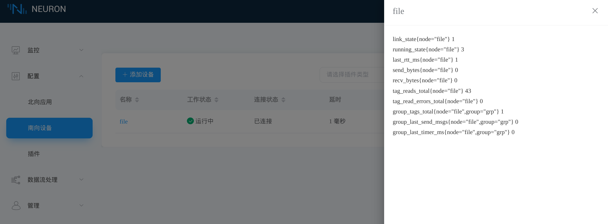

# Monitor

<!--QQDQ，这个页面感觉可以再优化下？它的作用觉得写的不是太清楚-->

Neuron Monitor 插件是一款开源的北向插件，它提供了一个兼容 [Prometheus] 的[数据统计 HTTP API] ，用于监控运行的 Neuron 实例。

Neuron 会在启动时创建一个 *monitor* 单例节点，用户不能直接使用该插件创建或删除节点。
您可以在仪表板的**北向应用**页签中看到 *monitor* 节点。

<figure align="center">
  
  <figcaption align = "center">
    <sub><b>Fig.1 - Neuron *monitor* 节点</b></sub>
  </figcaption>
</figure>

## 应用配置

以下是配置 *monitor* 节点时可用的参数，这些参数主要用于建立 MQTT 连接，以及[心跳](#心跳消息)和[事件](#事件消息)上报功能。

|字段           | 说明                                                            |
| ------------------- | ---------------------------------------------------------------------- |
| **客户端 ID**       | MQTT 通信的客户端 ID，必填。                                           |
| **事件主题前缀**    | 事件消息发布的主题的前缀。                                             |
| **心跳主题**        | 心跳消息发布的主题。                                                   |
| **心跳间隔**        | 心跳消息之间的间隔时间（秒），设置为0将禁用心跳消息。                  |
| **服务器地址**      | MQTT 服务器地址，必填。                                                |
| **服务器端口**      | MQTT 服务器端口号，必填。                                              |
| **用户名**          | MQTT 用户名，选填。                                                    |
| **密码**            | MQTT 用户密码，选填。                                                  |
| **SSL**             | 是否启用 SSL，选填，默认不启用。                                       |
| **CA 证书**         | CA 证书，启用 SSL 且使用自签发证书时必填。                             |
| **客户端证书**      | 客户端证书，使用 SSL 双向认证时必填。                                  |
| **客户端私钥**      | 客户端密钥，使用 SSL 双向认证时必填。                                  |
| **客户端私钥密码**  | 客户端密钥密码，使用 SSL 双向认证并且提供了加密的**客户端私钥**时必填。|

## 数据统计

Neuron 仪板表的**关于**页面和**数据统计**页签使用 Monitor 插件提供的 API 显示信息。

可以通过点击**系统信息 -> 关于**打开**关于**页面。

<figure align="center">
  
  <figcaption align = "center">
    <sub><b>Fig.2 - Neuron 仪板表*关于*页面</b></sub>
  </figcaption>
</figure>

点击节点上的**数据统计**图标，可以显示**数据统计**页签。

<figure align="center">
  
  <figcaption align = "center">
    <sub><b>Fig.3 - Neuron 仪板表*数据统计*图标</b></sub>
  </figcaption>
</figure>

如下，展示了一个样例 *file* 节点的数据统计。

<figure align="center">
  
  <figcaption align = "center">
    <sub><b>Fig.4 - Neuron 仪板表*数据统计*页签</b></sub>
  </figcaption>
</figure>
::: warning 注意
数据统计 API 在 Neuron 进程的整个生命周期中都是启用的。
启动或者停止 *monitor* 节点只会停止[心跳](#心跳消息)和[事件](#事件消息)上报功能。
:::

## 心跳消息

心跳是设备和 Neuron 实例本身的时间序列状态。Monitor 插件可以向 MQTT 服务器发送心跳消息，用于检查 Neuron 进程的存活或者节点的状态。它包含设备状态和报警、运行模式、通信链路状态等。此外，如果平台或应用程序在一定时间内（10秒或以上）无法接收到此消息流，则可能代表Neuron软件出现问题或网络故障。

除了 MQTT 连接参数，心跳消息功能由**心跳主题**和**心跳间隔**两个参数控制。
**心跳主题**参数指定心跳上报的 MQTT 主题，**心跳间隔**参数指定每条心跳消息之间间隔的秒数。

::: tip
将**心跳间隔**设为 **0**，将停止心跳上报功能。
:::

心跳消息具有以下字段：

* `timestamp`：消息生成时的 Unix 时间戳。
* `version`：Neuron 的版本信息。
* `states`：节点状态信息的数组，类似 [节点状态 HTTP API] 响应的数据。

以下是一个心跳消息样例：

```json:no-line-numbers
{
  "timestamp": 1658134132237,
  "version": "2.4.0",
  "states": [
    {
      "node": "mqtt-client",
      "link": 2,
      "running": 3
    },
    {
      "node": "fx5u-client",
      "link": 2,
      "running": 3
    }
  ]
}
```

## 事件消息

事件代表 Neuron 进程中的内部状态变化，比如节点的创建，删除或者配置。
系统管理员或者运维工程师通常比较关注这些事件。

Monitor 插件可以向 MQTT 服务器发送事件消息，使用的主题由**事件主题前缀**参数决定。
下文中我们用 *{event-topic-prefix}* 表示配置的**事件主题前缀**参数的实际值。

### 节点事件

#### 节点创建事件

上报主题： *{event-topic-prefix}/node/add*

消息示例：

```json:no-line-numbers
{
  "name": "file",
  "plugin": "File"
}
```

#### 节点删除事件

上报主题： *{event-topic-prefix}/node/delete*

消息示例：

```json:no-line-numbers
{
  "name": "file"
}
```

#### 节点配置事件

上报主题： *{event-topic-prefix}/node/setting*

消息示例：

```json:no-line-numbers
{
  "node": "file",
  "params": {
    "file_length": 512
  }
}
```

#### 节点控制事件

上报主题： *{event-topic-prefix}/node/ctl*

消息示例：

```json:no-line-numbers
{
  "node": "file",
  "cmd": 1
}
```

### 组事件

#### 组创建事件

上报主题： *{event-topic-prefix}/group/add*

消息示例：

```json:no-line-numbers
{
  "node": "file",
  "group": "grp",
  "interval": 1000
}
```

#### 组更新事件

上报主题： *{event-topic-prefix}/group/update*

消息示例：

```json:no-line-numbers
{
  "node": "file",
  "group": "grp",
  "interval": 2000
}
```

#### 组删除事件

上报主题： *{event-topic-prefix}/group/delete*

消息示例：

```json:no-line-numbers
{
  "node": "file",
  "group": "grp"
}
```

### 点位事件

#### 点位创建事件

上报主题： *{event-topic-prefix}/tag/add*

消息示例：

```json:no-line-numbers
{
  "node": "file",
  "group": "grp",
  "tags": [
    {
      "name": "tag0",
      "type": 13,
      "attribute": 1,
      "address": "hello.txt",
      "precision": 0,
      "decimal": 0.0,
      "description": ""
    }
  ]
}
```

#### 点位更新事件

上报主题： *{event-topic-prefix}/tag/update*

消息示例：

```json:no-line-numbers
{
  "node": "file",
  "group": "grp",
  "tags": [
    {
      "name": "tag0",
      "type": 13,
      "attribute": 3,
      "address": "hello.txt",
      "precision": 0,
      "decimal": 0.0,
      "description": ""
    }
  ]
}
```

#### 点位删除事件

上报主题： *{event-topic-prefix}/tag/delete*

消息示例：

```json:no-line-numbers
{
  "node": "file",
  "group": "grp",
  "tags": [
    "tag0"
  ]
}
```

[Prometheus]: https://prometheus.io/
[数据统计 HTTP API]: ../../../http-api/metrics.md
[节点状态 HTTP API]: ../../../http-api/configuration.md#获取-node-状态
