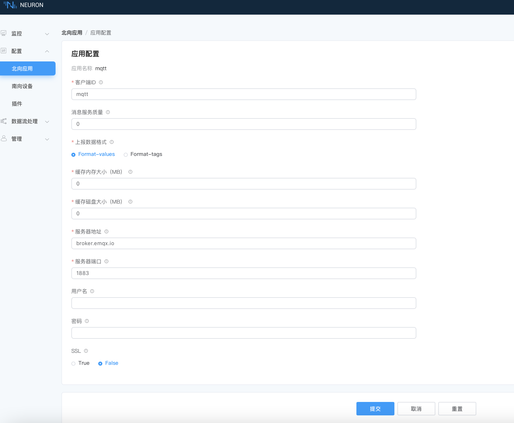

# MQTT

[MQTT] 是一种轻量级的消息传输协议，专为物联网设备和应用程序设计。它采用发布与订阅模型，允许设备和应用程序通过中间代理（Broker）进行通信。MQTT拥有轻量级、高效率和可靠性等诸多优点，特别适用于边缘硬件资源有限，需要高效地传输实时数据，以及对通信延迟和带宽占用有要求的场景。

MQTT协议在工业互联网中得到广泛选择和应用，它为工业互联网带来了实时数据交换、设备互通性、资源节约和稳定可靠等诸多价值，成为工业互联网通信的重要基石。

Neuron 支持 MQTT 插件作为其数据汇聚上报的方式之一，Neuron MQTT 插件允许用户快速构建使用 MQTT 协议的物联网应用程序，可以在设备和云之间进行通讯。开发人员还可以通过 MQTT 插件向 IoT 设备发布控制指令，触发设备操作，例如打开或关闭灯、电机或者其他设备。

此外，MQTT 插件还支持使用身份验证和加密通讯协议进行安全通讯，确保数据的安全性和隐私性。

[MQTT]: https://mqtt.org

## 添加插件

在**配置 -> 北向应用**，点击 **添加应用** 添加 MQTT 客户端节点。

## 应用配置

以下是使用 MQTT 插件配置节点时可用的参数：

| 字段               | 说明                                                         |
| ------------------ | ------------------------------------------------------------ |
| **MQTT 版本**      | MQTT 协议的版本，默认为 v3.1.1。             |
| **客户端 ID**      | MQTT 通信的客户端 id，必填。                                 |
| **QoS 等级**       | MQTT 通信的服务质量等级，可选，默认为 QoS 0 。               |
| **上报数据格式**   | 上报数据的 JSON 格式：<br />· **values-format**：数据被分成 `values` 和 `errors` 的子对象。<br />· **tags-format**：数据被放在一个数组中。 <br />· **ECP-format**：在 **tags-format** 的基础上增加数据类型。<br />· **Custom**：自定义上报数据格式。<br />关于通信数据格式，见 [数据上下行格式](./api.md#数据上报)|
| **上报点位错误码**     | 点位采集报错时，上报点位错误码，默认开启。           |
| **写请求主题**     | 接收点位写入请求的 MQTT 主题。关于通信数据格式，见 [数据上下行格式](./api.md#写-tag)。如开启链路追踪，请按 W3C 标准配置用户属性 `traceparent` 和 `tracestate`。|
| **写响应主题**     | 发送点位写入响应的 MQTT 主题。                           |
| **驱动状态上报**   | 上报所有南向驱动状态到指定的 MQTT 主题。                  |
| **状态上报主题**   | 状态上报的主题。                                        |
| **状态上报间隔**   | 上报南向节点状态的时间间隔，单位为秒，可填范围为 1-3600，默认1 |
| **离线缓存**       | 离线缓存开关。连接断开时缓存 MQTT 消息，连接重建时同步缓存的消息到MQTT服务器。关于离线缓存功能的详细介绍，见[离线数据缓存](#离线数据缓存) |
| **缓存内存大小**   | 通信失败时内存消息缓存大小 (MB) 限制，必填；范围：[0, 1024]，不能大于缓存磁盘大小。 |
| **缓存磁盘大小**   | 通信失败时磁盘消息缓存大小 (MB) 限制，必填，范围：[0, 10240]。<br />设为非零值时，缓存内存大小 也须为非零值。 |
| **缓存消息重传间隔** | 通信恢复、消息重传时每条消息之间的时间间隔 (MS)，必填；范围：[10, 120000] |
| **服务器地址**     | MQTT Broker 地址，必填。                                     |
| **服务器端口**     | MQTT Broker 端口号，必填。                                   |
| **用户名**         | 连接到 Broker 时使用的用户名，选填。                         |
| **密码**           | 连接到 Broker 时使用的密码，选填。                           |
| **SSL**            | 是否启用 SSL，选填，默认不启用。有关 SSL 的详细介绍，见 [MQTT over SSL](#mqtt-over-ssl) |
| **CA 证书**        | CA 证书，启用 SSL 且使用自签发证书时必填。                   |
| **客户端证书**     | 客户端证书，使用 SSL 双向认证时必填。                        |
| **客户端私钥**     | 客户端密钥，使用 SSL 双向认证时必填。                        |

### 离线数据缓存

离线数据缓存是 MQTT 插件特有的功能，当网络中断发生时，MQTT 插件首先将数据存储在内存缓存中，并且仅当内存缓存已满时才将数据刷新到磁盘缓存中。当网络恢复连接时，MQTT 插件将以 FIFO（先进先出）的顺序将缓存的数据发布到服务器上。这项功能在网络连接不稳定的场景中非常有用，可以帮助防止网络离线或暂时不可用时数据丢失，增强构建在 Neuron 上的应用程序的鲁棒性和可靠性。

缓存容量取决于可用于消息排队的物理存储大小。离线数据缓存由**离线缓存**，**缓存内存大小**，和**缓存磁盘大小**参数控制，要开启离线数据缓存功能：

1. 将**离线缓存**参数设置为 *True* ，同时要配置**缓存内存大小**和**缓存磁盘大小**参数。
2. 通过**缓存内存大小**参数指定内存缓存大小（单位为兆字节），最大允许缓存大小为 1GB 。
3. 通过**缓存磁盘大小**参数指定磁盘缓存大小（单位为兆字节），最大允许缓存大小为 10GB 。
3. 通过**缓存消息重传间隔**参数指定缓存消息重传间隔（单位为毫秒），最大允许缓存消息重传间隔为 120 秒 。

下表给出了（使用[ Modbus TCP 插件](../../south-devices/modbus-tcp/modbus-tcp)时）离线缓存磁盘空间使用情况的一些统计数据。

- 第一列是每条 MQTT 消息中数据点的数量
- 第二列是带有该数量数据点的 MQTT 消息负载大小（以字节为单位）
- 第三列是磁盘中缓存消息的数量
- 第四列是所需的磁盘空间大小（以千字节为单位）

| *每消息数据点数量* | *消息负载大小 (Bytes)* | *缓存消息数量* | *磁盘使用空间 (KB)* |
| ------------------ | ---------------------- | -------------- | ------------------- |
| 10                 | 219                    | 100            | 64                  |
| 10                 | 219                    | 1000           | 349                 |
| 100                | 1284                   | 100            | 228                 |
| 100                | 1284                   | 1000           | 2077                |
| 1000               | 12993                  | 100            | 1401                |
| 1000               | 12993                  | 1000           | 13427               |

### 驱动状态上报

驱动状态上报功能允许用户将南向驱动状态上报到指定的 MQTT 主题。如需上报驱动状态，请将**驱动状态上报**参数设置为 `True` ，并指定**状态上报主题**参数和**状态上报间隔**参数。上报数据格式如下：

```json
{
	"timestamp": 1725583528917,
	"states": [{
		"node": "modbus1",
		"link": 1,
		"running": 3
	}, {
		"node": "s7-1200",
		"link": 0,
		"running": 3
	}, {
		"node": "opcua1",
		"link": 1,
		"running": 3
	}]
}
```

其中：

- `timestamp`：上报时间戳，单位为毫秒。
- `states`：驱动状态列表，每个元素包含以下字段：
  - `node`：南向驱动名称。
  - `link`：驱动与设备之间的连接状态，0 表示断开连接状态，1 表示连接正常状态。
  - `running`：驱动运行状态，3 表示运行状态、4 表示停止状态。


### MQTT over SSL

MQTT over SSL/TLS 是一种通过 SSL/TLS 加密传输 MQTT 消息的安全方法，用于在客户端和 MQTT 服务器之间传输数据，保证客户端和服务器之间传递的所有数据都是加密且安全的。

Neuron 的 MQTT 插件支持 MQTT over SSL。
要启用 SSL 加密，请在配置节点时打开 **SSL** 参数：

- 如果使用自签发的证书， 需要通过 **CA 证书**参数提供 CA 证书。
- 如果使用双向身份验证，还应通过**客户端证书**和**客户端私钥**参数分别提供客户端证书和私钥文件。

## 添加订阅

完成插件的添加和配置后，我们将继续通过订阅南向设备实现数据的转发。

完成设备配置后，在**北向应用**页，点击设备卡片/设备列进入**组列表**页。点击**添加订阅**，并进行如下设置：

- **南向设备**：选择要订阅的南向设备，例如，modbus-tcp-1；

- **组**：选择南向设备下的某个组，例如，group-1。

- **主题**：指定上报主题，例如 /neuron/mqtt/upload。


上报数据的确切格式由**上报数据格式**参数控制，有 **tags-format** 和 **values-format** 两种格式。更多详细信息，请参阅 [数据上下行格式](./api.md#data-upload)。

## 测试 MQTT 插件

本节将通过[公共的 EMQX Broker（broker.emqx.io）](https://www.emqx.com/zh/mqtt/public-mqtt5-broker)为例演示如何通过 MQTT 插件实现 Mobbus TCP 数据的转发。

### 创建南向插件

南向插件 Modbus TCP 已安装且完成组和点位的配置，和 Neuron 之间通信正常。有关 Modbus TCP 插件的安装及配置，见 [Modbus TCP](../../south-devices/modbus-tcp/modbus-tcp.md)。

### 创建北向插件

在**配置 -> 北向应用**，点击 **添加应用** 添加 MQTT 客户端节点。点击应用卡片上的**应用配置**按键进入应用配置界面设置 MQTT 连接，并进行如下设置：

* 客户端 ID：注意每个 ID 要相互独立，不可以重复，这里使用默认值 mqtt；
* 消息服务质量：选择 0
* 服务器地址：使用默认的公共的 EMQX Broker（broker.emqx.io）；
* 服务器端口：使用 MQTT broker port（1883）；
* 其他保持默认配置，点击**提交**，完成北向应用的配置，应用卡片自动进入 **运行中** 的工作状态。




### 使用 MQTTX 查看数据

订阅完成后，用户可以使用 MQTT 客户端（推荐使用 MQTTX，可在[官网](https://www.emqx.com/zh/products/mqttx)中下载）连接到公共的 EMQX 代理来查看上报的数据：

**建立连接**

在 MQTTX 中，点击**新建连接**并进行如下配置：

- **名称**：输入连接名称，如 neuronmqtt
- **服务器地址**：保留默认 broker.emqx.io
- **端口**：保留默认值 1883
- 其他可保留默认设置
- 点击**连接**

**添加订阅**

在连接窗口，点击**添加订阅**，在弹出的窗口中进行如下设置：

- **Topic**：与设置北向应用参数中的主题保持一致，例如 `/neuron/mqtt/upload`。

  ::: tip
  默认的上传 Topic 的主题格式为 `/neuron/{node_name}/upload`，其中 {node_name} 为创建的北向应用的名称。用户也可自定义上报主题。
  :::

- **QoS**：保留默认值 0

- 其他可保留默认设置

此时，我们将能在 MQTTX 中看到由 Neuron 转发的数据，如下图所示。


## 运行与维护

在设备卡片或设备列，您可点击数据统计图表查看及应用运行情况、接受和发送的数据情况。关于统计字段的说明，见[创建北向应用](../north-apps.md)。

如果设备运行出现任何问题，您可点击 DEBUG 日志图表，此时系统将自动打印该节点的 DEBUG 级别日志，十分钟后将切回系统默认级别日志。稍后，您可点击页面顶部功能栏的**系统信息** -> **日志**查看日志，并进行故障诊断。稍后，您可点击页面顶部功能栏的**系统信息** -> **日志**查看日志，并进行故障诊断。有关系统日志的详细解析，见[管理日志](../../../admin/log-management.md)。
