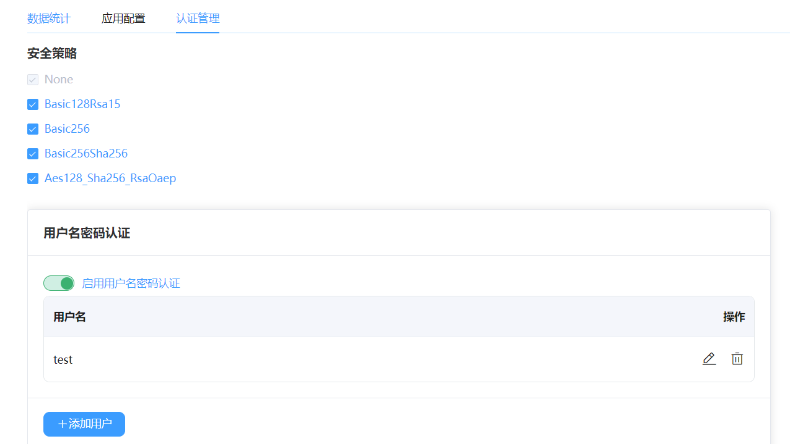
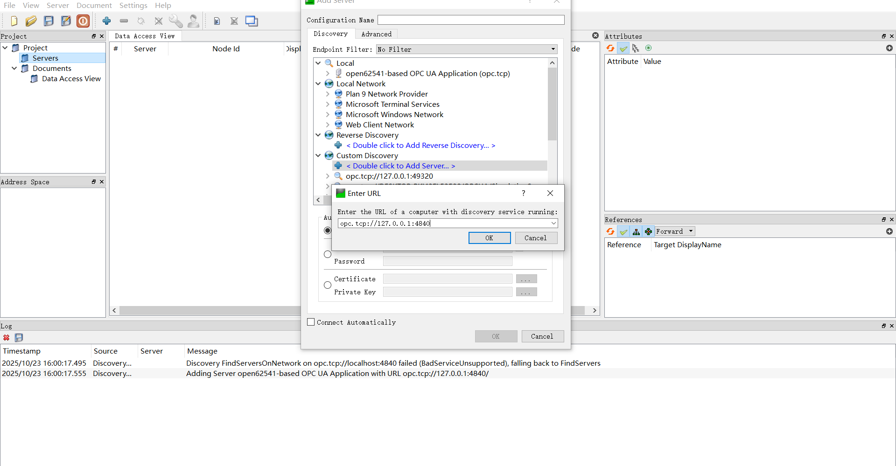
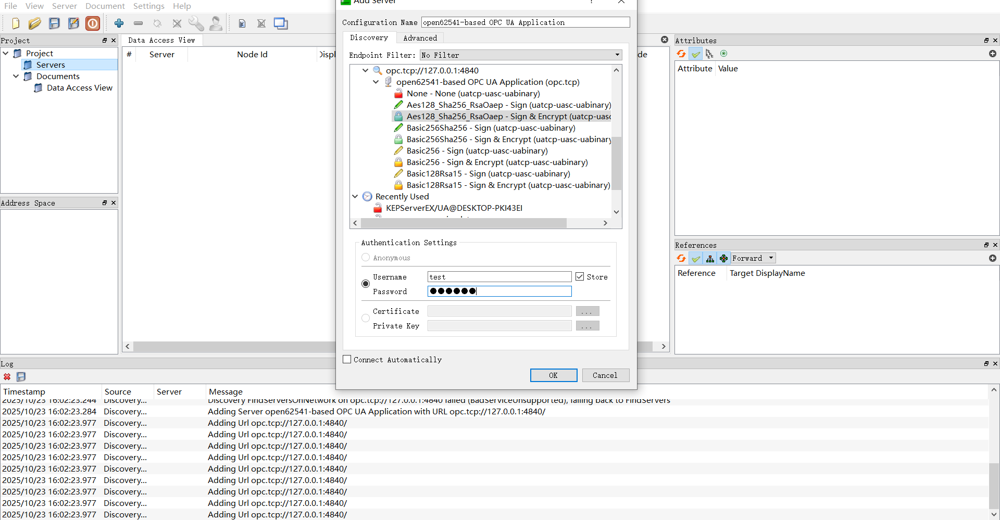
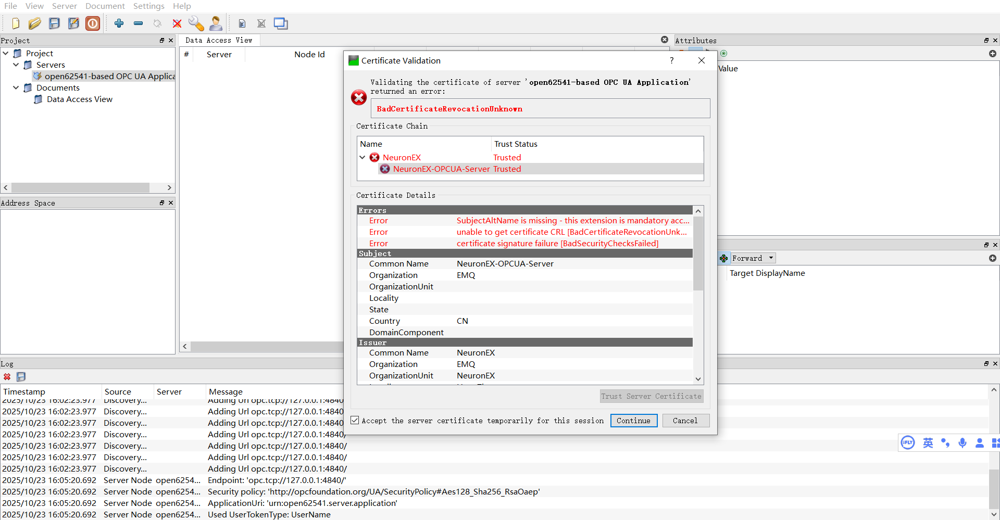
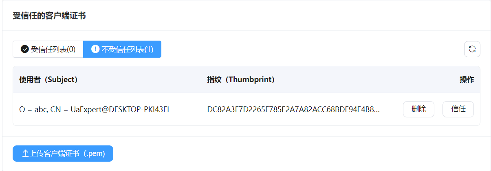
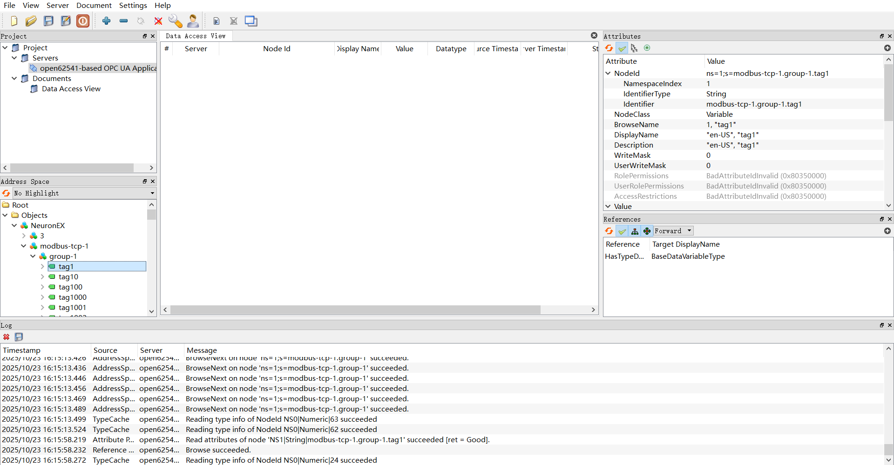
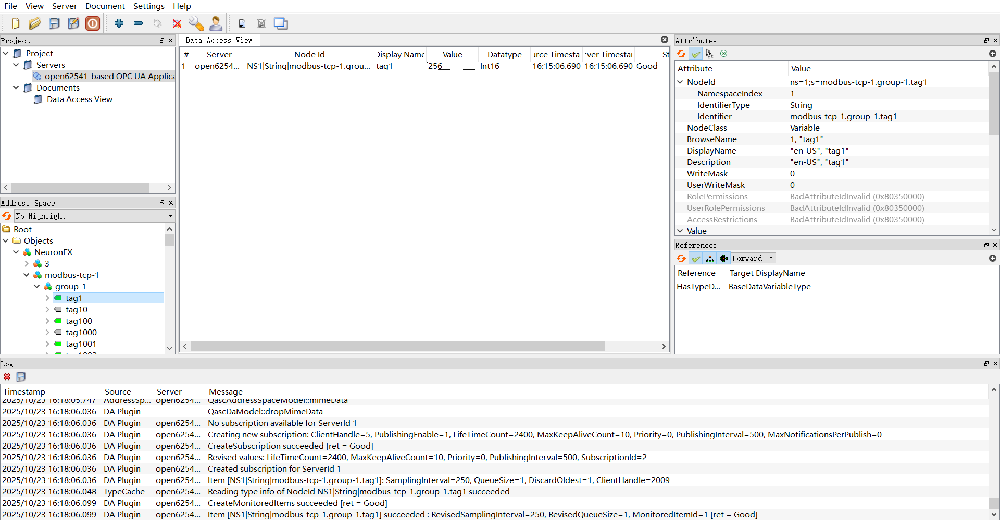

# 使用 UaExpert 连接 Neuron OPC UA Server

本节演示如何使用 UAExpert（一个常用的 OPC UA 客户端）连接、信任证书、订阅变量和写入值，以验证 Neuron 中的 OPC UA Server 配置正确。

## 1. 安装 UaExpert

在 [Unified Automation 官方网站](https://www.unified-automation.com/downloads.html)，下载并安装 UaExpert。

## 2. 新增北向 OPC UA Server

1. 新增北向 OPC UA Server 应用，保持默认配置，点击提交。
2. 进入应用配置页面，切换到认证管理，开启安全策略和用户名密码认证。

     
3. 订阅南向驱动数据。

## 3. UaExpert 连接

1. 打开 UaExpert 软件，点击工具栏 **+** 按钮， 双击 **Custom Discovery** -> **< Double click to Add Server... >**， 在弹出的对话框中填写 OPC UA Server 的访问地址，点击 **OK** 后地址会被添加到列表末尾。

    

2. 完全展开访问地址下的子节点，选择合适的连接策略和设置用户名密码，点击 `OK` 提交，连接会被添加到 UaExpert 的 **Project** 视图中。
   
    

3. 在左侧 **Project** 视图中右键点击 **Servers** 下的目标 OPC UA Server，在弹出菜单中选择 **Connect** 连接目标服务器。此时会弹出服务器证书验证页面，可以查看服务器证书是否和北向应用显示一致，然后进行信任服务器证书操作以及继续。
    

4. 此时因为是陌生客户端连接，北向 OPC UA Server 应用会返回 `BadCertificateUntrusted` 错误，需要去北向应用认证操作页面进行手动信任操作，然后再连接即可正常连接。
    

5. 展开左侧 **Address Space** 视图中的子节点，可在右侧 **Attributes** 中看到对应的节点的地址信息，其中 **NamespaceIndex** 为 **名字空间索引**，**Identifier** 为 **节点 ID**。

    。

## 4. 监控与写入

1. 拖动 **Address Space** 视图中的子节点到 **Data Access View** 视图，可以看到该节点的数据类型。
    。
2. 修改南向对应数据点位数据，观察订阅节点数据是否变化。
3. 在 `Value` 项双击，写入数据，观察南向设备数据是否变化。

