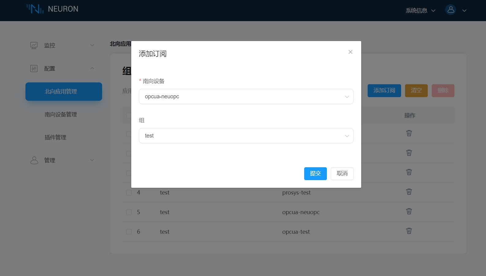

# Ignition 连接示例

Ignition 是由 Inductive Automation 公司开发的一款工业应用平台。它被设计用于帮助工业组织在整个企业中实现数字化转型。Ignition 提供了一系列的工具和服务，包括 SCADA 系统、工业信息管理（MES）、IIoT、机器学习等。

您可通过 Neuron SparkPlugB 连接 Ignition 平台。

## 安装 Ignition

1. 从 Ignition 官网下载 Ignition 安装包，按照官方文档进行安装。

2. 从 Ignition 官网下载 Designer Launcher 安装包，按照官方文档进行安装。

3. 从 Ignition 官网下载第三方模块 MQTT-Engine-signed.modl。登录 Ignition web 管理页面，进入 **Config** -> **Modules** 页面，点击 **Install or Upgrade a Module...**，安装 **MQTT-Engine-signed**。

4. 本机启动一个 EMQX broker 实例，启动命令：`./bin/emqx start`。

5. 打开 **Config** -> **MQTT ENGINE/Setting** -> **Servers** -> **Setting**，点击 **Create new MQTT Server Setting...** 创建一个 **Name** 为 EMQX 的连接， **URL** 设置为 **tcp://localhost:1883**，点击 **Save Changes** 保存设置。

## 配置 Neuron

1. 在 Neuron **北向应用** 中添加一个 Sparkplug B 应用。

2. 在 **应用配置** 中填写 **客户端 ID**、**组 ID**、**节点 ID**、**服务器地址** 和 **服务器端口**, 点击 **提交** 并启动连接。

3. 在 **组列表** 中添需要订阅的 **南向设备** 和 **组**。

## 查看转发数据

1. 打开 Desiger Launcher 桌面图标，点击 **Add Designer** 添加安装好的 Ignition 服务器 URL。

2. 连接到 Ignition 服务器后，打开 **samplequickstart**。

3. 在软件界面中找到 **Tag Browser** 并选择 **MQTT Engine**，展开 **Edge Nodes\Factory1\Neuron1\opcua-kepserver\test** 可以看到即时上传的测点数据。
