# 采集 PLC 数据

本教程介绍使用 Neuron 通过 ADS 协议采集倍福 PLC 上不同地址区域的数据。

## 环境介绍

本教程使用了在同一个局域网下的 2 台机器：

- 机器 1 为 Linux 系统，安装了 Neuron 软件；您可以查阅[安装指南]以获取详细的 Neuron 安装说明。
- 机器 2 为 Windows 系统，安装了倍福 TwinCAT 3 软件；您可以前往 [Beckhoff TwinCAT 网站]下载和安装 TwinCAT 。

|          | 机器 1            | 机器 2              |
| -------- | ----------------- | ------------------- |
| 操作系统 | Linux             | Windows             |
| IP 地址   | 192.168.1.152     | 192.168.1.107       |
| amsnetid | 192.168.1.152.1.1 | 192.168.1.107.1.1   |
| 安装软件 | Neuron            | TwinCAT             |
| 网络     | 连通              | 连通                |

## 配置 TwinCAT

在 Neuron 和倍福 PLC 之间建立通讯，添加路由、查找 AMS Net ID、AMS port、以及变量的 index group 和 index offset。

### 在 TwinCAT 中添加路由

打开 **TwinCAT Static Routes** 对话框。

<figure align="center">
  
  <figcaption align = "center">
    <b>Fig.1 - 打开 TwinCAT static routes 对话框</b>
  </figcaption>
</figure>

点击**添加**。

<figure align="center">
  
  <figcaption align = "center">
    <b>Fig.2 - TwinCAT static routes 对话框</b>
  </figcaption>
</figure>

输入下图红框内容，其中 **AmsNetId**，为 Neuron 所在机器与倍福 PLC 相连的网卡的 IP 地址后加上 ".1.1" 。

<figure align="center">
  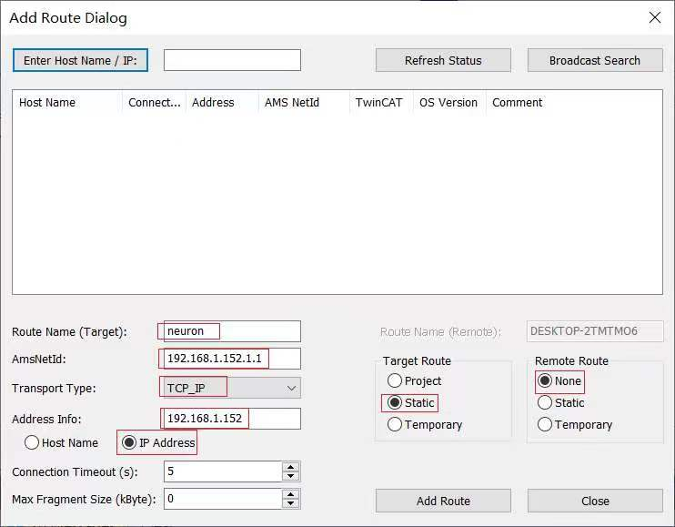
  <figcaption align = "center">
    <b>Fig.3 - TwinCAT add route 对话框</b>
  </figcaption>
</figure>

添加成功后，页面如下：

<figure align="center">
  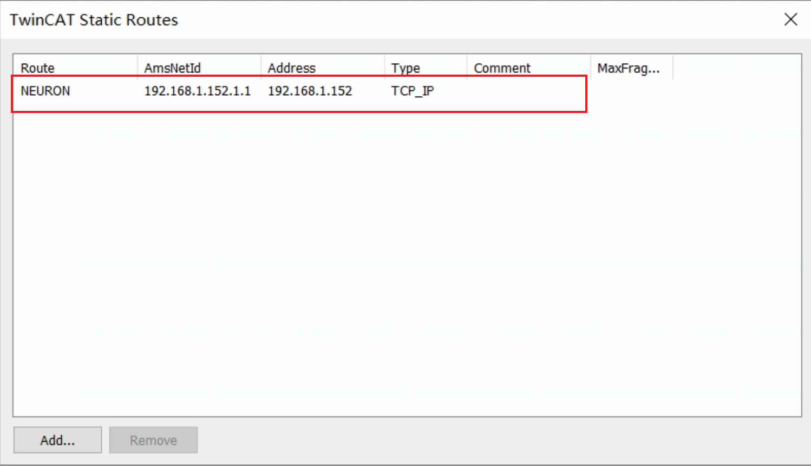
  <figcaption align = "center">
    <b>Fig.4 - 更新后的 TwinCAT static routes 对话框</b>
  </figcaption>
</figure>

### 查看 AMS Net ID 及 AMS Port

打开 **TwinCAT System** 对话框查看 AMS Net ID。

<figure align="center">
  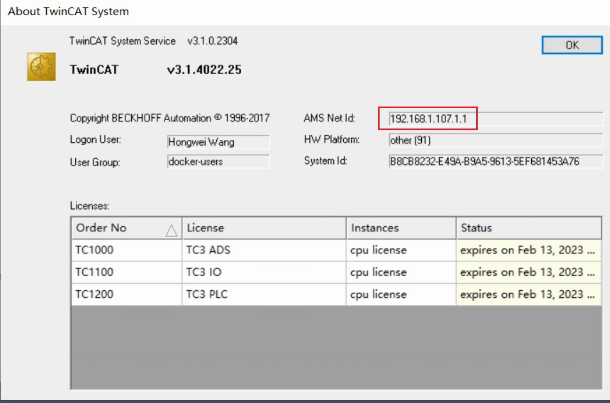
  <figcaption align = "center">
    <b>Fig.5 - TwinCAT system 对话框</b>
  </figcaption>
</figure>

TwinCAT PLC 默认端口号为 851。

<figure align="center">
  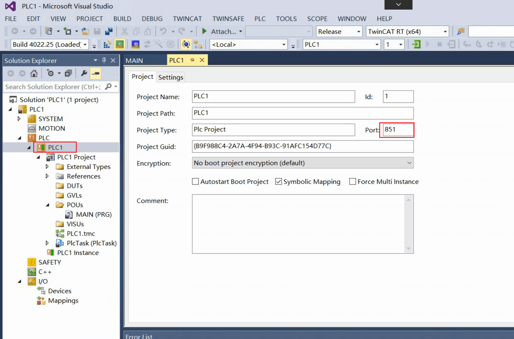
  <figcaption align = "center">
    <b>Fig.6 - TwinCAT PLC 项目页</b>
  </figcaption>
</figure>

### 查看变量 index group 和 index offset

在本教程中我们使用以下 TwinCAT PLC 程序，其定义了足够的变量进行演示。

<figure align="center">
  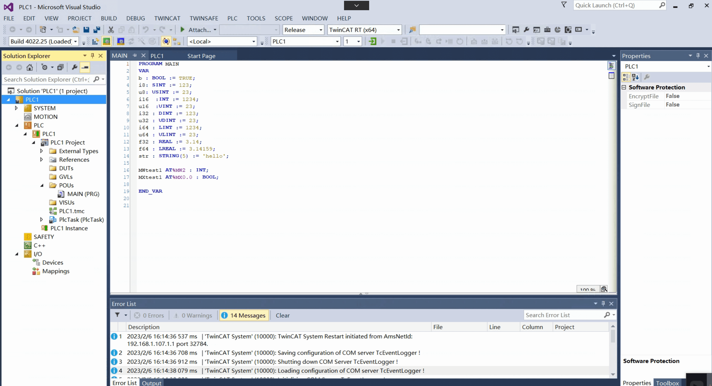
  <figcaption align = "center">
    <b>Fig.7 - TwinCAT PLC 项目主程序</b>
  </figcaption>
</figure>

#### 查看 index group

[Beckhoff index group/offset 页面]列出了访问 PLC 内存范围所需的 index group。
对于 %MW 域，index group 为 0x4020 。对于 %MX 域，index group 为 0x4021。
对于主程序中定义的变量 *b、i8、u8、i16、u16、i32、u32、i64、u64、f32、f64、str*，index group 为 0x4040。

<figure align="center">
  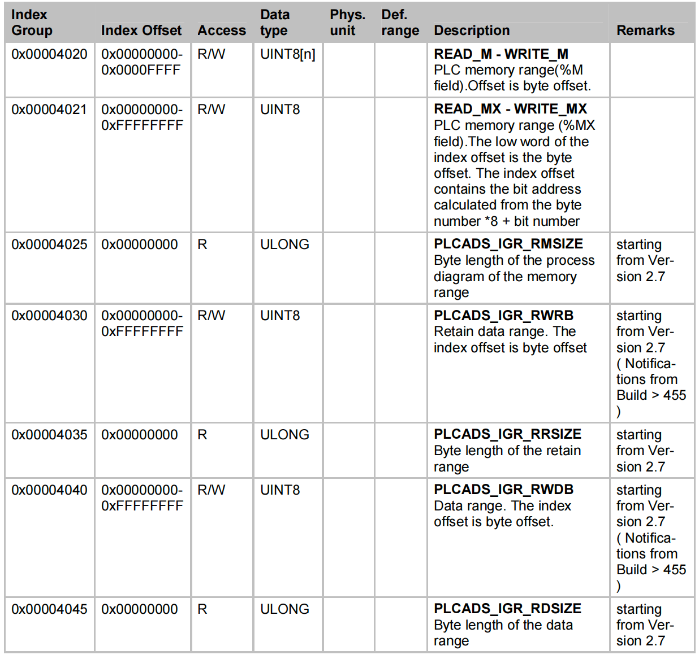
  <figcaption align = "center">
    <b>Fig.8 - TwinCAT index group 表</b>
  </figcaption>
</figure>

#### 查看 index offset

在 TwinCAT 中打开 PLC 的数据区 (data area) 页面可以查看变量的 index offset。

<figure align="center">
  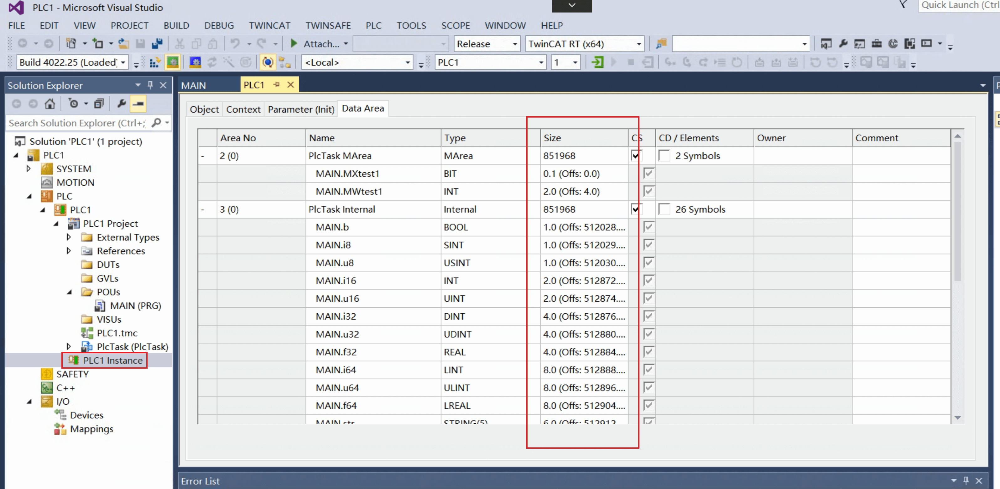
  <figcaption align = "center">
    <b>Fig.9 - TwinCAT PLC 数据区页面</b>
  </figcaption>
</figure>

#### 通过 TPY 文件查找 index group/offset

您也可通过 TPY 文件找到 index group 和 index offset。

首先请确认 **TPY 文件** 已被启用。

<figure align="center">
  
  <figcaption align = "center">
    <b>Fig.10 - TwinCAT PLC 项目配置页面</b>
  </figcaption>
</figure>

在项目路径打开 TPY 文件。

<figure align="center">
  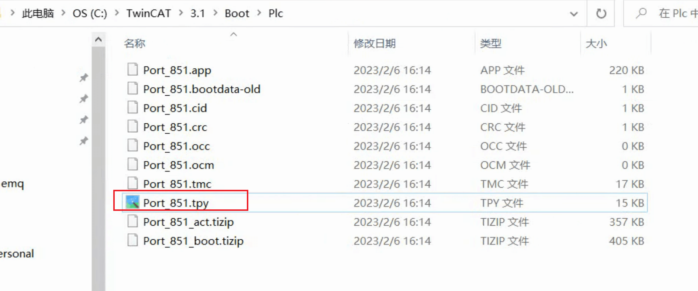
  <figcaption align = "center">
    <b>Fig.11 - TwinCAT PLC 项目 TPY 文件路径</b>
  </figcaption>
</figure>

TPY 文件中包含了 PLC 程序中所有变量的 index group 和 index offset 信息：

<figure align="center">
  
  <figcaption align = "center">
    <b>Fig.12 - TwinCAT PLC 项目 TPY 文件内容</b>
  </figcaption>
</figure>

## 配置 Neuron

### 添加 ADS 南向节点

在 Neuron 仪表板中，点击**南向设备管理 -> 添加设备**来添加一个 ADS 节点。

<figure align="center">
  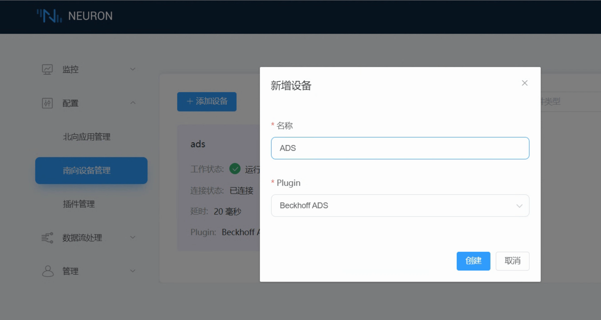
  <figcaption align = "center">
    <b>Fig.13 - 在 Neuron 仪表板中添加 ADS 节点</b>
  </figcaption>
</figure>

### 配置 ADS 节点

请点击节点配置图标来配置新创建的 ADS 节点。

<figure align="center">
  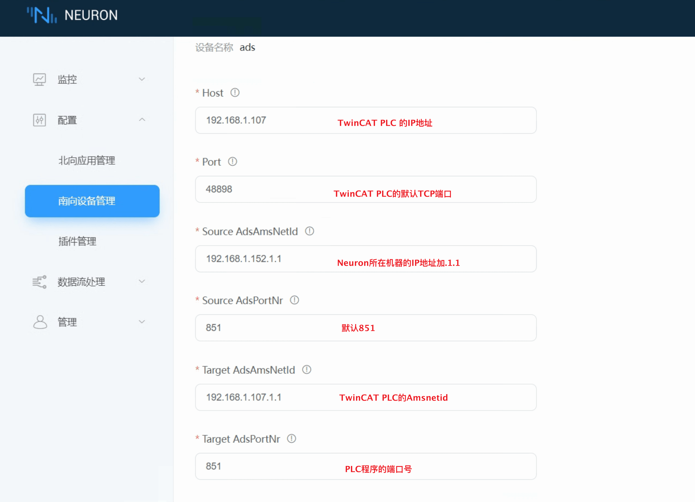
  <figcaption align = "center">
    <b>Fig.14 - 在 Neuron 仪表板中配置 ADS 节点</b>
  </figcaption>
</figure>

### 为 ADS 节点添加点位

对于前文提及的 TwinCAT PLC 程序中的每个变量，我们将在 Neuron ADS 节点上添加一个相应的点位。
[Beckhoff 数据类型]页面给出了数据类型的长度，结合程序源代码可以得出点位的数据类型。

<figure align="center">
  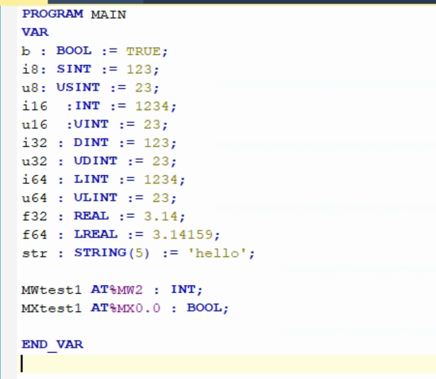
  <figcaption align = "center">
    <b>Fig.15 - TwinCAT PLC 主程序</b>
  </figcaption>
</figure>

对于点位地址，index offset 可在 TwinCAT PLC 数据区页面查看。

<figure align="center">
  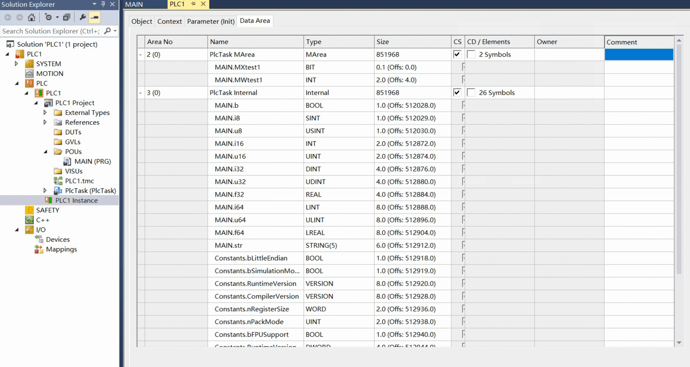
  <figcaption align = "center">
    <b>Fig.16 - TwinCAT PLC 数据区页面</b>
  </figcaption>
</figure>

下图展示了我们往 ADS 节点添加的所有点位。

<figure align="center">
  
  <figcaption align = "center">
    <b>Fig.17 - Neuron 仪表板中显示 ADS 节点点位</b>
  </figcaption>
</figure>

## 数据监控

### 读点位

当 TwinCAT PLC 处于运行模式后，我们可以在界面中看到所有变量值。

<figure align="center">
  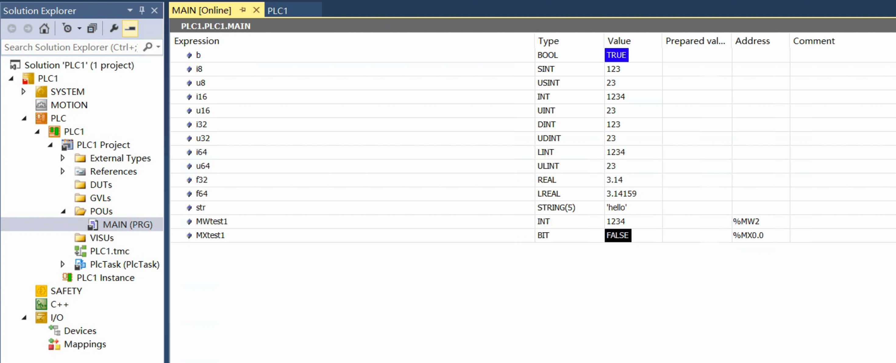
  <figcaption align = "center">
    <b>Fig.18 - TwinCAT 运行模式中的变量值</b>
  </figcaption>
</figure>

在 Neuron 仪表板中，点击**监控 -> 数据监控**查看变量值读取正确。

<figure align="center">
  
  <figcaption align = "center">
    <b>Fig.19 - Neuron 数据监控标签页</b>
  </figcaption>
</figure>

### 写点位

在 Neuron **数据监控**标签页，在 *main.MXtest1* 点位上点击 **Write** 写入 true。

<figure align="center">
  
  <figcaption align = "center">
    <b>Fig.20 - Neuron 写点位 main.MXtest1</b>
  </figcaption>
</figure>

在 *main.MWtest1* 点位上点击 **Write** 写入值 *6666*。

<figure align="center">
  
  <figcaption align = "center">
    <b>Fig.21 - Neuron 写点位 main.MWtest1</b>
  </figcaption>
</figure>

写入成功后，可以在 TwinCAT 中查看变量值更新了。

<figure align="center">
  
  <figcaption align = "center">
    <b>Fig.22 - TwinCAT 中更新后的变量值</b>
  </figcaption>
</figure>

[安装指南]: ../../../quick-start/installation.md
[Beckhoff TwinCAT 网站]: https://www.beckhoff.com/en-us/products/automation/twincat
[Beckhoff index group/offset 页面]: https://infosys.beckhoff.com/english.php?content=../content/1033/tcadscommon/12495369867.html
[Beckhoff 数据类型]: https://infosys.beckhoff.com/english.php?content=../content/1033/tc3_plc_intro/2529399691.html
