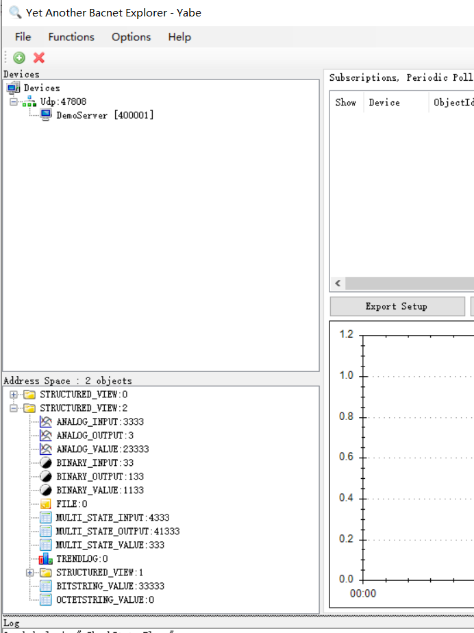

# Yabe 模拟器连接示例

本文将使用 BACnet/IP 插件连接 Yabe 模拟器，实现读写 BACnet 模拟设备的点位值。确保  BACnet/IP 插件和 Yabe 模拟器网络联通。

Yabe（Yet Another Bacnet Explorer）是一款图形界面应用程序，可以用于浏览 BACnet 设备。目前支持 BACnet IPv4 & IPv6、BACnet MSTP、BACnet PTP、BACnet Ethernet、BACnet SecureConnect。支持 read、write、read multiple、write multiple、iam、whois、 subscribeCOV、notify、WriteFile、ReadFile 等功能。同时还包括三个演示服务器应用：

- 通用服务器
- 壁挂式房间控制器模拟器
- 天气服务器

## 安装 Yabe 模拟器

从 [Yabe](https://sourceforge.net/projects/yetanotherbacnetexplorer/) 页面下载并安装 Yabe 模拟器。

## 启用 BACnet/IP 协议

安装完成后，启动 Yabe 程序。

* 进入菜单 **Functions -> Add device**。
* 在弹出窗口的 **BACnet/IP V4 & V6 over Udp** 区域，选择可以与 BACnet 设备通讯的网卡 IP，端口根据实际情况填写，本示例保持默认值即可，然后点击 **Start** 按钮。
* 打开 DemoServer 程序，Yabe 程序会发现 DemoServer 并显示设备 ID、IP 和 PORT，如下图所示。


* 在窗口的 Devices 区域，点击发现的 DemoServer，窗口的 Address Space 区域会显示节点信息，继续点击 STRUCTURED_VIEW:2，会看到 DemoServer 模拟设备支持的具体对象节点，如下图所示。



* 在 Address Space 区域点击具体 Object 节点，在 Properties 可以查看节点的属性。修改属性 Present Value 并按下回车，可以对节点参数值进行修改，如下图所示。


* 在需要监听变化的 Object 节点点击右键唤出菜单，然后点击 **Subscribe** 菜单项，可以对参数值进行实时监控，如下图所示。


## 配置 Neuron 配置

* 在 **南向设备** 中 点击 **添加设备**，选择 **BACnet/IP** 插件来创建一个连接 Yabe DemoServer 的节点。
* 创建好节点后，点击 **设备配置** 进入设备配置页面，根据实际情况配置节点信息，
	* **设备 IP 地址**：设备的 IP 地址
	* **设备端口**：设备的端口，默认为 47808
* 在创建好的南向设备节点中，创建组，并在组下创建点位。

## 数据监控

完成点位的配置后，您可点击 **监控** -> **数据监控**查看设备信息以及反控设备，具体可参考[数据监控](../../../../usage/monitoring.md)。


##  DemoServer 配置文件
Yabe 默认的 DemoServer 配置文件包含节点较少，本示例对配置文件进行了修改，具体文件如下所示。新建 `DeviceStorage.Xml` 文件，拷贝配置内容，替换 Yabe 安装目录 `C:\Program Files\yabe\AddOn` 下同名文件，重启 DemoServer 即可。

```xml
<?xml version="1.0"?>
<DeviceStorage xmlns:xsi="http://www.w3.org/2001/XMLSchema-instance" xmlns:xsd="http://www.w3.org/2001/XMLSchema">
  <Objects>
    <Object Type="OBJECT_DEVICE" Instance="400001">
      <Properties>
        <Property Id="PROP_OBJECT_IDENTIFIER" Tag="BACNET_APPLICATION_TAG_OBJECT_ID">
          <Value>OBJECT_DEVICE:400001</Value>
        </Property>
        <Property Id="PROP_OBJECT_NAME" Tag="BACNET_APPLICATION_TAG_CHARACTER_STRING">
          <Value>DemoServer</Value>
        </Property>
        <Property Id="PROP_OBJECT_TYPE" Tag="BACNET_APPLICATION_TAG_ENUMERATED">
          <Value>8</Value>
        </Property>
        <Property Id="PROP_SYSTEM_STATUS" Tag="BACNET_APPLICATION_TAG_ENUMERATED">
          <Value>0</Value>
        </Property>
        <Property Id="PROP_VENDOR_NAME" Tag="BACNET_APPLICATION_TAG_CHARACTER_STRING">
          <Value>Yabe</Value>
        </Property>
        <Property Id="PROP_VENDOR_IDENTIFIER" Tag="BACNET_APPLICATION_TAG_UNSIGNED_INT">
          <Value>260</Value>
        </Property>
        <Property Id="PROP_MODEL_NAME" Tag="BACNET_APPLICATION_TAG_CHARACTER_STRING">
          <Value>GNU</Value>
        </Property>
        <Property Id="PROP_FIRMWARE_REVISION" Tag="BACNET_APPLICATION_TAG_CHARACTER_STRING">
          <Value>1.0.3</Value>
        </Property>
        <Property Id="PROP_APPLICATION_SOFTWARE_VERSION" Tag="BACNET_APPLICATION_TAG_CHARACTER_STRING">
          <Value>1.0.3</Value>
        </Property>
        <Property Id="PROP_PROTOCOL_VERSION" Tag="BACNET_APPLICATION_TAG_UNSIGNED_INT">
          <Value>1</Value>
        </Property>
        <Property Id="PROP_PROTOCOL_REVISION" Tag="BACNET_APPLICATION_TAG_UNSIGNED_INT">
          <Value>14</Value>
        </Property>
        <Property Id="PROP_PROTOCOL_SERVICES_SUPPORTED" Tag="BACNET_APPLICATION_TAG_BIT_STRING">
          <Value>010001110000101111001000001010001010101000</Value>
        </Property>
        <Property Id="PROP_PROTOCOL_OBJECT_TYPES_SUPPORTED" Tag="BACNET_APPLICATION_TAG_BIT_STRING">
          <Value>0000000010101010000000000000000100000000111110111111111</Value>
        </Property>
        <Property Id="PROP_OBJECT_LIST" Tag="BACNET_APPLICATION_TAG_OBJECT_ID">
        </Property>
        <Property Id="PROP_MAX_APDU_LENGTH_ACCEPTED" Tag="BACNET_APPLICATION_TAG_UNSIGNED_INT">
          <Value>1476</Value>
        </Property>
        <Property Id="PROP_SEGMENTATION_SUPPORTED" Tag="BACNET_APPLICATION_TAG_ENUMERATED">
          <Value>3</Value>
        </Property>
        <Property Id="PROP_APDU_TIMEOUT" Tag="BACNET_APPLICATION_TAG_UNSIGNED_INT">
          <Value>3000</Value>
        </Property>
        <Property Id="PROP_NUMBER_OF_APDU_RETRIES" Tag="BACNET_APPLICATION_TAG_UNSIGNED_INT">
          <Value>3</Value>
        </Property>
        <Property Id="PROP_DEVICE_ADDRESS_BINDING" Tag="BACNET_APPLICATION_TAG_NULL" />
        <Property Id="PROP_DATABASE_REVISION" Tag="BACNET_APPLICATION_TAG_UNSIGNED_INT">
          <Value>0</Value>
        </Property>
        <Property Id="PROP_DESCRIPTION" Tag="BACNET_APPLICATION_TAG_CHARACTER_STRING">
          <Value>Demo Server</Value>
        </Property>
        <Property Id="PROP_LOCAL_TIME" Tag="BACNET_APPLICATION_TAG_TIME">
          <Value>01-01-0001 00:00:00</Value>
        </Property>
        <Property Id="PROP_UTC_OFFSET" Tag="BACNET_APPLICATION_TAG_SIGNED_INT">
          <Value>0</Value>
        </Property>
        <Property Id="PROP_LOCAL_DATE" Tag="BACNET_APPLICATION_TAG_DATE">
          <Value>01-01-0001 00:00:00</Value>
        </Property>
        <Property Id="PROP_DAYLIGHT_SAVINGS_STATUS" Tag="BACNET_APPLICATION_TAG_BOOLEAN">
          <Value>False</Value>
        </Property>
        <Property Id="PROP_LOCATION" Tag="BACNET_APPLICATION_TAG_CHARACTER_STRING">
          <Value>EU</Value>
        </Property>
        <Property Id="PROP_ACTIVE_COV_SUBSCRIPTIONS" Tag="BACNET_APPLICATION_TAG_NULL" />
        <Property Id="PROP_STRUCTURED_OBJECT_LIST" Tag="BACNET_APPLICATION_TAG_OBJECT_ID">
          <Value>OBJECT_STRUCTURED_VIEW:0</Value>
          <Value>OBJECT_STRUCTURED_VIEW:2</Value>
        </Property>
      </Properties>
    </Object>
    <Object Type="OBJECT_BINARY_INPUT" Instance="33">
	
      <Properties>
        <Property Id="PROP_DESCRIPTION" Tag="BACNET_APPLICATION_TAG_CHARACTER_STRING">
          <Value>This is the green binary_input description</Value>
        </Property>
        <Property Id="PROP_EVENT_STATE" Tag="BACNET_APPLICATION_TAG_ENUMERATED">
          <Value>0</Value>
        </Property>
        <Property Id="PROP_OBJECT_IDENTIFIER" Tag="BACNET_APPLICATION_TAG_OBJECT_ID">
          <Value>OBJECT_BINARY_INPUT:33</Value>
        </Property>
        <Property Id="PROP_OBJECT_NAME" Tag="BACNET_APPLICATION_TAG_CHARACTER_STRING">
          <Value>green</Value>
        </Property>
        <Property Id="PROP_OBJECT_TYPE" Tag="BACNET_APPLICATION_TAG_ENUMERATED">
          <Value>3</Value>
        </Property>
        <Property Id="PROP_OUT_OF_SERVICE" Tag="BACNET_APPLICATION_TAG_BOOLEAN">
          <Value>False</Value>
        </Property>
        <Property Id="PROP_POLARITY" Tag="BACNET_APPLICATION_TAG_ENUMERATED">
          <Value>0</Value>
        </Property>
        <Property Id="PROP_PRESENT_VALUE" Tag="BACNET_APPLICATION_TAG_ENUMERATED">
          <Value>1</Value>
        </Property>
        <Property Id="PROP_RELIABILITY" Tag="BACNET_APPLICATION_TAG_ENUMERATED">
          <Value>0</Value>
        </Property>
        <Property Id="PROP_STATUS_FLAGS" Tag="BACNET_APPLICATION_TAG_BIT_STRING">
          <Value>0000</Value>
        </Property>
      </Properties>
    </Object>
	 <Object Type="OBJECT_BINARY_OUTPUT" Instance="133">
	
      <Properties>
        <Property Id="PROP_DESCRIPTION" Tag="BACNET_APPLICATION_TAG_CHARACTER_STRING">
          <Value>This is the green binary_output description</Value>
        </Property>
        <Property Id="PROP_EVENT_STATE" Tag="BACNET_APPLICATION_TAG_ENUMERATED">
          <Value>0</Value>
        </Property>
        <Property Id="PROP_OBJECT_IDENTIFIER" Tag="BACNET_APPLICATION_TAG_OBJECT_ID">
          <Value>OBJECT_BINARY_OUTPUT:133</Value>
        </Property>
        <Property Id="PROP_OBJECT_NAME" Tag="BACNET_APPLICATION_TAG_CHARACTER_STRING">
          <Value>green-out</Value>
        </Property>
        <Property Id="PROP_OBJECT_TYPE" Tag="BACNET_APPLICATION_TAG_ENUMERATED">
          <Value>4</Value>
        </Property>
        <Property Id="PROP_OUT_OF_SERVICE" Tag="BACNET_APPLICATION_TAG_BOOLEAN">
          <Value>False</Value>
        </Property>
        <Property Id="PROP_POLARITY" Tag="BACNET_APPLICATION_TAG_ENUMERATED">
          <Value>0</Value>
        </Property>
        <Property Id="PROP_PRESENT_VALUE" Tag="BACNET_APPLICATION_TAG_ENUMERATED">
          <Value>1</Value>
        </Property>
        <Property Id="PROP_RELIABILITY" Tag="BACNET_APPLICATION_TAG_ENUMERATED">
          <Value>0</Value>
        </Property>
        <Property Id="PROP_STATUS_FLAGS" Tag="BACNET_APPLICATION_TAG_BIT_STRING">
          <Value>0000</Value>
        </Property>
      </Properties>
    </Object>
		 <Object Type="OBJECT_BINARY_VALUE" Instance="1133">
	
      <Properties>
        <Property Id="PROP_DESCRIPTION" Tag="BACNET_APPLICATION_TAG_CHARACTER_STRING">
          <Value>This is the green binary_value description</Value>
        </Property>
        <Property Id="PROP_EVENT_STATE" Tag="BACNET_APPLICATION_TAG_ENUMERATED">
          <Value>0</Value>
        </Property>
        <Property Id="PROP_OBJECT_IDENTIFIER" Tag="BACNET_APPLICATION_TAG_OBJECT_ID">
          <Value>OBJECT_BINARY_OUTPUT:133</Value>
        </Property>
        <Property Id="PROP_OBJECT_NAME" Tag="BACNET_APPLICATION_TAG_CHARACTER_STRING">
          <Value>green-value</Value>
        </Property>
        <Property Id="PROP_OBJECT_TYPE" Tag="BACNET_APPLICATION_TAG_ENUMERATED">
          <Value>5</Value>
        </Property>
        <Property Id="PROP_OUT_OF_SERVICE" Tag="BACNET_APPLICATION_TAG_BOOLEAN">
          <Value>False</Value>
        </Property>
        <Property Id="PROP_POLARITY" Tag="BACNET_APPLICATION_TAG_ENUMERATED">
          <Value>0</Value>
        </Property>
        <Property Id="PROP_PRESENT_VALUE" Tag="BACNET_APPLICATION_TAG_ENUMERATED">
          <Value>1</Value>
        </Property>
        <Property Id="PROP_RELIABILITY" Tag="BACNET_APPLICATION_TAG_ENUMERATED">
          <Value>0</Value>
        </Property>
        <Property Id="PROP_STATUS_FLAGS" Tag="BACNET_APPLICATION_TAG_BIT_STRING">
          <Value>0000</Value>
        </Property>
      </Properties>
    </Object>
    <Object Type="OBJECT_ANALOG_OUTPUT" Instance="3">
      <Properties>
        <Property Id="PROP_DESCRIPTION" Tag="BACNET_APPLICATION_TAG_CHARACTER_STRING">
          <Value>This is the red analog_output description</Value>
        </Property>
        <Property Id="PROP_EVENT_STATE" Tag="BACNET_APPLICATION_TAG_ENUMERATED">
          <Value>0</Value>
        </Property>
        <Property Id="PROP_OBJECT_IDENTIFIER" Tag="BACNET_APPLICATION_TAG_OBJECT_ID">
          <Value>OBJECT_ANALOG_OUTPUT:3</Value>
        </Property>
        <Property Id="PROP_OBJECT_NAME" Tag="BACNET_APPLICATION_TAG_CHARACTER_STRING">
          <Value>red</Value>
        </Property>
        <Property Id="PROP_OBJECT_TYPE" Tag="BACNET_APPLICATION_TAG_ENUMERATED">
          <Value>1</Value>
        </Property>
        <Property Id="PROP_OUT_OF_SERVICE" Tag="BACNET_APPLICATION_TAG_BOOLEAN">
          <Value>False</Value>
        </Property>
        <Property Id="PROP_PRESENT_VALUE" Tag="BACNET_APPLICATION_TAG_REAL">
          <Value>0.03</Value>
        </Property>
        <Property Id="PROP_PRIORITY_ARRAY" Tag="BACNET_APPLICATION_TAG_NULL">
          <Value />
          <Value />
          <Value />
          <Value />
          <Value />
          <Value />
          <Value />
          <Value />
          <Value />
          <Value />
          <Value />
          <Value />
          <Value />
          <Value />
          <Value />
          <Value />
        </Property>
        <Property Id="PROP_RELIABILITY" Tag="BACNET_APPLICATION_TAG_ENUMERATED">
          <Value>0</Value>
        </Property>
        <Property Id="PROP_RELINQUISH_DEFAULT" Tag="BACNET_APPLICATION_TAG_REAL">
          <Value>0</Value>
        </Property>
        <Property Id="PROP_STATUS_FLAGS" Tag="BACNET_APPLICATION_TAG_BIT_STRING">
          <Value>0000</Value>
        </Property>
        <Property Id="PROP_UNITS" Tag="BACNET_APPLICATION_TAG_ENUMERATED">
          <Value>64</Value>
        </Property>
      </Properties>
    </Object>
    <Object Type="OBJECT_ANALOG_INPUT" Instance="3333">
      <Properties>
        <Property Id="PROP_COV_INCREMENT" Tag="BACNET_APPLICATION_TAG_REAL">
          <Value>1.0</Value>
        </Property>
        <Property Id="PROP_DESCRIPTION" Tag="BACNET_APPLICATION_TAG_CHARACTER_STRING">
          <Value>This is the yellow analog_input description</Value>
        </Property>
        <Property Id="PROP_EVENT_STATE" Tag="BACNET_APPLICATION_TAG_ENUMERATED">
          <Value>0</Value>
        </Property>
        <Property Id="PROP_OBJECT_IDENTIFIER" Tag="BACNET_APPLICATION_TAG_OBJECT_ID">
          <Value>OBJECT_ANALOG_INPUT:3333</Value>
        </Property>
        <Property Id="PROP_OBJECT_NAME" Tag="BACNET_APPLICATION_TAG_CHARACTER_STRING">
          <Value>yellow</Value>
        </Property>
        <Property Id="PROP_OBJECT_TYPE" Tag="BACNET_APPLICATION_TAG_ENUMERATED">
          <Value>0</Value>
        </Property>
        <Property Id="PROP_OUT_OF_SERVICE" Tag="BACNET_APPLICATION_TAG_BOOLEAN">
          <Value>False</Value>
        </Property>
        <Property Id="PROP_PRESENT_VALUE" Tag="BACNET_APPLICATION_TAG_REAL">
          <Value>0.23</Value>
        </Property>
        <Property Id="PROP_RELIABILITY" Tag="BACNET_APPLICATION_TAG_ENUMERATED">
          <Value>0</Value>
        </Property>
        <Property Id="PROP_STATUS_FLAGS" Tag="BACNET_APPLICATION_TAG_BIT_STRING">
          <Value>0000</Value>
        </Property>
        <Property Id="PROP_UNITS" Tag="BACNET_APPLICATION_TAG_ENUMERATED">
          <Value>64</Value>
        </Property>
      </Properties>
    </Object>
	<Object Type="OBJECT_ANALOG_VALUE" Instance="23333">
      <Properties>
        <Property Id="PROP_COV_INCREMENT" Tag="BACNET_APPLICATION_TAG_REAL">
          <Value>1.0</Value>
        </Property>
        <Property Id="PROP_DESCRIPTION" Tag="BACNET_APPLICATION_TAG_CHARACTER_STRING">
          <Value>This is the yellow analog_value description</Value>
        </Property>
        <Property Id="PROP_EVENT_STATE" Tag="BACNET_APPLICATION_TAG_ENUMERATED">
          <Value>0</Value>
        </Property>
        <Property Id="PROP_OBJECT_IDENTIFIER" Tag="BACNET_APPLICATION_TAG_OBJECT_ID">
          <Value>OBJECT_ANALOG_VALUE:23333</Value>
        </Property>
        <Property Id="PROP_OBJECT_NAME" Tag="BACNET_APPLICATION_TAG_CHARACTER_STRING">
          <Value>yellow-v</Value>
        </Property>
        <Property Id="PROP_OBJECT_TYPE" Tag="BACNET_APPLICATION_TAG_ENUMERATED">
          <Value>2</Value>
        </Property>
        <Property Id="PROP_OUT_OF_SERVICE" Tag="BACNET_APPLICATION_TAG_BOOLEAN">
          <Value>False</Value>
        </Property>
        <Property Id="PROP_PRESENT_VALUE" Tag="BACNET_APPLICATION_TAG_REAL">
          <Value>1.23</Value>
        </Property>
        <Property Id="PROP_RELIABILITY" Tag="BACNET_APPLICATION_TAG_ENUMERATED">
          <Value>0</Value>
        </Property>
        <Property Id="PROP_STATUS_FLAGS" Tag="BACNET_APPLICATION_TAG_BIT_STRING">
          <Value>0000</Value>
        </Property>
        <Property Id="PROP_UNITS" Tag="BACNET_APPLICATION_TAG_ENUMERATED">
          <Value>64</Value>
        </Property>
      </Properties>
    </Object>
    <Object Type="OBJECT_MULTI_STATE_VALUE" Instance="333">
      <Properties>
        <Property Id="PROP_DESCRIPTION" Tag="BACNET_APPLICATION_TAG_CHARACTER_STRING">
          <Value>This is the blue multi_state_value description</Value>
        </Property>
        <Property Id="PROP_EVENT_STATE" Tag="BACNET_APPLICATION_TAG_ENUMERATED">
          <Value>0</Value>
        </Property>
        <Property Id="PROP_NUMBER_OF_STATES" Tag="BACNET_APPLICATION_TAG_UNSIGNED_INT">
          <Value>3</Value>
        </Property>
        <Property Id="PROP_OBJECT_IDENTIFIER" Tag="BACNET_APPLICATION_TAG_OBJECT_ID">
          <Value>OBJECT_MULTI_STATE_VALUE:333</Value>
        </Property>
        <Property Id="PROP_OBJECT_NAME" Tag="BACNET_APPLICATION_TAG_CHARACTER_STRING">
          <Value>blue</Value>
        </Property>
        <Property Id="PROP_OBJECT_TYPE" Tag="BACNET_APPLICATION_TAG_ENUMERATED">
          <Value>19</Value>
        </Property>
        <Property Id="PROP_OUT_OF_SERVICE" Tag="BACNET_APPLICATION_TAG_BOOLEAN">
          <Value>False</Value>
        </Property>
        <Property Id="PROP_PRESENT_VALUE" Tag="BACNET_APPLICATION_TAG_UNSIGNED_INT">
          <Value>25</Value>
        </Property>
        <Property Id="PROP_PRIORITY_ARRAY" Tag="BACNET_APPLICATION_TAG_NULL">
          <Value />
          <Value />
          <Value />
          <Value />
          <Value />
          <Value />
          <Value />
          <Value />
          <Value />
          <Value />
          <Value />
          <Value />
          <Value />
          <Value />
          <Value />
          <Value />
        </Property>
        <Property Id="PROP_RELINQUISH_DEFAULT" Tag="BACNET_APPLICATION_TAG_UNSIGNED_INT">
          <Value>0</Value>
        </Property>
        <Property Id="PROP_STATE_TEXT" Tag="BACNET_APPLICATION_TAG_CHARACTER_STRING">
          <Value>one</Value>
          <Value>two</Value>
          <Value>three</Value>
        </Property>
        <Property Id="PROP_STATUS_FLAGS" Tag="BACNET_APPLICATION_TAG_BIT_STRING">
          <Value>0000</Value>
        </Property>
      </Properties>
    </Object>
	<Object Type="OBJECT_MULTI_STATE_INPUT" Instance="4333">
      <Properties>
        <Property Id="PROP_DESCRIPTION" Tag="BACNET_APPLICATION_TAG_CHARACTER_STRING">
          <Value>This is the blue multi_state_value description</Value>
        </Property>
        <Property Id="PROP_EVENT_STATE" Tag="BACNET_APPLICATION_TAG_ENUMERATED">
          <Value>0</Value>
        </Property>
        <Property Id="PROP_NUMBER_OF_STATES" Tag="BACNET_APPLICATION_TAG_UNSIGNED_INT">
          <Value>3</Value>
        </Property>
        <Property Id="PROP_OBJECT_IDENTIFIER" Tag="BACNET_APPLICATION_TAG_OBJECT_ID">
          <Value>OBJECT_MULTI_STATE_INPUT:3433</Value>
        </Property>
        <Property Id="PROP_OBJECT_NAME" Tag="BACNET_APPLICATION_TAG_CHARACTER_STRING">
          <Value>blue-i</Value>
        </Property>
        <Property Id="PROP_OBJECT_TYPE" Tag="BACNET_APPLICATION_TAG_ENUMERATED">
          <Value>13</Value>
        </Property>
        <Property Id="PROP_OUT_OF_SERVICE" Tag="BACNET_APPLICATION_TAG_BOOLEAN">
          <Value>False</Value>
        </Property>
        <Property Id="PROP_PRESENT_VALUE" Tag="BACNET_APPLICATION_TAG_UNSIGNED_INT">
          <Value>24</Value>
        </Property>
        <Property Id="PROP_PRIORITY_ARRAY" Tag="BACNET_APPLICATION_TAG_NULL">
          <Value />
          <Value />
          <Value />
          <Value />
          <Value />
          <Value />
          <Value />
          <Value />
          <Value />
          <Value />
          <Value />
          <Value />
          <Value />
          <Value />
          <Value />
          <Value />
        </Property>
        <Property Id="PROP_RELINQUISH_DEFAULT" Tag="BACNET_APPLICATION_TAG_UNSIGNED_INT">
          <Value>0</Value>
        </Property>
        <Property Id="PROP_STATE_TEXT" Tag="BACNET_APPLICATION_TAG_CHARACTER_STRING">
          <Value>one</Value>
          <Value>two</Value>
          <Value>three</Value>
        </Property>
        <Property Id="PROP_STATUS_FLAGS" Tag="BACNET_APPLICATION_TAG_BIT_STRING">
          <Value>0000</Value>
        </Property>
      </Properties>
    </Object>
		<Object Type="OBJECT_MULTI_STATE_OUTPUT" Instance="41333">
      <Properties>
        <Property Id="PROP_DESCRIPTION" Tag="BACNET_APPLICATION_TAG_CHARACTER_STRING">
          <Value>This is the blue multi_state_value description</Value>
        </Property>
        <Property Id="PROP_EVENT_STATE" Tag="BACNET_APPLICATION_TAG_ENUMERATED">
          <Value>0</Value>
        </Property>
        <Property Id="PROP_NUMBER_OF_STATES" Tag="BACNET_APPLICATION_TAG_UNSIGNED_INT">
          <Value>3</Value>
        </Property>
        <Property Id="PROP_OBJECT_IDENTIFIER" Tag="BACNET_APPLICATION_TAG_OBJECT_ID">
          <Value>OBJECT_MULTI_STATE_INPUT:3433</Value>
        </Property>
        <Property Id="PROP_OBJECT_NAME" Tag="BACNET_APPLICATION_TAG_CHARACTER_STRING">
          <Value>blue-o</Value>
        </Property>
        <Property Id="PROP_OBJECT_TYPE" Tag="BACNET_APPLICATION_TAG_ENUMERATED">
          <Value>14</Value>
        </Property>
        <Property Id="PROP_OUT_OF_SERVICE" Tag="BACNET_APPLICATION_TAG_BOOLEAN">
          <Value>False</Value>
        </Property>
        <Property Id="PROP_PRESENT_VALUE" Tag="BACNET_APPLICATION_TAG_UNSIGNED_INT">
          <Value>23</Value>
        </Property>
        <Property Id="PROP_PRIORITY_ARRAY" Tag="BACNET_APPLICATION_TAG_NULL">
          <Value />
          <Value />
          <Value />
          <Value />
          <Value />
          <Value />
          <Value />
          <Value />
          <Value />
          <Value />
          <Value />
          <Value />
          <Value />
          <Value />
          <Value />
          <Value />
        </Property>
        <Property Id="PROP_RELINQUISH_DEFAULT" Tag="BACNET_APPLICATION_TAG_UNSIGNED_INT">
          <Value>0</Value>
        </Property>
        <Property Id="PROP_STATE_TEXT" Tag="BACNET_APPLICATION_TAG_CHARACTER_STRING">
          <Value>one</Value>
          <Value>two</Value>
          <Value>three</Value>
        </Property>
        <Property Id="PROP_STATUS_FLAGS" Tag="BACNET_APPLICATION_TAG_BIT_STRING">
          <Value>0000</Value>
        </Property>
      </Properties>
    </Object>
    <Object Type="OBJECT_BITSTRING_VALUE" Instance="33333">
      <Properties>
        <Property Id="PROP_OBJECT_IDENTIFIER" Tag="BACNET_APPLICATION_TAG_OBJECT_ID">
          <Value>OBJECT_BITSTRING_VALUE:33333</Value>
        </Property>
        <Property Id="PROP_OBJECT_NAME" Tag="BACNET_APPLICATION_TAG_CHARACTER_STRING">
          <Value>Pink</Value>
        </Property>
        <Property Id="PROP_OBJECT_TYPE" Tag="BACNET_APPLICATION_TAG_ENUMERATED">
          <Value>39</Value>
        </Property>
        <Property Id="PROP_PRESENT_VALUE" Tag="BACNET_APPLICATION_TAG_BIT_STRING">
          <Value>010101</Value>
        </Property>
        <Property Id="PROP_STATUS_FLAGS" Tag="BACNET_APPLICATION_TAG_BIT_STRING">
          <Value>0000</Value>
        </Property>
        <Property Id="PROP_BIT_TEXT" Tag="BACNET_APPLICATION_TAG_CHARACTER_STRING">
          <Value>This is bit zero it should be on</Value>
          <Value>This is bit one it should be off</Value>
          <Value>This is bit two it should be off</Value>
          <Value>This is bit three it should be on</Value>
          <Value>This is bit four it should be on</Value>
          <Value>This is bit five it should be off</Value>
        </Property>
      </Properties>
    </Object>
    <Object Type="OBJECT_OCTETSTRING_VALUE" Instance="0">
      <Properties>
        <Property Id="PROP_DESCRIPTION" Tag="BACNET_APPLICATION_TAG_CHARACTER_STRING">
          <Value>This is a huge blob. 2000 bytes. It can only be transferred by segmentation</Value>
        </Property>
        <Property Id="PROP_OBJECT_IDENTIFIER" Tag="BACNET_APPLICATION_TAG_OBJECT_ID">
          <Value>OBJECT_OCTETSTRING_VALUE:0</Value>
        </Property>
        <Property Id="PROP_OBJECT_NAME" Tag="BACNET_APPLICATION_TAG_CHARACTER_STRING">
          <Value>HugeBlob</Value>
        </Property>
        <Property Id="PROP_OBJECT_TYPE" Tag="BACNET_APPLICATION_TAG_ENUMERATED">
          <Value>47</Value>
        </Property>
        <Property Id="PROP_PRESENT_VALUE" Tag="BACNET_APPLICATION_TAG_OCTET_STRING">
          <Value />
        </Property>
        <Property Id="PROP_STATUS_FLAGS" Tag="BACNET_APPLICATION_TAG_BIT_STRING">
          <Value>0000</Value>
        </Property>
        <Property Id="PROP_EVENT_STATE" Tag="BACNET_APPLICATION_TAG_ENUMERATED">
          <Value>0</Value>
        </Property>
        <Property Id="PROP_OUT_OF_SERVICE" Tag="BACNET_APPLICATION_TAG_BOOLEAN">
          <Value>False</Value>
        </Property>
      </Properties>
    </Object>
    <Object Type="OBJECT_TRENDLOG" Instance="0">
      <Properties>
        <Property Id="PROP_DESCRIPTION" Tag="BACNET_APPLICATION_TAG_CHARACTER_STRING">
          <Value>TrendLog Test</Value>
        </Property>
        <Property Id="PROP_OBJECT_IDENTIFIER" Tag="BACNET_APPLICATION_TAG_OBJECT_ID">
          <Value>OBJECT_TRENDLOG:0</Value>
        </Property>
        <Property Id="PROP_OBJECT_NAME" Tag="BACNET_APPLICATION_TAG_CHARACTER_STRING">
          <Value>TestLog</Value>
        </Property>
        <Property Id="PROP_OBJECT_TYPE" Tag="BACNET_APPLICATION_TAG_ENUMERATED">
          <Value>20</Value>
        </Property>
        <Property Id="PROP_BUFFER_SIZE" Tag="BACNET_APPLICATION_TAG_UNSIGNED_INT">
          <Value>100</Value>
        </Property>
        <Property Id="PROP_STOP_WHEN_FULL" Tag="BACNET_APPLICATION_TAG_BOOLEAN">
          <Value>False</Value>
        </Property>
        <Property Id="PROP_ENABLE" Tag="BACNET_APPLICATION_TAG_BOOLEAN">
          <Value>True</Value>
        </Property>
        <Property Id="PROP_TOTAL_RECORD_COUNT" Tag="BACNET_APPLICATION_TAG_UNSIGNED_INT">
          <Value>100</Value>
        </Property>
        <Property Id="PROP_RECORD_COUNT" Tag="BACNET_APPLICATION_TAG_UNSIGNED_INT">
          <Value>100</Value>
        </Property>
        <Property Id="PROP_LOG_BUFFER" Tag="BACNET_APPLICATION_TAG_LOG_RECORD">
          <!-- Will be auto generated -->
        </Property>
        <Property Id="PROP_EVENT_STATE" Tag="BACNET_APPLICATION_TAG_ENUMERATED">
          <Value>0</Value>
        </Property>
      </Properties>
    </Object>
	<Object Type="OBJECT_FILE" Instance="0">
      <Properties>
        <Property Id="PROP_OBJECT_IDENTIFIER" Tag="BACNET_APPLICATION_TAG_OBJECT_ID">
          <Value>OBJECT_FILE:0</Value>
        </Property>
        <Property Id="PROP_OBJECT_NAME" Tag="BACNET_APPLICATION_TAG_CHARACTER_STRING">
          <Value>PerformanceTestFile</Value>
        </Property>
        <Property Id="PROP_OBJECT_TYPE" Tag="BACNET_APPLICATION_TAG_ENUMERATED">
          <Value>10</Value>
        </Property>
        <Property Id="PROP_FILE_TYPE" Tag="BACNET_APPLICATION_TAG_CHARACTER_STRING">
          <Value>TEXT</Value>
        </Property>
        <Property Id="PROP_FILE_SIZE" Tag="BACNET_APPLICATION_TAG_UNSIGNED_INT">
          <Value>10000000</Value>
        </Property>
        <Property Id="PROP_MODIFICATION_DATE" Tag="BACNET_APPLICATION_TAG_DATE">
          <Value>01-04-2006 00:00:00</Value>
          <Value>01-01-0001 07:00:03</Value>
        </Property>
        <Property Id="PROP_ARCHIVE" Tag="BACNET_APPLICATION_TAG_BOOLEAN">
          <Value>False</Value>
        </Property>
        <Property Id="PROP_READ_ONLY" Tag="BACNET_APPLICATION_TAG_BOOLEAN">
          <Value>False</Value>
        </Property>
        <Property Id="PROP_FILE_ACCESS_METHOD" Tag="BACNET_APPLICATION_TAG_ENUMERATED">
          <Value>2</Value>
        </Property>
        <Property Id="PROP_DESCRIPTION" Tag="BACNET_APPLICATION_TAG_CHARACTER_STRING">
          <Value>temp.txt</Value>
        </Property>
      </Properties>
    </Object>
    <Object Type="OBJECT_GROUP" Instance="0">
      <Properties>
        <Property Id="PROP_OBJECT_IDENTIFIER" Tag="BACNET_APPLICATION_TAG_OBJECT_ID">
          <Value>OBJECT_GROUP:0</Value>
        </Property>
        <Property Id="PROP_OBJECT_NAME" Tag="BACNET_APPLICATION_TAG_CHARACTER_STRING">
          <Value>MyGroup</Value>
        </Property>
        <Property Id="PROP_OBJECT_TYPE" Tag="BACNET_APPLICATION_TAG_ENUMERATED">
          <Value>11</Value>
        </Property>
        <Property Id="PROP_DESCRIPTION" Tag="BACNET_APPLICATION_TAG_CHARACTER_STRING">
          <Value>Test group containing two registers (3 properties)</Value>
        </Property>
        <Property Id="PROP_PRESENT_VALUE" Tag="BACNET_APPLICATION_TAG_READ_ACCESS_RESULT">
          <Value />
        </Property>
        <Property Id="PROP_LIST_OF_GROUP_MEMBERS" Tag="BACNET_APPLICATION_TAG_READ_ACCESS_SPECIFICATION">
          <Value>OBJECT_BITSTRING_VALUE:33333:PROP_PRESENT_VALUE:PROP_OBJECT_NAME</Value>
          <Value>OBJECT_BINARY_INPUT:33:PROP_PRESENT_VALUE</Value>
        </Property>
      </Properties>
    </Object>
    <Object Type="OBJECT_STRUCTURED_VIEW" Instance="0">
      <Properties>
        <Property Id="PROP_OBJECT_IDENTIFIER" Tag="BACNET_APPLICATION_TAG_OBJECT_ID">
          <Value>OBJECT_STRUCTURED_VIEW:0</Value>
        </Property>
        <Property Id="PROP_OBJECT_NAME" Tag="BACNET_APPLICATION_TAG_CHARACTER_STRING">
          <Value>Device</Value>
        </Property>
        <Property Id="PROP_OBJECT_TYPE" Tag="BACNET_APPLICATION_TAG_ENUMERATED">
          <Value>29</Value>
        </Property>
        <Property Id="PROP_DESCRIPTION" Tag="BACNET_APPLICATION_TAG_CHARACTER_STRING">
          <Value>Contains the device</Value>
        </Property>
        <Property Id="PROP_NODE_TYPE" Tag="BACNET_APPLICATION_TAG_ENUMERATED">
          <Value>3</Value>
        </Property>
        <Property Id="PROP_SUBORDINATE_LIST" Tag="BACNET_APPLICATION_TAG_OBJECT_ID">
          <Value>OBJECT_DEVICE:400001</Value>
        </Property>
      </Properties>
    </Object>
    <Object Type="OBJECT_STRUCTURED_VIEW" Instance="1">
      <Properties>
        <Property Id="PROP_OBJECT_IDENTIFIER" Tag="BACNET_APPLICATION_TAG_OBJECT_ID">
          <Value>OBJECT_STRUCTURED_VIEW:1</Value>
        </Property>
        <Property Id="PROP_OBJECT_NAME" Tag="BACNET_APPLICATION_TAG_CHARACTER_STRING">
          <Value>SubData</Value>
        </Property>
        <Property Id="PROP_OBJECT_TYPE" Tag="BACNET_APPLICATION_TAG_ENUMERATED">
          <Value>29</Value>
        </Property>
        <Property Id="PROP_DESCRIPTION" Tag="BACNET_APPLICATION_TAG_CHARACTER_STRING">
          <Value>Contains 1 object</Value>
        </Property>
        <Property Id="PROP_NODE_TYPE" Tag="BACNET_APPLICATION_TAG_ENUMERATED">
          <Value>8</Value>
        </Property>
        <Property Id="PROP_SUBORDINATE_LIST" Tag="BACNET_APPLICATION_TAG_OBJECT_ID">
          <Value>OBJECT_GROUP:0</Value>
        </Property>
      </Properties>
    </Object>
    <Object Type="OBJECT_STRUCTURED_VIEW" Instance="2">
      <Properties>
        <Property Id="PROP_OBJECT_IDENTIFIER" Tag="BACNET_APPLICATION_TAG_OBJECT_ID">
          <Value>OBJECT_STRUCTURED_VIEW:2</Value>
        </Property>
        <Property Id="PROP_OBJECT_NAME" Tag="BACNET_APPLICATION_TAG_CHARACTER_STRING">
          <Value>Data</Value>
        </Property>
        <Property Id="PROP_OBJECT_TYPE" Tag="BACNET_APPLICATION_TAG_ENUMERATED">
          <Value>29</Value>
        </Property>
        <Property Id="PROP_DESCRIPTION" Tag="BACNET_APPLICATION_TAG_CHARACTER_STRING">
          <Value>Contains the rest</Value>
        </Property>
        <Property Id="PROP_NODE_TYPE" Tag="BACNET_APPLICATION_TAG_ENUMERATED">
          <Value>8</Value>
        </Property>
        <Property Id="PROP_SUBORDINATE_LIST" Tag="BACNET_APPLICATION_TAG_OBJECT_ID">
          <Value>OBJECT_BINARY_INPUT:33</Value>
		  <Value>OBJECT_BINARY_OUTPUT:133</Value>
	      <Value>OBJECT_BINARY_VALUE:1133</Value>
          <Value>OBJECT_ANALOG_OUTPUT:3</Value>
          <Value>OBJECT_ANALOG_INPUT:3333</Value>
		  <Value>OBJECT_ANALOG_VALUE:23333</Value>
		            <Value>OBJECT_MULTI_STATE_INPUT:4333</Value>
		            <Value>OBJECT_MULTI_STATE_OUTPUT:41333</Value>
          <Value>OBJECT_MULTI_STATE_VALUE:333</Value>
          <Value>OBJECT_BITSTRING_VALUE:33333</Value>
          <Value>OBJECT_OCTETSTRING_VALUE:0</Value>
          <Value>OBJECT_TRENDLOG:0</Value>
          <Value>OBJECT_FILE:0</Value>
          <Value>OBJECT_STRUCTURED_VIEW:1</Value>
        </Property>
      </Properties>
    </Object>
  </Objects>
</DeviceStorage>
```