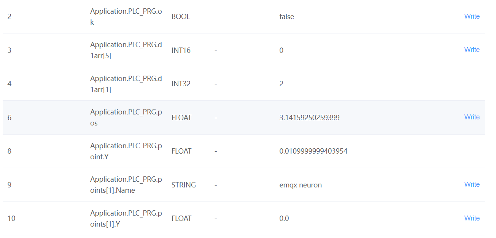
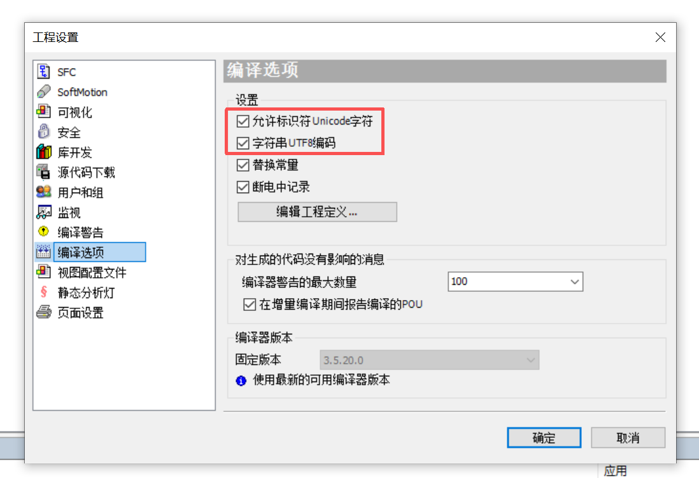
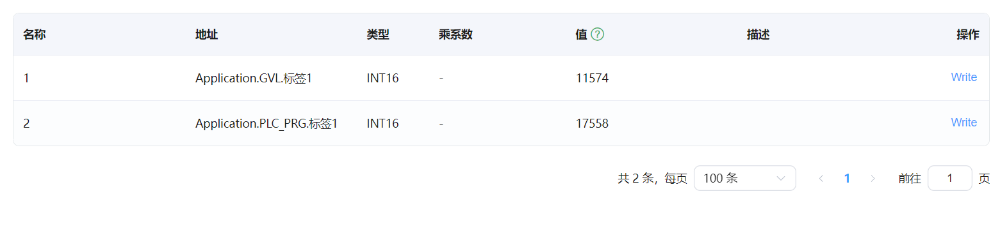

# 连接 CODESYS V3 PLC 模拟器示例

本文将使用 CODESYS V3 TCP 插件连接 CODESYS V3 PLC 模拟器，实现读写 CODESYS V3 模拟设备的数据。

## CODESYS V3 开发环境安装

CODESYS V3 开发环境安装程序，可以去 CODESYS 官网下载。本示例使用的版本是 CODESYS V3.5 SP12，不同的版本有一定的差异，但是整体操作类似。

## 新建工程

* 点击菜单 **文件->新建工程**，选择 **Standard project**， 取名为 **test**。
* 设备选择 **CODESYS Control Win v3 x64**，PLC_PRG 选择 **结构化文本（ST）**。
* 在 **Applicaton** 右键添加对象 **DUT**，新建结构体 **Point**，定义如下图。

* 打开 **PLC_PRG**, 定义变量如下图。

* 在 **Applicaton** 右键添加对象 **符号配置**，然后点击 **建立**，选择需要导出的变量，如下图所示。
 
* 点击 **编译**，然后点击菜单 **编译->生成代码**，然后在工程目录会生成了符号文件 `test.Device.Application.xml`，内容如下。
```xml
<?xml version="1.0" encoding="utf-8"?>
<Symbolconfiguration xmlns="http://www.3s-software.com/schemas/Symbolconfiguration.xsd">
  <Header>
    <Version>3.5.11.0</Version>
    <SymbolConfigObject version="3.5.12.0" runtimeid="3.5.12.0" libversion="3.5.11.0" compiler="3.5.12.0" lmm="3.5.12.0" profile="CODESYS V3.5 SP12+" settings="SupportOPCUA, XmlIncludeComments, LayoutCalculator=OptimizedClientSideLayoutCalculator" />
    <ProjectInfo name="test" devicename="Device" appname="Application" />
  </Header>
  <TypeList>
    <TypeSimple name="T_BOOL" size="1" swapsize="0" typeclass="Bool" iecname="BOOL" />
    <TypeSimple name="T_BYTE" size="1" swapsize="1" typeclass="Byte" iecname="BYTE" />
    <TypeSimple name="T_DINT" size="4" swapsize="4" typeclass="DInt" iecname="DINT" />
    <TypeSimple name="T_DWORD" size="4" swapsize="4" typeclass="DWord" iecname="DWORD" />
    <TypeSimple name="T_INT" size="2" swapsize="2" typeclass="Int" iecname="INT" />
    <TypeSimple name="T_REAL" size="4" swapsize="4" typeclass="Real" iecname="REAL" />
    <TypeSimple name="T_SINT" size="1" swapsize="1" typeclass="SInt" iecname="SINT" />
    <TypeSimple name="T_STRING" size="81" swapsize="0" typeclass="String" iecname="STRING" />
    <TypeSimple name="T_UDINT" size="4" swapsize="4" typeclass="UDInt" iecname="UDINT" />
    <TypeSimple name="T_UINT" size="2" swapsize="2" typeclass="UInt" iecname="UINT" />
    <TypeSimple name="T_USINT" size="1" swapsize="1" typeclass="USInt" iecname="USINT" />
    <TypeArray name="T_ARRAY__0__10__0__10__0__10__OF_INT" size="2662" nativesize="2662" typeclass="Array" iecname="ARRAY [0..10, 0..10, 0..10] OF INT" basetype="T_INT">
      <ArrayDim minrange="0" maxrange="10" />
      <ArrayDim minrange="0" maxrange="10" />
      <ArrayDim minrange="0" maxrange="10" />
    </TypeArray>
    <TypeArray name="T_ARRAY__0__10__0__20__OF_DWORD" size="924" nativesize="924" typeclass="Array" iecname="ARRAY [0..10, 0..20] OF DWORD" basetype="T_DWORD">
      <ArrayDim minrange="0" maxrange="10" />
      <ArrayDim minrange="0" maxrange="20" />
    </TypeArray>
    <TypeArray name="T_ARRAY__0__10__OF_INT" size="22" nativesize="22" typeclass="Array" iecname="ARRAY [0..10] OF INT" basetype="T_INT">
      <ArrayDim minrange="0" maxrange="10" />
    </TypeArray>
    <TypeUserDef name="T_Point" size="89" nativesize="92" typeclass="Userdef" pouclass="STRUCTURE" iecname="Point">
      <UserDefElement iecname="X" type="T_INT" byteoffset="0" vartype="VAR" />
      <UserDefElement iecname="Y" type="T_REAL" byteoffset="4" vartype="VAR" />
      <UserDefElement iecname="Name" type="T_STRING" byteoffset="8" vartype="VAR" />
    </TypeUserDef>
    <TypeArray name="T_ARRAY__0__5__OF_Point" size="552" nativesize="552" typeclass="Array" iecname="ARRAY [0..5] OF Point" basetype="T_Point">
      <ArrayDim minrange="0" maxrange="5" />
    </TypeArray>
  </TypeList>
  <NodeList>
    <Node name="Application">
      <Node name="PLC_PRG">
        <Node name="counter" type="T_STRING" access="ReadWrite" />
        <Node name="d1arr" type="T_ARRAY__0__10__OF_INT" access="ReadWrite" />
        <Node name="d2arr" type="T_ARRAY__0__10__0__20__OF_DWORD" access="ReadWrite" />
        <Node name="d3arr" type="T_ARRAY__0__10__0__10__0__10__OF_INT" access="ReadWrite" />
        <Node name="ok" type="T_BOOL" access="ReadWrite" />
        <Node name="point" type="T_Point" access="ReadWrite" />
        <Node name="points" type="T_ARRAY__0__5__OF_Point" access="ReadWrite" />
        <Node name="pos" type="T_REAL" access="ReadWrite" />
        <Node name="v" type="T_BOOL" access="ReadWrite" />
        <Node name="v1" type="T_BYTE" access="ReadWrite" />
        <Node name="v10" type="T_STRING" access="ReadWrite" />
        <Node name="v2" type="T_SINT" access="ReadWrite" />
        <Node name="v3" type="T_USINT" access="ReadWrite" />
        <Node name="v4" type="T_INT" access="ReadWrite" />
        <Node name="v5" type="T_UINT" access="ReadWrite" />
        <Node name="v6" type="T_DWORD" access="ReadWrite" />
        <Node name="v7" type="T_DINT" access="ReadWrite" />
        <Node name="v8" type="T_UDINT" access="ReadWrite" />
        <Node name="v9" type="T_REAL" access="ReadWrite" />
      </Node>
    </Node>
  </NodeList>
</Symbolconfiguration>
```
## 启动模拟器与下载程序

* windows 菜单栏，直接运行 `CODESYS Control Win v3 x64`。
* 开发环境切换到 **Device** 配置页，敲击回车键，连接模拟器，第一次连接，会要求设置用户名和密码。
* 使用设置的用户名和密码登录到模拟器设备并下载程序，下载之后运行。

## Neuron 配置节点连接 CODESYS V3 模拟器

* 在 **南向设备** 中 点击 `添加设备`，选择 `CODESYS V3 TCP` 插件来创建一个连接 CODESYS V3 模拟器的节点。
* 创建好节点后，点击 `设备配置` 进入设备配置页面，根据实际情况配置节点信息，
	* `设备 IP 地址`：设备的 IP 地址，即模拟器运行主机的 IP 地址
	* `设备端口`：设备的端口，默认为 11740
 	* `连接超时时间`：默认为 3000
 	* `用户名`：设置的用户名
 	* `密码`：设置的密码
* 在创建好的南向设备节点中，创建组，并在组下创建点位，点位地址根据导出的 XML 文件中的 `NodeList` 进行拼接。
* 进入 Neuron **数据监控** 选择对应设备与组，查看采集的数据点，如下图所示。


  

## CODESYS 支持中文标签配置
确保 CODESYS 3.5.20 以上版本，并且项目工程中编译选项启用以下选项：


数据显示如下：
