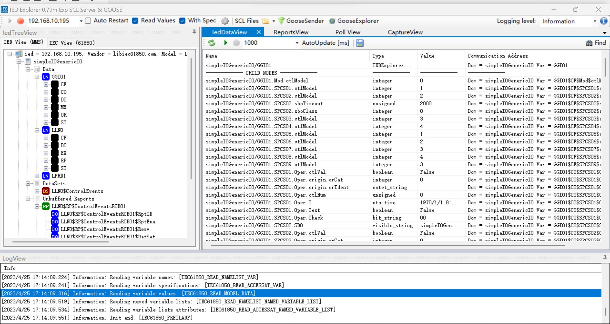

# 连接 LibIEC61850 服务器

## 设置 LibIEC61850 服务器

到 https://github.com/mz-automation/libiec61850 下载源码，按照项目页面的提示编译源码，这里演示在 Ubuntu 系统下的编译安装。

```sh
$ cd libiec61850
$ mkdir build
$ cd build
$ cmake .. && make -j4
$ cd sudo ./examples/server_example_control/server_example_control
```

## 设置 IEDExplorer

1. 到 https://sourceforge.net/projects/iedexplorer/ 下载 IEDExplorer。

2. 打开 IEDExplorer_0.79n.exe 设置好 `server_example_control` 服务器监听的 IP 地址和端口，启动连接。


## 设置 Neuron

1. 在 Neuron 南向设备管理中添加一个 IEC61850 设备；

2. 在设备配置中修改 `设备 IP 地址` 为 `server_example_control` 服务器监听的 IP 地址。

3. 在设备配置中修改 `设备端口` 为 `server_example_control` 服务器监听的端口。

4. 其他配置参数保持默认，提交设置表单。

5. 添加 `组`，添加从测试 `点位`。

## 测试点位

| 名称 | 地址                                  | 属性 | 类型   |
| ---- | ------------------------------------- | ---- | ------ |
| CF1  | simpleIOGenericIO/GGIO1$CF$Mod$ctlModel       | Read | INT8   |
| CO1  | simpleIOGenericIO/GGIO1$CO$SPCSO1$Oper$ctlNum | Read | UINT8  |
| CF2  | simpleIOGenericIO/GGIO1$CF$SPCSO1$ctlModel    | Read | INT16  |
| CO2  | simpleIOGenericIO/GGIO1$CO$SPCSO2$Oper$ctlNum | Read | UINT16 |
| CF3  | simpleIOGenericIO/GGIO1$CF$SPCSO2$ctlModel    | Read | INT32  |
| ST1  | simpleIOGenericIO/GGIO1$ST$SPCSO4$Oper$ctlNum | Read | UINT32 |
| CF4  | simpleIOGenericIO/GGIO1$CF$SPCSO3$ctlModel    | Read | INT64  |
| ST2  | simpleIOGenericIO/GGIO1$ST$SPCSO1$ctlNum      | Read | UINT64 |
| MX1  | simpleIOGenericIO/GGIO1$MX$AnIn1$mag$f        | Read | FLOAT  |
| MX2  | simpleIOGenericIO/GGIO1$MX$AnIn3$mag$f        | Read | DOUBLE |
| CO3  | simpleIOGenericIO/GGIO1$CO$SPCSO1$Oper$Test   | Read | BOOL   |
| DC1  | simpleIOGenericIO/GGIO1$CO$SPCSO2$SBO         | Read | STRING |
| RP1  | simpleIOGenericIO/LLN0$RP$ControlEventsRCB01$RptID         | Read Write | STRING |
| RP2  | simpleIOGenericIO/LLN0$RP$ControlEventsRCB01$BufTm         | Read Write | UINT32 |
