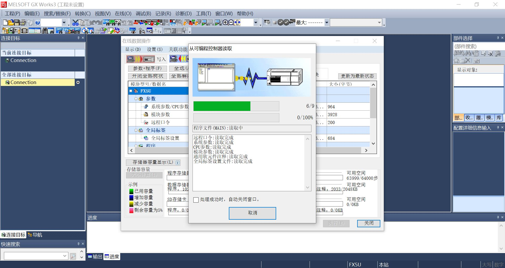
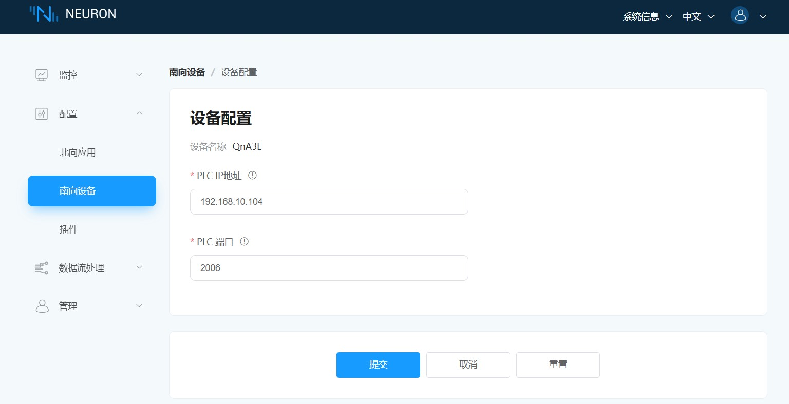
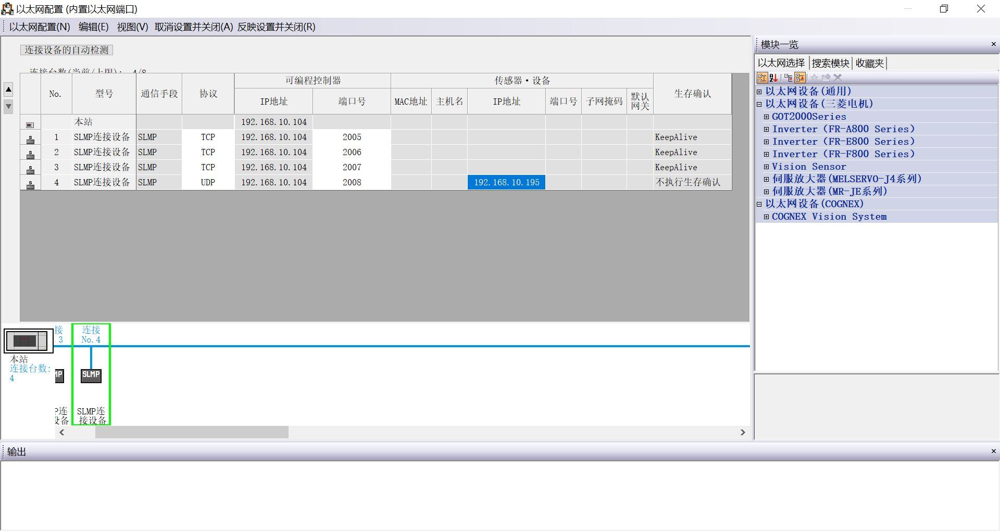
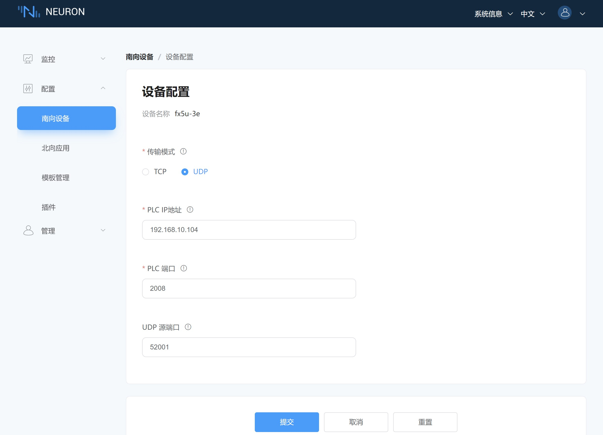

# FX5U 连接示例

FX5U 是三菱电机的一款高性能的紧凑型可编程逻辑控制器（PLC）。它是三菱 FX 系列 PLC 的一部分，适用于各种中小型自动化应用。

本节介绍如何通过 Neuron Mitsubishi 3E 插件连接 FX5U。

## 配置 FX5U

1. 打开 GX Works3 PLC 编程软件，新建工程，**系列** 选择 **FX5CPU**，**机型** 选择 **FX5U**，点击 **确定**。

2. 点击 **连接目标** -> **Connection**，分别设置 **适配器** 和 **适配器的IP地址**，点击 **确定**。

3. 点击菜单 **在线** -> **从可编程控制器读取** -> **全选** -> **执行**。

4. 点击 **导航** -> **参数** -> **FX5UCPU** -> **模块参数** -> **以太网端口**，检查并确认 **IP地址设置**，点击 **对象设备连接配置设置**。

5. 拖动 **以太网设备（通用）** -> **SLMP连接设备** 到列表中，**协议** 选择 **TCP** 并设置号 **端口号**，点击 **反映设置并关闭**。

6. 点击菜单 **在线** -> **写入至可编程控制器** -> **执行**。

## 配置 Neuron

1. 在 Neuron 南向设备管理中添加一个 Mitsubishi 3E 设备。

2. 在设备配置中修改 **PLC IP 地址** 为目标设备 IP 地址。

3. 在设备配置中修改 **PLC 端口** 为目标设备端口，提交设置表单。

4. 添加 **组**，添加测试 **点位**。

## 使用 UDP 模式连接 FX5U
1. 设置 PLC 中的 UDP 协议，**协议**选择 UDP，**端口号**填写 PLC 监听端口，**IP 地址**填写 Neuron 运行主机的 IP 地址。

2. 配置 Neuron UDP 传输模式，**传输模式**选择 UDP，UDP源端口使用默认端口号 52001。

## 测试点位

| 名称 | 地址     | 属性 | 类型   |
| ---- | --------| ---- | ------ |
| DATA1  | D0    | Read Write | INT16  |
| DATA2  | D1    | Read Write | UINT16 |
| DATA3  | D2    | Read Write | INT32  |
| DATA4  | D4    | Read Write | UINT32 |
| DATA5  | D6    | Read Write | FLOAT  |
| DATA6  | D8    | Read Write | DOUBLE |
| DATA7  | X0    | Read       | BIT    |
| DATA8  | Y0    | Read Write | BIT    |
| DATA9  | D20.0 | Read       | BIT    |
| DATA10  | D100.16  | Read Write | STRING |
