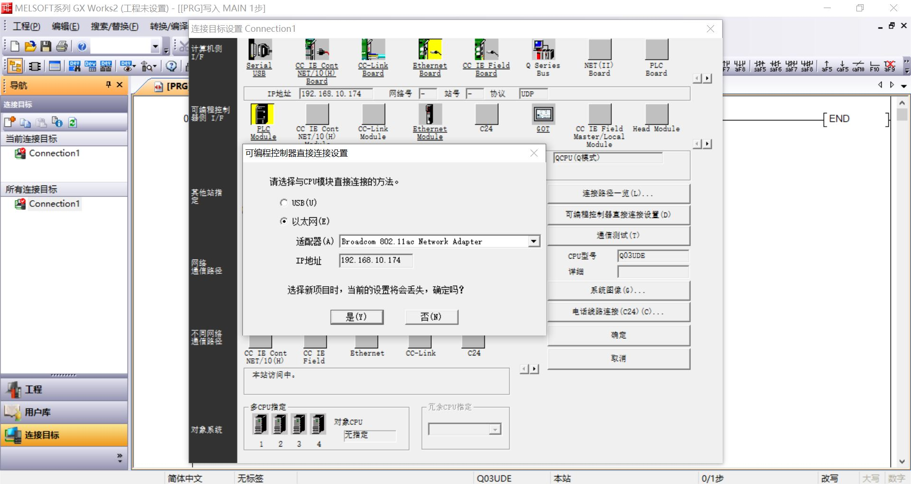
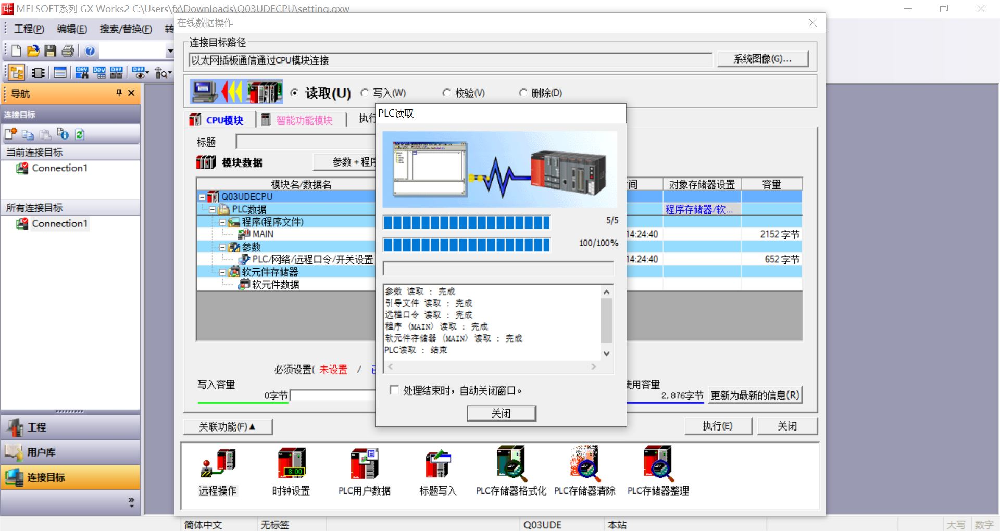
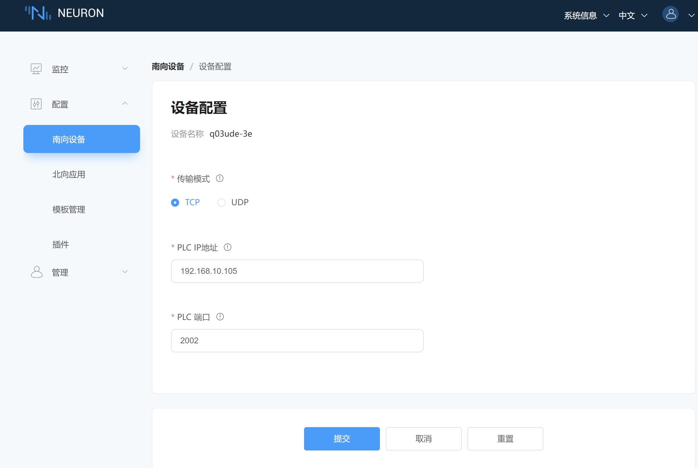

# Q03UDE 连接示例

Q03UDE 是三菱电机 Q 系列 PLC 的一款产品。这款 PLC 适用于大型和复杂的自动化应用，提供了高性能和丰富的功能。

本节介绍如何通过 Neuron Mitsubishi 3E 插件连接 Q03UDE 。

## PLC 设置

1. 打开 GX Works2 PLC 编程软件，新建工程，**系列** 选择 **QCPU(Q模式)**，**机型** 选择 **Q03UDE**，点击 **确定**。

2. 点击 **连接目标** -> **Connection1** -> **可编程控制器直接连接设置** -> **以太网**，分别设置 **适配器** 和 **IP地址**，点击 **确定**。

3. 点击菜单 **在线** -> **PLC读取** -> **全选** -> **执行**。

4. 点击 **导航** -> **参数** -> **PLC参数** -> **打开设置**，**协议** 选择 **TCP**，**打开方式** 选择 **MC协议**，设置好需要的 **本站端口号**，点击 **设置结束**。

5. 点击菜单 **在线** -> **PLC写入** -> **执行**。

## 配置 Neuron

1. 在 Neuron 南向设备管理中添加一个 Mitsubishi 3E 设备。

2. 在设备配置中修改 **PLC IP 地址** 为目标设备 IP 地址。

3. 在设备配置中修改 **PLC 端口** 为目标设备端口，提交设置表单。

4. 添加 **组**，添加测试 **点位**。

## 测试点位

| 名称 | 地址     | 属性 | 类型   |
| ---- | --------| ---- | ------ |
| DATA1  | D0    | Read Write | INT16  |
| DATA2  | D1    | Read Write | UINT16 |
| DATA3  | D2    | Read Write | INT32  |
| DATA4  | D4    | Read Write | UINT32 |
| DATA5  | D6    | Read Write | FLOAT  |
| DATA6  | D8    | Read Write | DOUBLE |
| DATA7  | X0    | Read       | BIT    |
| DATA8  | Y0    | Read Write | BIT    |
| DATA9  | D20.0 | Read       | BIT    |
| DATA10  | D100.16  | Read Write | STRING |
