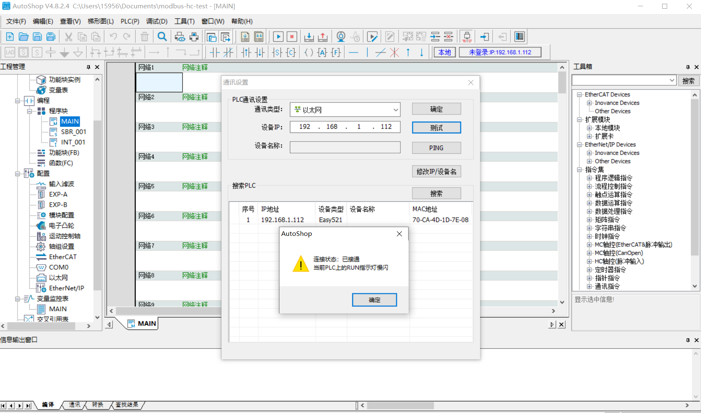
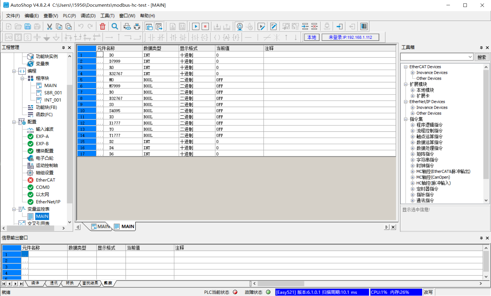

# Easy521 连接示例

本文将使用 HuiChuan Specialized Modbus TCP 插件连接汇川 Easy521 PLC，实现读写 PLC 中的点位值。

Inovance Modbus TCP 插件可以通过本地局域网或者 Intenet 连接到汇川 PLC，但是需要注意的是，如果 PLC 与 Neuron 服务器不在同一局域网，需要在 PLC 上配置端口转发。

## 前置准备

通过汇川编程软件 AutoShop 连接到 Easy521 PLC，可以查看 PLC 中的点位。

### 查看 PLC 点位

1. 在右上方菜单栏选择 **测试通讯状态**，打开通讯设置窗口，搜索到 PLC，为 PLC 配置 IP 地址、子网掩码等。

2. 在左侧菜单选择 **变量监控表**，打开 MAIN 窗口，需要手动添加元件。可以查看到 PLC 支持的数据区域以及地址范围，添加后点击上方菜单栏 **监控** 实时监控点位数据。

## 配置 Neuron
* 在南向设备中，点击 **添加设备**，选择插件 **Inovance Modbus TCP** 来创建一个连接汇川 PLC 的节点。
* 创建好节点后，点击 **设备配置** 进入设备配置页面，根据实际情况配置节点信息，
	* **PLC IP 地址**：PLC 的 IP 地址
	* **PLC 端口**：PLC 的端口，默认为 502
* 在创建好的南向设备节点中，创建组，并在组下创建点位。

## 数据监控

完成点位的配置后，您可点击 **监控** -> **数据监控**查看设备信息以及反控设备，具体可参考[数据监控](../../../../../usage/monitoring.md)。