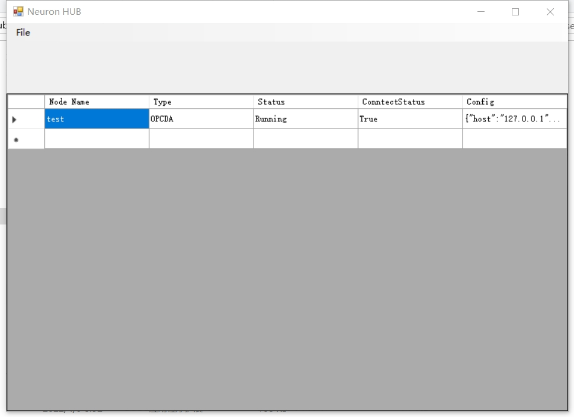
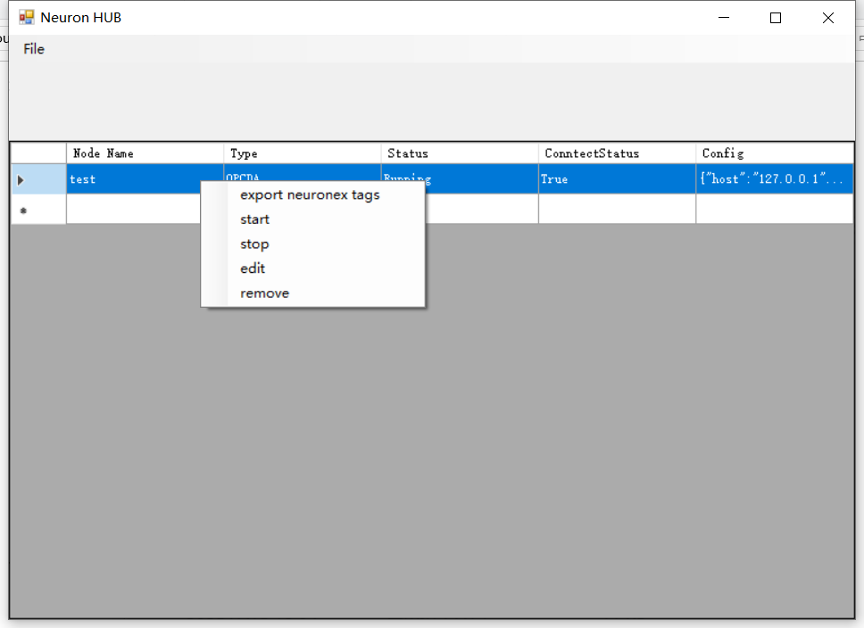
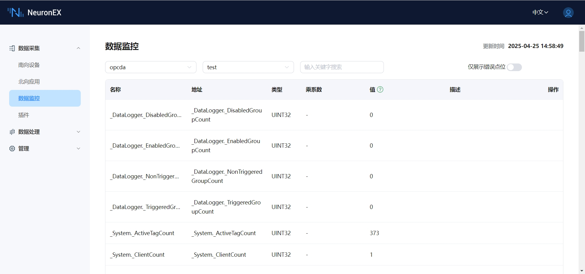

# 连接 KEPServerEX 6 OPC DA Server 示例

本文将使用 Neuron HUB 插件和 NEURON HUB Windows 程序连接 KEPServerEX 6 OPC DA Server，实现读写 OPC DA Server 的数据。

## KEPServerEX 6 安装

KEPServerEX 安装包可以从此官网页面 [KEPServerEX Demo Download](https://www.ptc.com/en/products/kepware/kepserverex/demo-download) 下载。

## NEURON HUB Windows 程序安装

NEURON HUB Windows 程序安装包可以联系技术支持人员获取。获取安装包后，双击运行安装即可。

## NEURON HUB Windows 程序使用

### OPC DA 节点添加
1. 点击 `File->NewOpcDa` 菜单项，进入 OPC DA 节点添加界面；
2. 填写 `node name`，此参数为 OPC DA 节点唯一标志，不可重复，后续会在 Neuron HUB 驱动中使用；
3. 填写 `host`，可以填写 IP 或 Hostname，此参数为需要连接的 OPC DA Server 的主机地址；
4. 尝试点击 `server` 的下拉按钮，可以尝试获取目标 host 的 OPC DA Server 列表，如果下拉为空则说明检测不到任何目标主机上的 OPC DA Server；
5. 点击 `Add` 按钮，添加此 OPC DA 节点。

添加成功后，会在 `Nodes Table` 看到刚才添加的 OPC DA 节点以及节点的基本信息，运行状态，连接状态等。

 

### 点位导出

OPC DA 节点在正常连接状态下，可以按 Neuron EX 点位模板文件的格式导出 OPC DA 全部点位。具体操作为将鼠标移动到需要导出点位的 OPC DA 节点，鼠标右键菜单，点击 `export neuronex tags`。
 

## 使用 Neuron HUB 驱动连接 OPC DA 节点

* 在 **南向设备** 中 点击 `添加设备`，选择 `Neuron HUB` 插件来创建一个连接 NEURON HUB Windows 程序的节点。填写配置信息，
	* `HUB IP 地址`：NEURON HUB Windows 程序运行主机的 IP 地址
	* `HUB 端口`：NEURON HUB Windows 程序端口，默认为 17889
	* `节点类型`：选择 `OPC DA`
	* `节点名称`：即 NEURON HUB Windows 程序中添加的 OPC DA 节点的名次，示例为 `test`
* 在创建好的南向设备节点中，导入上述导出的 OPC DA 点位表格。
* 进入 **监控页面** 选择对应设备与组，查看采集的数据点，如下图所示。
*  