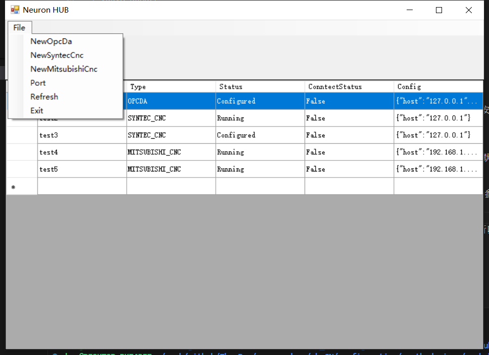
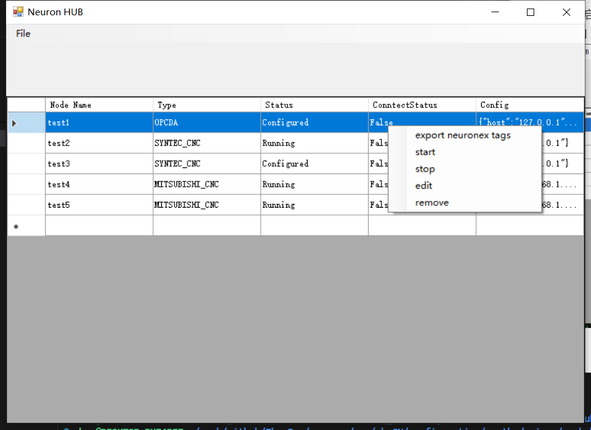

# NEURON HUB

Neuron HUB 插件通过 TCP 协议访问安装有 NEURON HUB 程序的主机。

## 设备设置

| 字段           | 说明                        |
| -------------- | --------------------------- |
| host           | Neuron HUB IP 地址          |
| port           | Neuron HUB 端口, 默认 17889 |
| type           | 节点类型                    |
| node           | 节点名称                    |
| batch_size     | 命令批量大小，默认 50       |
| expires        | 过期时间，默认 2000 ms      |
| sliding_window | 窗口大小，默认 1            |

type 目前支持 OPCDA，SYNTEC CNC 和 MITSUBISHI CNC 三类设备。

## 支持的数据类型

* uint8
* int8
* uint16
* int16
* uint32
* int32
* uint64
* int64
* float
* double
* bool
* string
* ARRAY_INT8   
* ARRAY_UINT8  
* ARRAY_INT16  
* ARRAY_UINT16  
* ARRAY_INT32   
* ARRAY_UINT32 
* ARRAY_INT64   
* ARRAY_UINT64 
* ARRAY_FLOAT     
* ARRAY_DOUBLE  
* ARRAY_BOOL     
* ARRAY_STRING  

## 地址格式
节点类型不同，地址形式不同，具体查看对应类型设备的文档。

## NEURON HUB Windows 程序
由于一些协议的平台受限，所以需要一个中间转换程序，NEURON HUB 程序就是进行的转换功能。安装包请联系支持人员获取。

### 安装
双击安装即可，安装目录推荐不要安装到系统盘，不然配置文件修改可能由于权限问题失败。程序默认开机启动。

### 新建节点
点击 `File` 菜单项，根据需要连接的设备类型，点击相对应的子菜单项。在界面填写相应的连接参数，添加即可。
 

### 节点操作
在界面 `Node Tables`，选中节点点击鼠标右键，会弹出右键菜单，可以实现节点启停，参数更新以及删除。OPCDA 节点还支持点位导出为 NEURON 节点的表格文件。
 

 ### 端口设置
 程序默认监听 17889 端口，可以通过 `File->Port` 进行端口设置。

