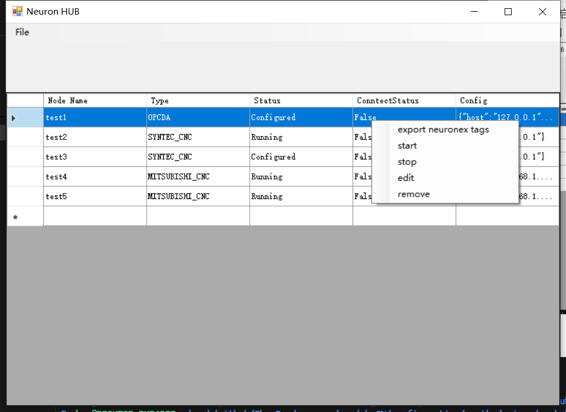

# NEURON HUB

**NeuronHUB**（运行于 **Windows** 的桌面程序）与 NeuronEX 南向插件 **NEURON HUB**共同构成一整套中转数采方案：前者在现场 Windows 环境的机器上做协议接入与数据采集（支持采集的协议有：**OPC DA、OPC AE、GE Historian、新代（SYNTEC）CNC、三菱（MITSUBISHI）CNC**），后者作为 NeuronEX 的南向驱动插件接入 NeuronHUB 上已采集的数据。

**部署背景：** NeuronEX 仅能部署在 **Linux**。若现场数采依赖 **DCOM** 等与 Windows 强绑定的机制（典型如 OPC DA），或必须使用仅提供 Windows 接口的网关与数据源，则无法在 Linux 上由原生存根方式直接采集这些协议。

**工作方式：** 在 Windows 主机上安装并运行 **NeuronHUB 程序**（联系EMQ商务人员获取NeuronHUB 程序），由其在本地对接 **OPC DA、OPC AE、GE Historian、新代（SYNTEC）CNC、三菱（MITSUBISHI）CNC** 等协议并完成采集与节点管理；NeuronEX 软件再通过 Neuron HUB 南向驱动读取 NeuronHUB 程序已采集到的数据，从而实现完整采集链路。

简言之：**NeuronHUB 负责在 Windows 上采数；Neuron HUB 驱动负责跨越网络把数据交给 NeuronEX。**

## 设备设置

| 字段           | 说明                       |
| -------------- | -------------------------- |
| host           | NeuronHUB IP 地址          |
| port           | NeuronHUB 端口, 默认 17889 |
| type           | 节点类型                   |
| node           | 节点名称                   |
| batch_size     | 命令批量大小，默认 10      |
| expires        | 过期时间，默认 2000 ms     |
| sliding_window | 窗口大小，默认 1           |

南向驱动侧的 `type`（节点类型）需与 NeuronHUB 中已为该连接创建的节点类型一致；常见包括 **OPCDA**、**OPC AE**、**GE Historian**、**SYNTEC CNC**、**MITSUBISHI CNC** 等，具体以实际 NeuronHUB 菜单与版本为准。

## 支持的数据类型

* uint8
* int8
* uint16
* int16
* uint32
* int32
* uint64
* int64
* float
* double
* bool
* string
* ARRAY_INT8   
* ARRAY_UINT8  
* ARRAY_INT16  
* ARRAY_UINT16  
* ARRAY_INT32   
* ARRAY_UINT32 
* ARRAY_INT64   
* ARRAY_UINT64 
* ARRAY_FLOAT     
* ARRAY_DOUBLE  
* ARRAY_BOOL     
* ARRAY_STRING  

## 地址格式
节点类型不同，地址形式不同，具体查看对应类型设备的文档。

## NeuronHUB Windows 程序
上文所述在 Windows 上承担协议对接与中继的就是 **NeuronHUB** 桌面程序（与 Linux 侧的 Neuron 插件名称相近，请注意区分环境与角色）。安装包请联系支持人员获取。

### 安装
双击安装即可，安装目录推荐不要安装到系统盘，不然配置文件修改可能由于权限问题失败。程序默认开机启动。

### 新建节点
点击 `File` 菜单项，根据需要连接的设备类型，点击相对应的子菜单项。在界面填写相应的连接参数，添加即可。
 

### 节点操作
在界面 `Node Tables`，选中节点点击鼠标右键，会弹出右键菜单，可以实现节点启停，参数更新以及删除。OPCDA 节点还支持点位导出为 NEURON 节点的表格文件。
 

### 端口设置
 程序默认监听 17889 端口，可以通过 `File->Port` 进行端口设置。

