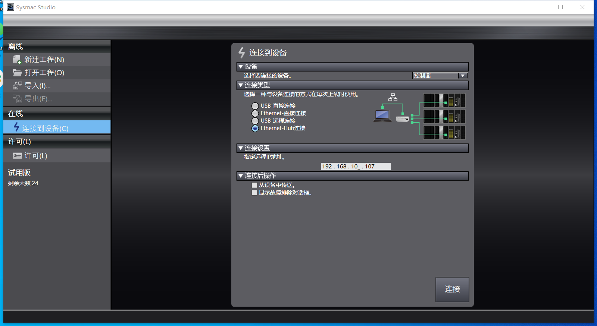
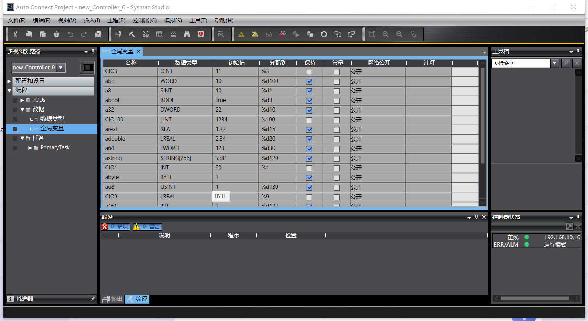
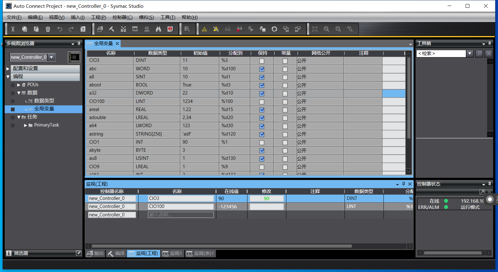

# Omron NX1P 连接示例

本文将使用 Omron FINS UDP 插件连接欧姆龙 NX1P PLC，实现读写 PLC 中的点位值。

Omron FINS UDP 插件需要通过本地局域网连接到欧姆龙 PLC，因此 PLC 应和 Neuron 处于同一局域网。

## 前置准备

已通过欧姆龙编程软件 Sysmac Studio 连接到 NX1P PLC，可以查看 PLC 中的点位。

## 查看 PLC 点位

1. 左侧菜单栏选择 **连接到设备** 打开 PLC 连接设定窗口，找到 **设备** 选项卡，选择要连接的设备为 **控制器**，连接类型选择 **Ethernet-Hub连接**，连接设置设置 PLC IP 地址，设置完成之后点击连接。设备设置页面如下图所示。
    
2. 连接成功进入工程页面，进入菜单 **控制器->传送中->从控制器传送**， 根据弹框提示，默认执行就行。
3. 左侧菜单栏选择 **编程->数据->全局变量**，右键选择 **编辑**，窗体就会显示 PLC 当前的点位信息。如下图所示。
    
4. Sysmac Studio 处于在线状态，不可对点位进行编辑操作。进入菜单 **控制器->离线**，进入编辑状态，在点位表格使用右键菜单，可以对点位进行相应的编辑操作。编辑完成之后，进入菜单 **控制器->在线**，连接 PLC ，然后进入菜单 **控制器->传送中->传送到控制器**，根据弹框提示，默认执行，将点位编辑结果写入 PLC 。
5. Sysmac Studio 保持在线状态，进入菜单 **视图->监视窗口**，在 **监视(工程)** 窗体，输入点位名称，可以监视点位实时数据和修改点位数据。如下图所示。
    

## 配置 Neuron
* 在南向设备中，点击 **添加设备**，选择插件 **Omron FINS UDP** 来创建一个连接 NX1P PLC 的节点。
* 创建好节点后，点击 **设备配置** 进入设备配置页面，根据实际情况配置节点信息，
	* **设备型号**: PLC 的型号，选择 NX
	* **PLC IP 地址**：PLC 的 IP 地址
	* **PLC 端口**：PLC 的端口，默认为 9600
* 在创建好的南向设备节点中，创建组，并在组下创建点位。

## 数据监控

完成点位的配置后，您可点击 **监控** -> **数据监控**查看设备信息以及反控设备，具体可参考[数据监控](../../../../../usage/monitoring.md)。