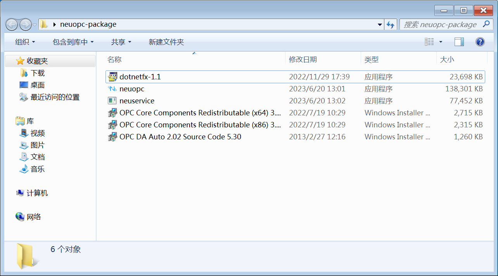
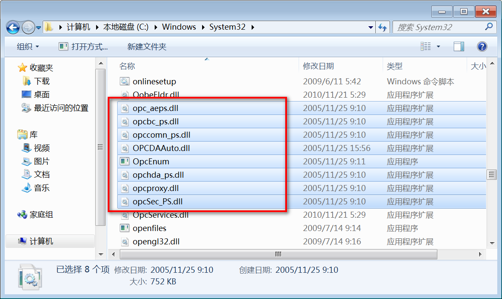
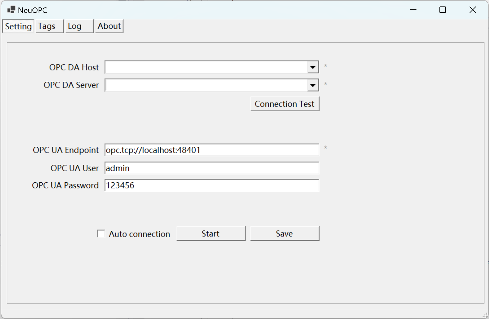
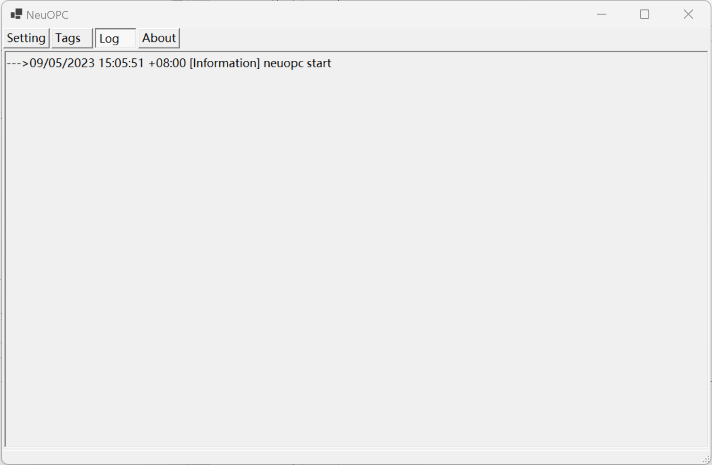

# 安装 NeuOPC

本例使用 windows 7 SP1 32位系统演示。

## 前置准备

- Windows 7 SP1 以上操作系统
- 安装 [KB3063858](https://www.microsoft.com/zh-CN/download/details.aspx?id=47409) 以及 [KB2999226](https://www.microsoft.com/zh-cn/download/details.aspx?id=49077) 更新程序。

## 安装 NeuOPC

1. 进入 NeuOPC [项目 releases 页面](https://github.com/neugates/neuopc/releases)下载最新的组件包"neuopc-package.zip"，解压后可见如下文件：

   

   其中：

   * `neuopc.exe`——运行 OPC DA 转换 OPC UA 的主程序。

   * `dotnetfx-1.1`——.Net framework 1.1，安装 OPC DAAuto 需要先正确安装此程序。

   * `OPC DA Auto 2.02 Source Code 5.30.msi` ——OPC 基金会官方组件，使用"Windows 任务管理器"安装。

   * `OPC Core Components Redistributable (x64) 3.00.108.msi` ——OPC 基金会官方组件，可不用安装。

   * `OPC Core Components Redistributable (x86) 3.00.108.msi` ——OPC 基金会官方组件，可不用安装。

2. 检查是否已经安装过 .Net framework 1.1 ，如果没有则安装 `dotnetfx-1.1`。

3. 使用任务管理器安装 `OPC DA Auto 2.02 Source Code 5.30.msi`，打开 **Windows 任务管理器** -> **文件** -> **运行新任务**，输入 MSI 文件路径，勾选 **以系统管理权限创建此任务**。

   

## 检查组件是否正确安装

1. 检查 `C:\Windows\System32` （ 32 位操作系统）或 `C:\Windows\SysWOW64` （64位操作系统） 目录下是否存在以下文件。如果文件不存在则联系销售人员进行支持。

   

2. 打开 **Windows 任务管理器** 检查 `OpcEnum` 系统服务是否在运行，如果正常运行，说明 `OPC DA Auto 2.02` 已被正常安装。

   

## 测试 NeuOPC 

本机安装 MatrikonOPCSimulation 或 KepServerEX 测试 NeuOPC 的安装。

1. 运行 neuopc.exe 程序，设置号 OPCDA Host 和 OPCDA Server 后点击 Connection Test。

5. 设置 UA 的各项参数后点击 `Start`，运行成功，如图：

