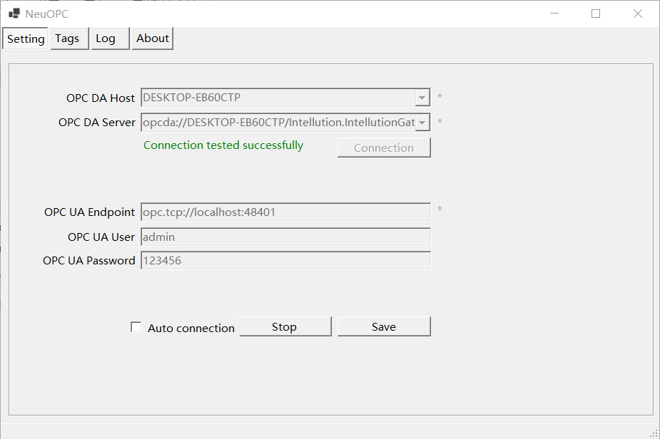
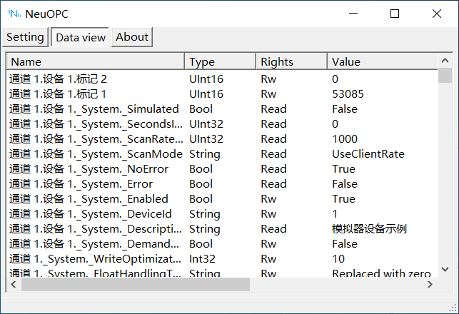

# 连接 NeuOPC

## NeuOPC 设置

1. 点击 `Setting` 按钮，进入设置界面；
2. 填写 `OPC DA Host`，可以填写 IP 或 Hostname，不填写则默认为本机；
3. 尝试点击 `OPC DA Server` 的下拉按钮，可以尝试获取目标 Host 的 DA Server 列表，如果下拉为空则说明检测不到任何目标主机上的 DA Server；
4. 点击 `Connection Test` 按钮，服务器连接成功后会显示“Connection tested successfully”。
5. 设置 `OPC UA Endpoint`；
6. 设置 `OPC UA User`；
7. 设置 `OPC UA Password`；
8. 点击 `Start` 按钮，UA 服务器启动后，OPCDA 测点都会被映射到 UA Server 的 NeuOPC 节点下，所有测点的 UA namespace 为2，此时 `Setting` 的相关项目会变为不可设置状态；
9. 勾选 `Auto connection` 后，可在后续启动中自动连接连接和监听；
10. 点击 `Tags` 按钮，进入测点列表界面，通过鼠标双击测点列表的 `Name` 列可将对应的测点名称复制到剪贴板中，然后在 Neuron 的 Tag 表单中粘贴。
    
    

## Neuron OPC UA 设置

1. 在 neuron 南向设备管理中添加一个 OPC UA 设备；

2. 在设备配置中修改 `端点 URL` 为 NeuOPC 的 UA Server 地址；

3. 在设备配置中填写 `用户名`，与 NeuOPC 中设置的一致；

4. 在设备配置中填写 `密码`，与 NeuOPC 中设置的一致；

5. 无需填写 `Cert` 和 `Key`，直接提交设置表单。

### 测试点位

| 名称                    | 地址                      | 属性 | 类型   |
| ----------------------- | ------------------------- | ---- | ------ |
| _System._ProductVersion | 2!_System._ProductVersion | Read | STRING |
| _System._ProductName    | 2!_System._ProductName    | Read | STRING |
| _System._DateTimeLocal  | 2!_System._DateTimeLocal  | Read | UINT32 |

