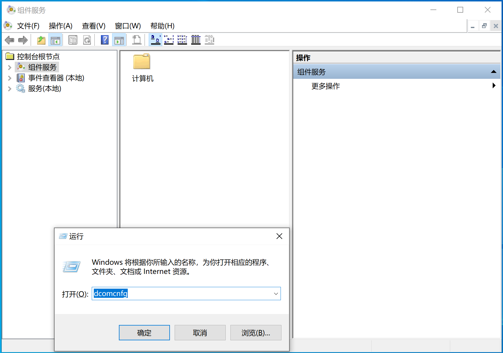
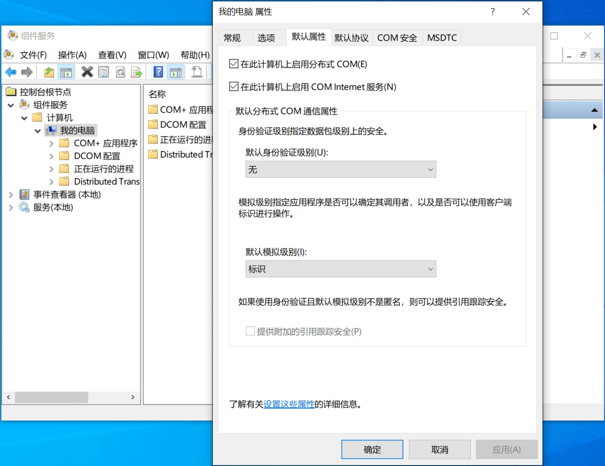
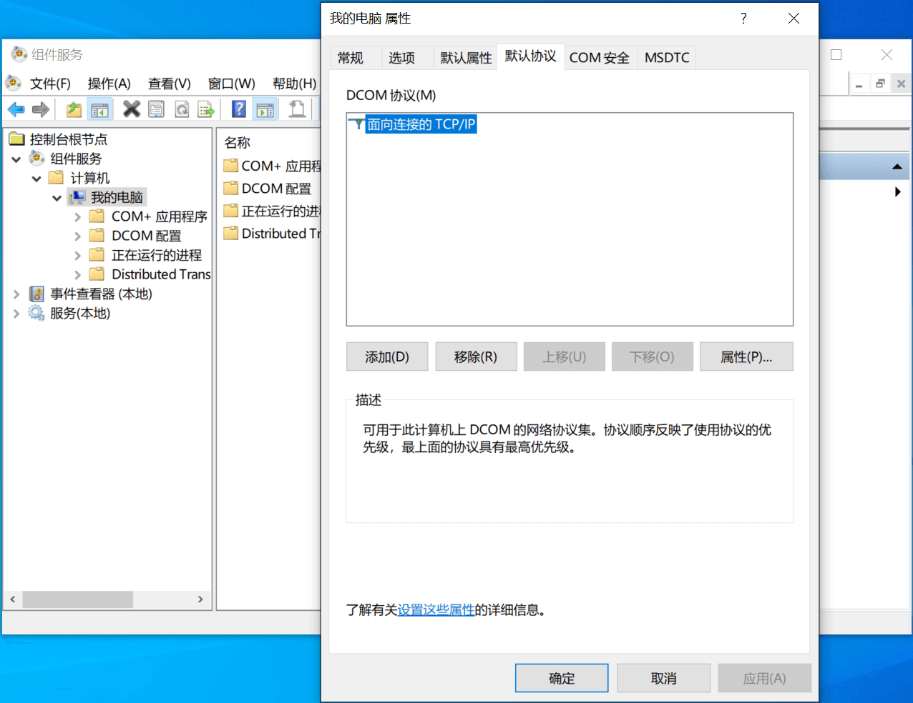
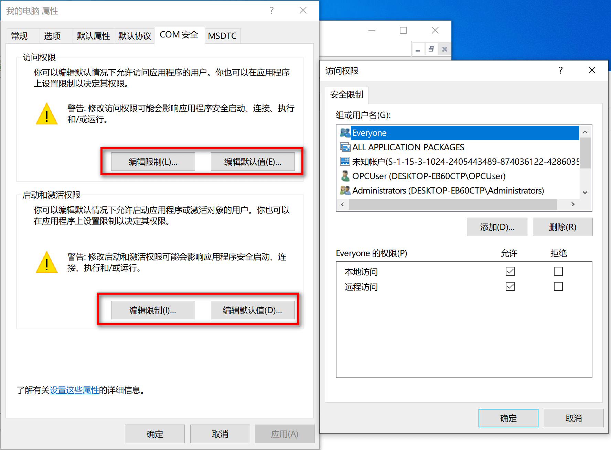
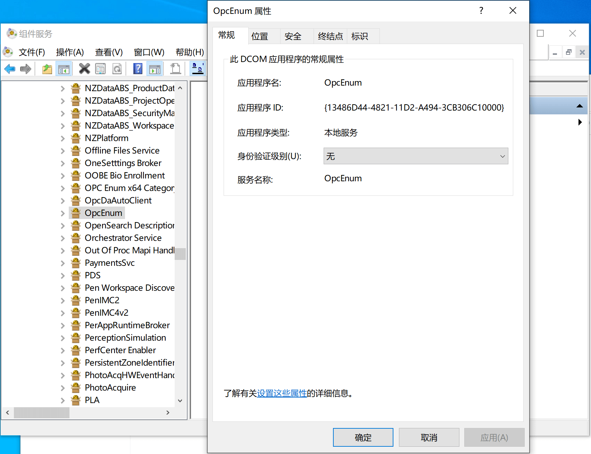
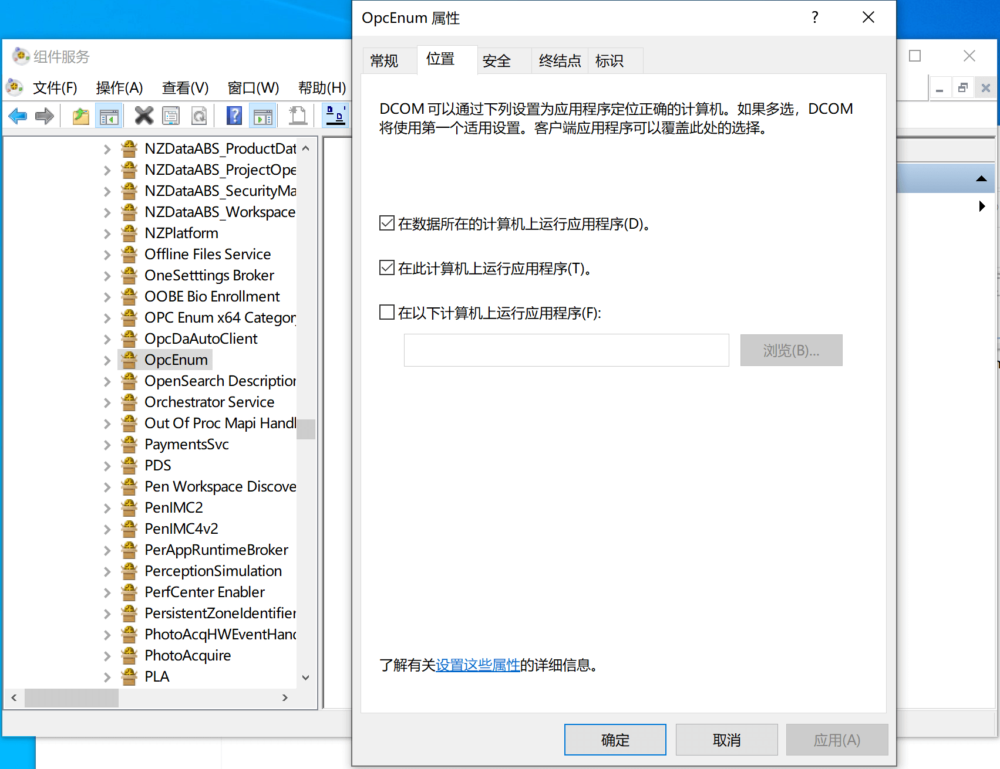
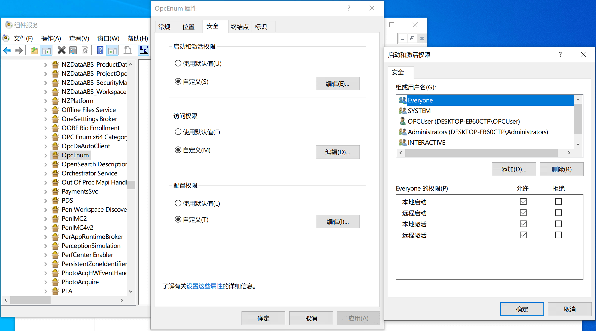
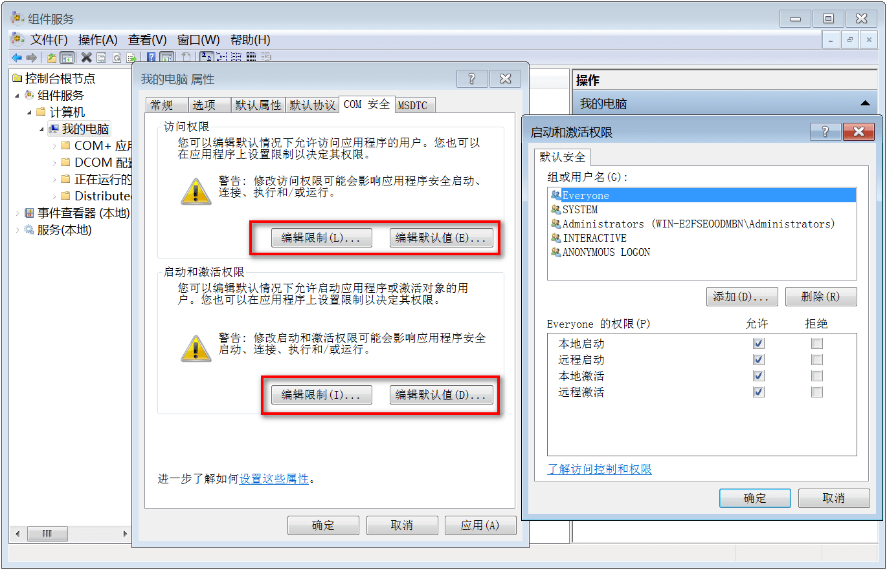
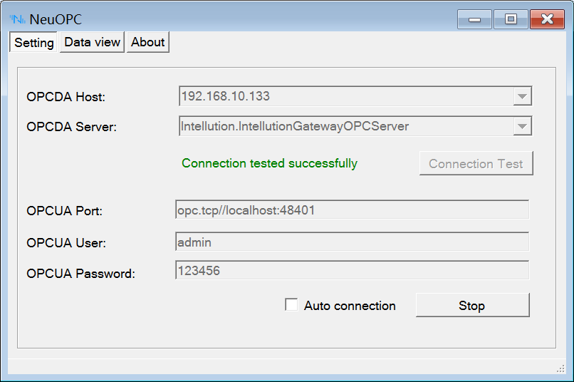
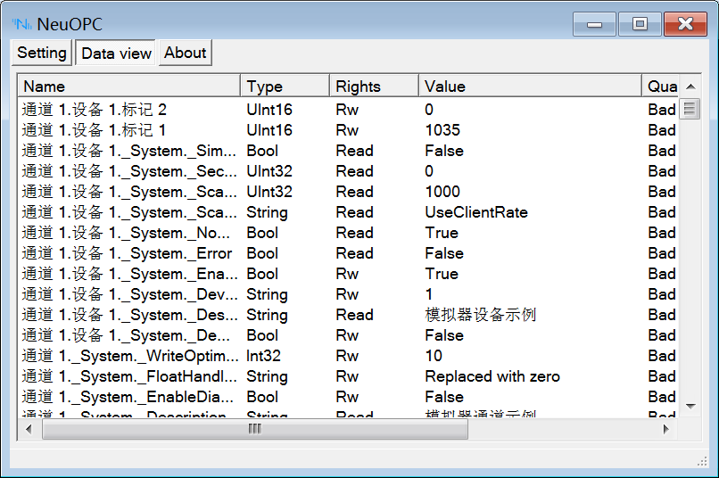

# NeuOPC 远程访问

## 远程主机 DCOM 设置

在远程主机上安装 MatrikonOPC Server for Simulation，并将电脑的防火墙关闭。演示使用的是 Administrator 账户。

1. 按下 **WIN + R** 键后在弹出的对话框中输入 `dcomcnfg` 确定后进入组件服务，如图：

2. 先对本机属性进行总体的设置， 展开 **组件服务\计算机\我的电脑**，右键我的电脑打开菜单中的 **属性** 设置：

在 **默认属性** 中勾选 `在此计算机上启用分布式 COM`，`默认身份验证级别` 设置位 `无`：

在 **默认协议** 中只保留 `面向连接的 TCP/IP`：

在 **COM 安全** 中将 `访问权限` 和 `启动和激活权限` 中的 `编辑限制` 和 `编辑默认值` 都分别添加  `Everyone`、`Administrators`、`ANONYMOUS LOGON` 用户，并将其下所有权限都勾选上：

3. 展开 **组件服务\计算机\我的电脑\DCOM 配置**，分别设置 `OpcEnum` 和 `MatrikonOPC Server for Simulation and Testing` 的属性，在 **常规** 中 `身份验证级别` 选择 `无`：

在 **位置** 中勾选 `在数据所在的计算机上运行应用程序` 和 `在此计算机上运行应用程序`：

在 **安全** 中所有权限选择自定义后分别添加 `Everyone`、`Administrators`、`ANONYMOUS LOGON` 用户，并将其下的所有权限勾选上：

4. 确认关闭系统防火墙或者添加安全策略允许 OpcEnum 和 Matrikon 等程序通过。

至此 OPC DA 的远程主机测试环境已经设置完成。

## 本地主机 DCOM 设置

为了远程访问设置好的远程主机，还需要对本地主机进行 DCOM 设置，配置内容除 `MatrikonOPC Server for Simulation and Testing` 以外，与远程主机一致，开始前先关闭本地主机的防火墙。

1. 先对本机属性进行总体的设置， 展开 **组件服务\计算机\我的电脑**，右键 **我的电脑** 打开菜单中的 **属性** 设置，设置的内容和方式与远程主机一致：

2. 展开 **组件服务\计算机\我的电脑\DCOM 配置**，设置 `OpcEnum`，设置的内容和方式与远程主机一致:

3. 确认关闭系统防火墙或者添加安全策略允许 OpcEnum 程序通过。

至此 OPC DA 的本地主机测试环境已经设置完成。

