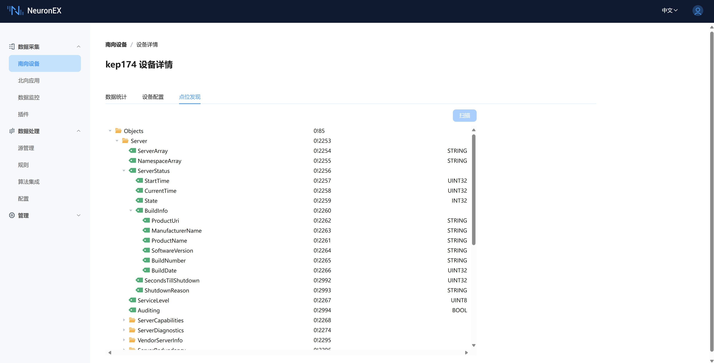

# 浏览 OPC UA 地址空间

NeuronEX 集成了 OPC UA 服务器的地址空间浏览器功能，这个功能可以帮助用户获取已连接的 OPC UA 服务器中的 Tag 信息，包括 Tag 在服务器模型中的位置信息、Tag 的访问地址以及 Tag 的类型信息。

## 使用方法
1. 在**南向设备**列表中，点击 OPC UA 节点操作菜单中的**设备配置**。

2. 在**设备配置**中填写正确的配置选项并提交。

3. 在**点位发现**中点击**扫描**按钮，如果连接已经建立，那么会立即获得 OPC UA 服务器中的模型信息。

4. 在树形的模型信息中展开各个节点可以获得这个节点的类型信息以及子节点。

