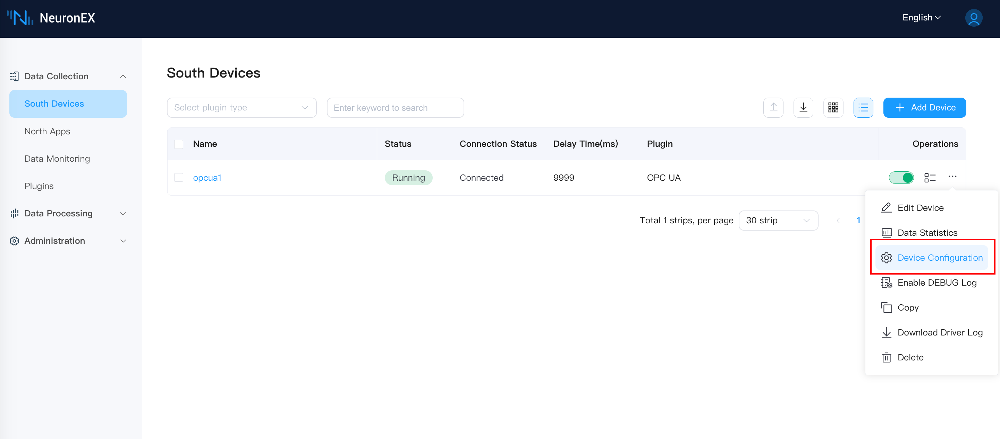
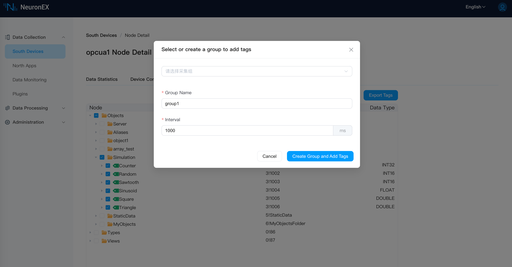
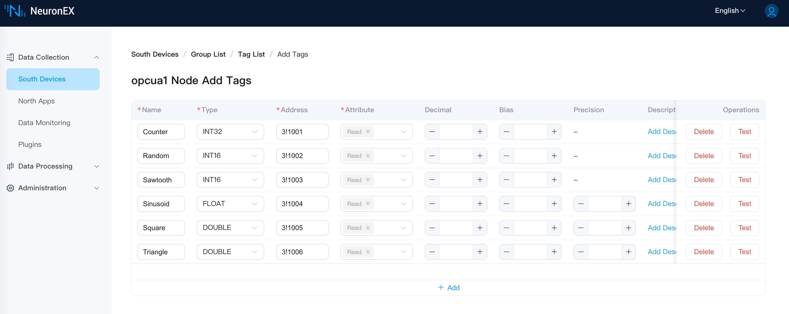
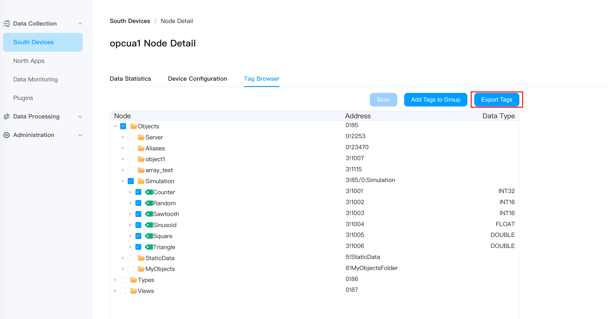

# 浏览 OPC UA 地址空间

NeuronEX 集成了 OPC UA 服务器的地址空间浏览器功能，这个功能可以帮助用户获取已连接的 OPC UA 服务器中的数据点位（Tag）信息，包括 Tag 在服务器模型中的位置信息、Tag 的访问地址以及 Tag 的类型信息，并将这些 Tag 快速添加到采集组中。

## 使用方法
1. 在**南向设备**列表中，点击 OPC UA 驱动操作菜单中的**设备配置**。

2. 在**设备配置**中填写正确的配置选项并提交，用于 OPC UA 驱动可正确连接上 OPC UA 服务器。

3. 在**点位发现**中点击**扫描**按钮，如果连接已经建立，那么会立即获得 OPC UA 服务器中的模型信息。

4. 单选或多选 OPCUA 地址空间中的数据点位，点击**添加点位到采集组**按钮，将这些数据点位添加到采集组中。可选择现有采集组，也可创建新采集组。一次最多添加 10000 个点位。

5. 在**点位列表**页中，可以继续对数据点进行编辑，包括修改数据点名称、读写类型等。

6. 也可以在**点位发现**页中，将所选数据点导出为 `.xlsx` 点表文件，并自行进行后续编辑。支持一次导出不超过 10000 个点位。

