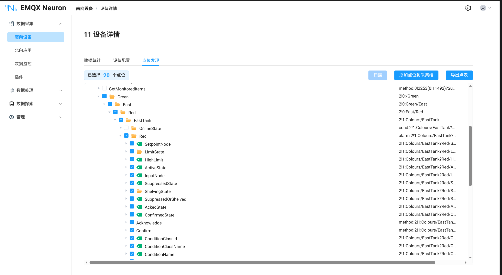
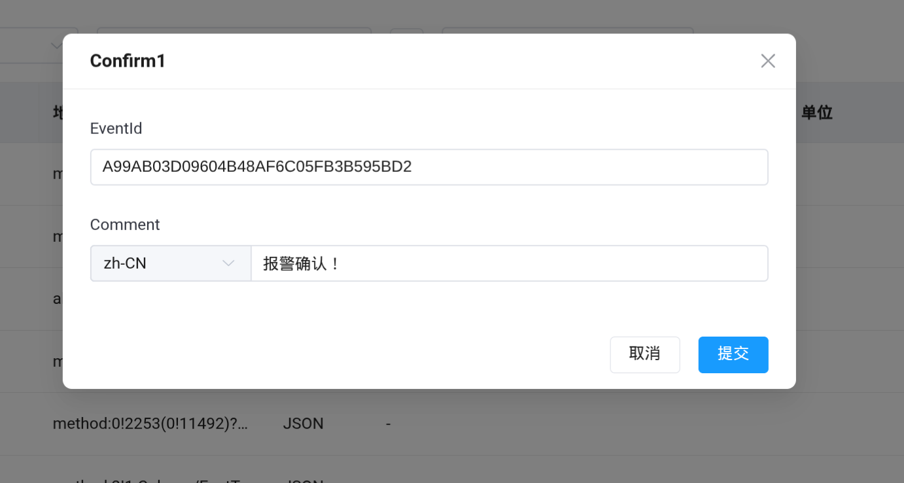

# OPC UA 条件和报警

OPC UA Part 9 定义了条件（Conditions）和报警（Alarms）模型，用于监控设备状态和事件。NeuronEX OPC UA 插件支持订阅条件与报警信息，并可调用 OPC UA 服务器上的方法（Methods）对报警进行确认等操作。

## 前提条件

使用条件与报警功能需满足以下条件：

1. OPC UA 服务器支持 Part 9 条件与报警模型。
2. 设备配置中**更新模式**设置为 **Subscribe** 或 **Read&Subscribe**。
3. 正确配置**事件根节点**（默认 `0!2253`，即 Server 节点），用于订阅条件与报警事件。

::: tip
条件与报警是事件驱动的，必须通过订阅接口接收服务器推送的通知，因此仅支持 Subscribe 或 Read&Subscribe 模式。
:::

## 添加报警点位和方法

通过点位发现功能（浏览地址空间）可快速找到并添加报警点位和方法节点。

以下示例使用公开测试服务器 `opc.tcp://opcua.demo-this.com:62544/Quickstarts/AlarmConditionServer`。

### 操作步骤

1. 在**南向设备**列表中，点击 OPC UA 设备的**设备配置**，确保设备已连接。
2. 进入**点位发现**页面，点击**扫描**按钮，浏览地址空间。

   

3. 在地址空间树中展开 `Server` 节点，找到条件与报警相关分支。
4. 选择目标报警点位（如 `alarm:2!1:Colours/EastTank?Red`），点击**添加点位到采集组**。
5. 方法节点同样可通过地址空间找到（如 `method:2!1:Colours/EastTank?Red(...)`），选择后添加到采集组。
6. 在**点位列表**中可编辑点位名称、读写类型等属性。

## 报警点位

报警点位地址格式为 `alarm:<NS>!<NODEID>`，数据类型为 **JSON**。

### 地址示例

假设 OPC UA 服务器上有一个红灯报警节点，命名空间索引为 2，节点 ID 为 `1:Colours/EastTank?Red`，则地址为：

```
alarm:2!1:Colours/EastTank?Red
```

- `alarm:` — 前缀，表示报警节点
- `2` — 命名空间索引
- `1:Colours/EastTank?Red` — 节点 ID

### 数据格式

该点位上报的 JSON 数据示例：

```json
{
    "active": true,
    "enabled": true,
    "confirmed": false,
    "retain": true,
    "severity": 700,
    "message": "The alarm severity has increased.",
    "source_name": "EastTank",
    "time": 1776749660756,
    "event_type": "ns=0;i=9764",
    "condition_id": "ns=2;s=1:Colours/EastTank?Red",
    "event_id": "F9372A873B95264C91FD50D281433084",
    "condition_name": "Red"
}
```

| 字段             | 说明                            |
| ---------------- | ------------------------------- |
| `active`         | 报警是否处于激活状态            |
| `enabled`        | 报警是否已启用                  |
| `confirmed`      | 报警是否已确认                  |
| `retain`         | 报警是否保持                    |
| `severity`       | 报警严重等级（0-1000）          |
| `message`        | 报警消息文本                    |
| `source_name`    | 报警源名称                      |
| `time`           | 事件发生时间（Unix 毫秒时间戳） |
| `event_type`     | 事件类型 ID                     |
| `condition_id`   | 条件节点 ID                     |
| `event_id`       | 事件唯一标识                    |
| `condition_name` | 条件名称                        |

## 方法调用

方法（Method）可用于对报警执行操作，例如确认报警。方法点位数据类型为 **JSON**，属性为**只写**。

### 地址格式

```
method:<NS>!<ObjectNODEID>(<MethodNS>!<MethodNODEID>)?<参数名>=<类型>&<参数名>=<类型>
```

### 示例

对上文红灯报警调用 Confirm 方法进行确认，地址为：

```
method:2!1:Colours/EastTank?Red(2!1:Colours/EastTank?Red/Confirm)?EventId=ByteString&Comment=LocalizedText
```

- `2!1:Colours/EastTank?Red` — 报警对象节点
- `2!1:Colours/EastTank?Red/Confirm` — Confirm 方法节点
- `EventId=ByteString&Comment=LocalizedText` — 方法参数及类型


