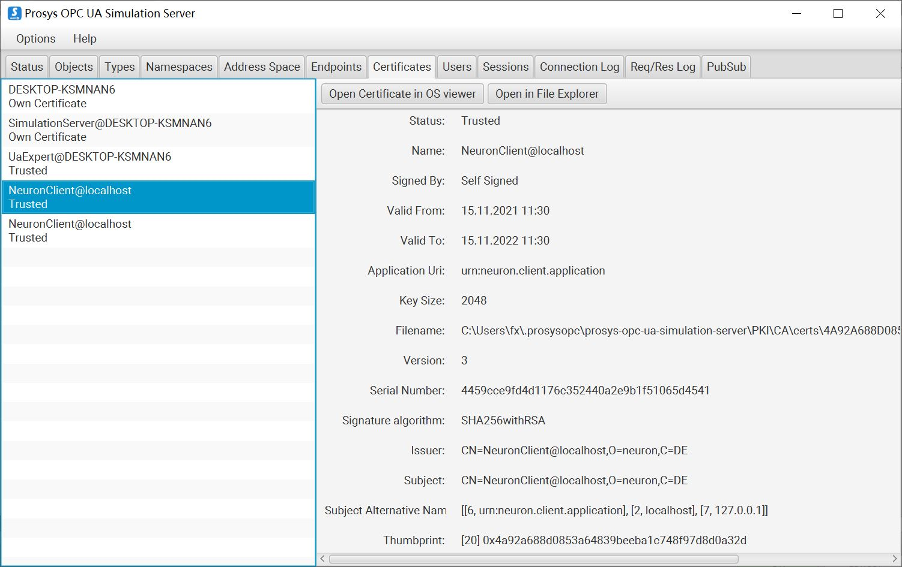

# 连接 Prosys Simulation Server

需要先将 Prosys Simulation Server 切换到 `Expert Mode`，点击菜单 `Options` -> `Switch to Expert Mode`。

## 匿名登录

1. Prosys OPC UA Simulation Server 界面中切换到 **Endpoints** -> **Security Modes** 取消选择 `Sign` 和 `Sign&Encrypt`，选择 `None`；

2. Prosys OPC UA Simulation Server 界面中切换到 **Users** -> **User Authentication Methods** 取消选择 `Username&Password`、`Certificate` 和 `IssuedToken/External System`，选择 `Anonymous`；

3. 保存设置并重新启动 Prosys OPC UA Simulation Server。

4. Neuron 新增南向 OPC UA 设备，打开 **设备配置**，填写目标 Server 的 `端点 URL`，无需填写用户名/密码，无需添加证书/密钥，启动设备连接；

## 证书/密钥 + 匿名登录

1. 参考[连接策略](./policy.md)生成或转换证书/密钥；

2. Prosys OPC UA Simulation Server 界面中切换到 **Endpoints** -> **Security Modes** 取消选择 `None`，选择 `Sign` 和 `Sign&Encrypt`；

3. Prosys OPC UA Simulation Server 界面中切换到 **Users** -> **User Authentication Methods** 取消选择 `Username&Password`、`Certificate` 和 `IssuedToken/External System`，选择 `Anonymous`；

4. 保存设置并重新启动 Prosys OPC UA Simulation Server。

5. Neuron 新增南向 OPC UA 设备，打开 **设备配置**，填写目标 Server 的 `端点 URL`，无需填写用户名/密码，添加证书/密钥，启动设备连接；

6. Prosys OPC UA Simulation Server 界面中切换到 **Certificates**，将列表中的客户端证书设置为信任；

## 用户名/密码登录

1. Prosys OPC UA Simulation Server 界面中切换到 **Endpoints** -> **Security Modes** 取消选择 `None`，选择 `Sign` 和 `Sign&Encrypt`；

2. Prosys OPC UA Simulation Server 界面中切换到 **Users** -> **User Authentication Methods** 取消选择 `Anonymous`、`Certificate` 和 `IssuedToken/External System`，选择 `Username&Password`，添加自定义用户名/密码；

3. 保存设置并重新启动 Prosys OPC UA Simulation Server。

4. Neuron 新增南向 OPC UA 设备，打开 **设备配置**，填写目标 Server 的 `端点 URL`，填写用户名/密码，无需添加证书/密钥，启动设备连接；

5. Prosys OPC UA Simulation Server 界面中切换到 **Certificates**，将列表中的客户端证书设置为信任；

## 证书/密钥 + 用户名/密码登录

1. 用户名/密码设置同上；

2. Neuron 新增南向 OPC UA 设备，打开 **设备配置**，填写目标 Server 的 `端点 URL`，填写用户名/密码，添加证书/密钥，启动设备连接；

3. Prosys OPC UA Simulation Server 界面中切换到 **Certificates**，将列表中的客户端证书设置为信任；

## Neuron 设置

1. 通过 UaExpert 软件查看 Ignition 测点信息， 参考 [配置 UaExpert](./uaexpert.md)。

1. 根据测点信息添加 `Groups` 和 `Tags`。

## 测试点位

| 名称     | 地址   | 属性 | 类型   |
| -------- | ------ | ---- | ------ |
| Counter  | 3!1001 | Read | INT32  |
| Random   | 3!1002 | Read | DOUBLE |
| Sawtooth | 3!1003 | Read | DOUBLE |
| Sinusoid | 3!1004 | Read | DOUBLE |
| Square   | 3!1005 | Read | DOUBLE |
| Triangle | 3!1006 | Read | DOUBLE |

