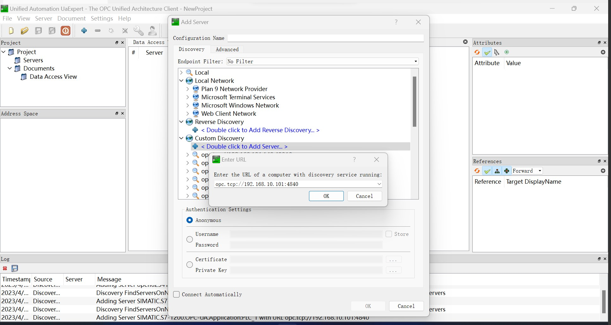

# UaExpert

UaExpert 是一种常见的 OPC UA 客户端。用户可通过 UaExpert 连接 OPC UA 服务器并查看服务器上可用的所有节点（比如设备、传感器等）及其属性（例如温度、压力等）等信息。

## 安装 UaExpert

在 [Unified Automation 官方网站](https://www.unified-automation.com/downloads.html)，下载并安装 UaExpert。

## 获取节点信息

1. 打开 UaExpert 软件，点击工具栏 `+` 按钮, 双击 **Custom Discovery** -> **< Double click to Add Server... >**, 在弹出的对话框中填写 OPC UA Server 的访问地址，点击 `OK` 后地址会被添加到列表末尾。

     

     

2. 完全展开访问地址下的子节点，双击合适的连接策略，连接会被添加到 UaExpert 的 **Project** 视图中。

     

     

3. 在左侧 **Project** 视图中右键点击 **Servers** 下的目标 OPC UA Server （图例中为 SIMATIC.S7-1200...），在弹出菜单中选择 `Connect` 接口连接目标服务器。

     

     

4. 展开左侧 **Address Space** 视图中的子节点，可在右侧 **Attributes** 中看到对应的节点的地址信息，其中 `NamespaceIndex` 为 **名字空间索引**，`Identifier` 为 **节点 ID**。

     

     

5. 拖动 **Address Space** 视图中的子节点到 **Data Access View** 视图，可以看到该节点的数据类型。

     

     

6. 根据 **Data Access View** 视图中的类型信息设置 Neuron OPC UA 插件的测点类型。
