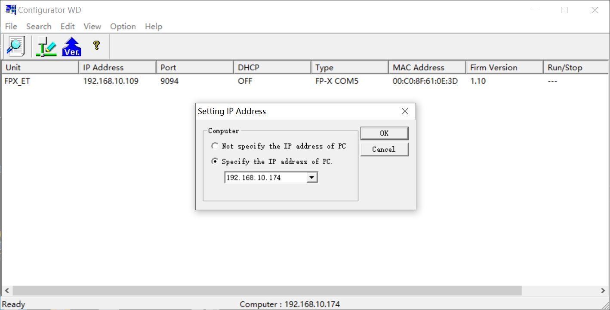
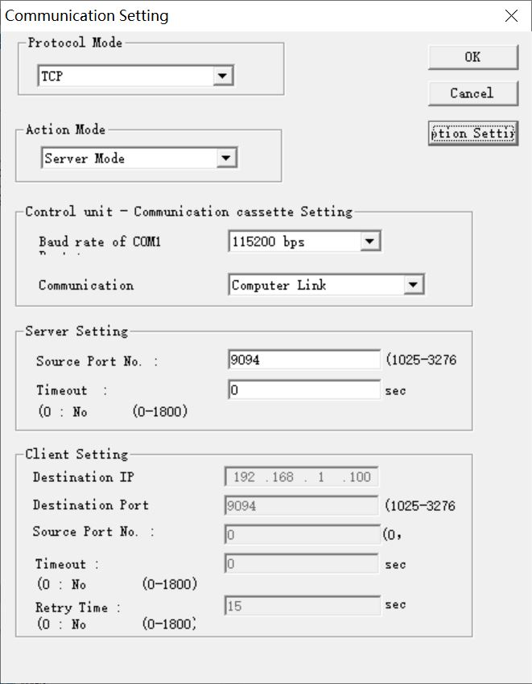
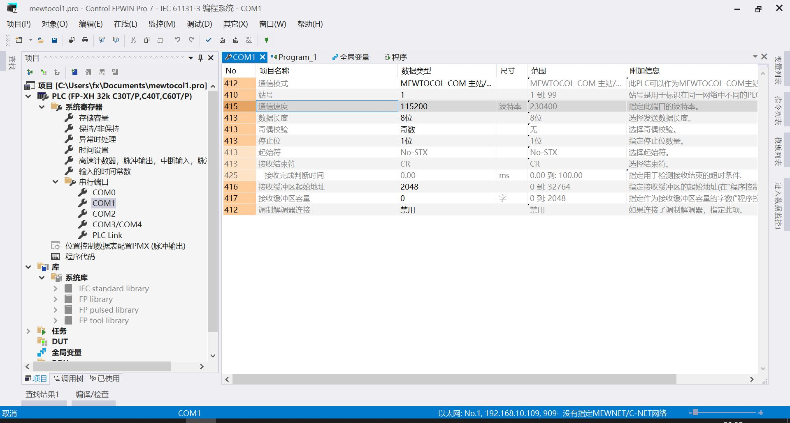
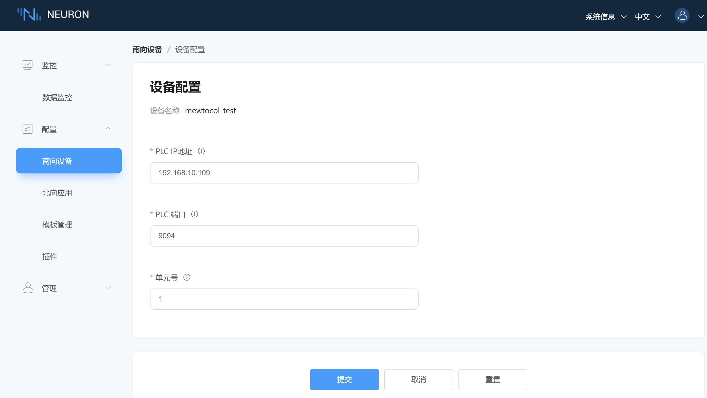

# FP-XH C30T 连接示例

FP-XH C30T 是 Panasonic（松下）公司生产的一款可编程逻辑控制器（PLC），属于 FP-XH 系列，适用于各种中小型自动化应用。

本节将演示如何通过 Neuron Mewtocol 插件连接 FP-XH C30T。

## 安装 Configurator WD

1. 到 https://www3.panasonic.biz/ac/e/fasys/software_info/common/tol_configwd.jsp 注册后下载 configurator_wd_v177.exe，并进行安装。

2. 打开 Configurator WD 软件，点击菜单 **Option** -> **Select IP of PC** -> **Specify the IP address of PC**，选择本机 IP 地址，然后点击 **OK** 按钮。

3. 点击菜单 **Search** -> **Search BroadCast**, 列表中出现 FP-X COM5 模组。

4. 右键点击列表中的 FP-X COM5 项，在弹出菜单中选择 **Setting IP Address**，为 PLC 设备设定一个固定 IP 地址，然后点击 **OK**。

5. 右键点击列表中的 FP-X COM5 项，在弹出菜单中选择 **Communication Setting**，将 **Baud rate of COM1** 设置为 **115200**，点击 **OK**。

6. 右键点击列表中的 FP-X COM5 项，在弹出菜单中选择 **Communication Setting**-> **Option Setting**，将 **Respons timeout** 设置为 **1000**，点击 **OK**。

7. 打开 Control FPWIN Pro 7，确认 PLC 串行端口 **COM1** 的 **通信速度** 为 **115200**。

## 配置 Neuron
1. 在 Neuron 南向设备管理中添加一个 Panasonic Mewtocol 设备。

2. 在设备配置中修改 **PLC IP 地址** 为目标设备 IP 地址。

3. 在设备配置中修改 **PLC 端口** 为目标设备端口。

4. 在设备配置中修改 **单元号** 为目标设备单元号，提交设置表单。

## 测试点位
| 名称 | 地址     | 属性 | 类型   |
| ---- | --------| ---- | ------ |
| DATA1  | DT0    | Read Write | INT16  |
| DATA2  | DT2    | Read Write | UINT16 |
| DATA3  | DT4    | Read Write | INT32  |
| DATA4  | DT7    | Read Write | UINT32 |
| DATA5  | DT10    | Read Write | FLOAT  |
| DATA6  | DT13    | Read Write | DOUBLE |
| DATA7  | X0    | Read       | BIT    |
| DATA8  | Y0    | Read Write | BIT    |
| DATA9  | DT20.0 | Read       | BIT    |
| DATA10  | DT17.20  | Read Write | STRING |

## 数据监控

完成点位的配置后，您可点击 **监控** -> **数据监控**查看设备信息以及反控设备，具体可参考[数据监控](../../../usage/monitoring.md)。