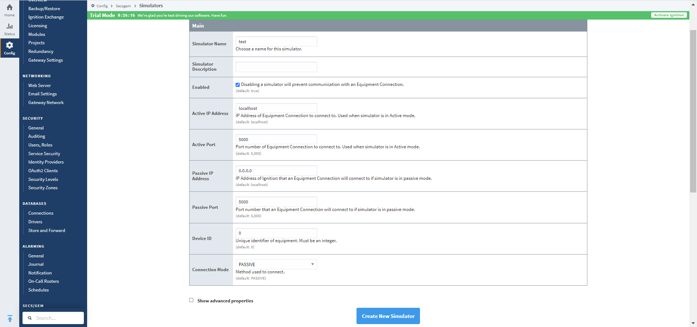
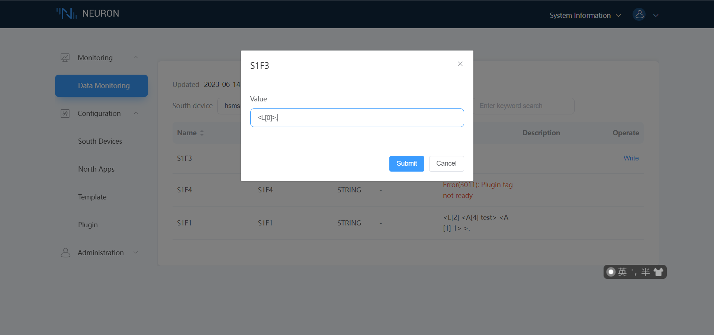
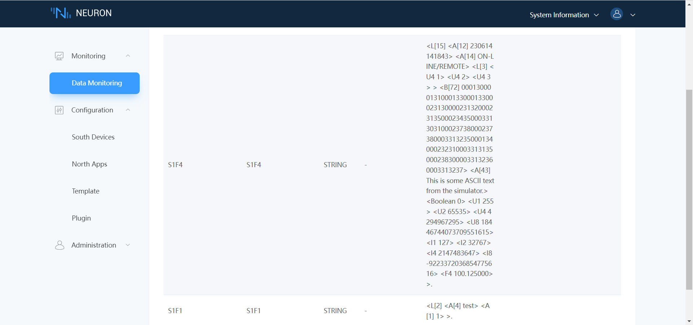

# 连接 Ignition SECS/GEM 模拟器示例

本文将使用 SECS GEM HSMS 插件连接 Ignition SECS/GEM 模拟器，实现读写 SECS/GEM 模拟设备的数据。确保插件和模拟器网络联通。

## Ignition SECS/GEM 模拟器安装

模拟器的安装分为两部分，第一部分是 Ignition 网关软件的安装，第二部分是 SECS/GEM 模块的安装。

* 安装 Ignition 网关软件，安装包可以从 [Ignition](https://inductiveautomation.com/downloads/) 页面下载。
* 下载 SECS/GEM Module, 文件可以从 [SECS/GEM Module](https://inductiveautomation.com/downloads/ignition/8.1.28) 页面下载。
* Ignition 安装完之后，使用浏览器访问 8088 端口，进行相应的初始化设置之后，登录进入主页面。
* 进入 **Config -> System -> Modules**，安装下载好的 SECS/GEM Module 文件。安装完成后，Config 菜单会出现 SECS/GEM 二级菜单，说明安装成功。

## 新建 Ignition SECS/GEM 模拟器

进入 **Config -> SECS/GEM -> Simulator**，点击 `Create new Simulator...`，根据需求输入模拟器参数，主要需要设置模拟器名称，Passive IP 地址，Passive 端口和设备 ID，之后点击新建即可。如下图所示。
  

本文新建的模拟器，名称为 test，Passive IP 地址为0.0.0.0， 端口为5000，设备 ID 为0。

## Neuron 配置节点连接 Ignition SECS/GEM 模拟器

* 在 **南向设备** 中 点击 `添加设备`，选择 `SECS GEM HSMS` 插件来创建一个连接 SECS/GEM 模拟器的节点。
* 创建好节点后，点击 `设备配置` 进入设备配置页面，根据实际情况配置节点信息，
	* `设备 IP 地址`：设备的 IP 地址
	* `设备端口`：设备的端口，默认为 5000
 	* `设备 ID`：设备的端口，默认为 0
* 在创建好的南向设备节点中，创建组，并在组下创建点位。
* 进入 Neuron **监控页面** 选择对应设备与组，查看采集的数据点，如下图所示。
  

因为 SECS-II 协议的特殊性，所以新建点位的时候有一定的规律。比如 S1F1 消息，其读取时不需要额外参数，那么直接新建一个 Read 或者 Sub 属性的点位就可以获取到返回值。但是对于比如 S1F3 消息，其需要一个 LIST 类型的参数，而且其返回值是 S1F4 消息，那么为了完成一次操作，需要新建两个点位，分别为 Write 属性的 S1F3 节点和 Sub（或者 Read ） 属性的 S1F4 节点，并且要求点位名称和消息名称一致。如以下图所示。

上图模拟的是 S1F3 读取，使用一个空 LIST 作为参数，S1F4 返回模拟器设备所有的状态。