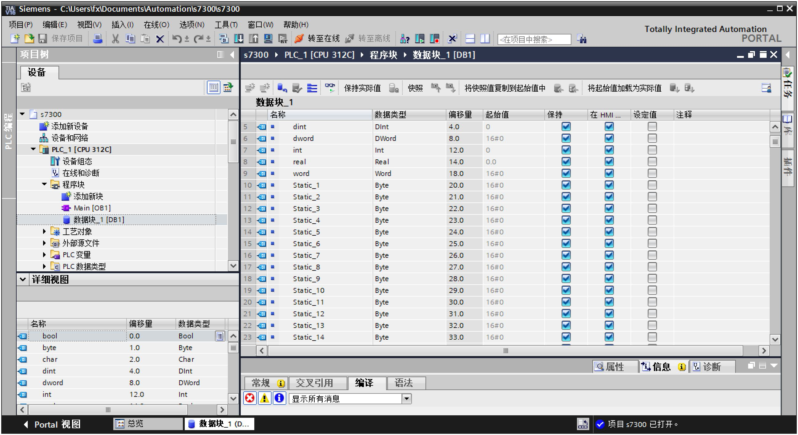
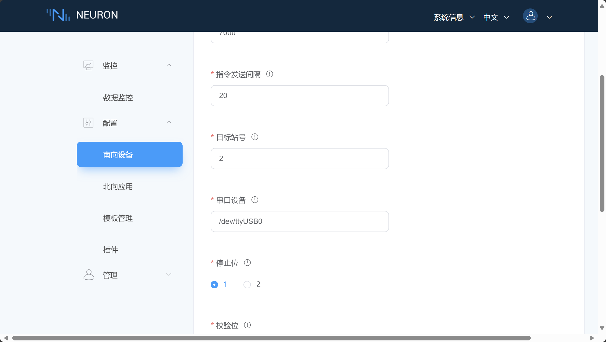

# Siemens S7300 PLC 连接示例

S7300 是 Siemens S7 系列 PLC 的一款产品。这款 PLC 适用于大型和复杂的自动化应用，提供了高性能和丰富的功能。

本节介绍如何通过 Neuron Siemens MPI 插件连接 S7300。

## 连接硬件设备

1. 使用 0CA23 适配器连接到 S7-300 的 MPI 接口。

2. 使用 RS232-USB 适配线缆将 0CA23 适配器连接至 PC。

## PLC 设置

1. 假定我们使用 S7300 PLC 的默认 MPI 站号 2。
2. 在 TIA Portal 中为 S7300 PLC 添加了数据块，并建立了数据点，如图：

## 配置 Neuron

1. 在 Neuron 南向设备管理中添加一个 Siemens MPI 设备。

2. 修改 **串口设备** 项为实际设备路径，其他配置项保持默认，提交设置表单。

3. 添加 **组**，添加测试 **点位**。

## 测试点位

| 名称 | 地址     | 属性 | 类型   |
| ---- | --------| ---- | ------ |
| DATA1  | DB1.DBB0    | Read Write | UINT32 |
| DATA2  | DB1.DBB16.7 | Read Write | BIT    |
| DATA3  | DB1.DBB5    | Read Write | DOUBLE |
| DATA4  | M100        | Read Write | INT64  |
| DATA5  | M108.20     | Read Write | STRING |
| DATA6  | I1.2        | Read Write | BIT    |
| DATA7  | Q0.7        | Read Write | BIT    |
