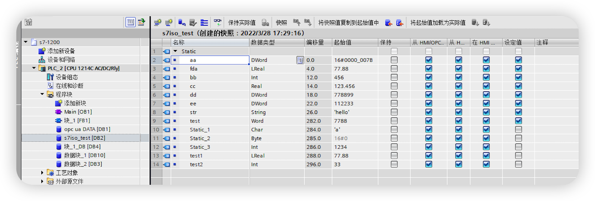

# Siemens 1200 PLC 连接示例

本文将使用 Siemens S7 ISOTCP 插件连接西门子 S7-1200 PLC，实现读写 PLC 中的点位值。

Siemens S7 ISOTCP 插件可以通过本地局域网或者 Internet 连接 PLC，但是需要注意的是，如果 PLC 与 Neuron 服务器不在同一局域网内，需要在 PLC 中配置端口映射。

## S7-1200 PLC 点位

本文假定已能使用 TIA Portal 软件连接 PLC，具体步骤，见[配置 S7-1200/1500](../../plc/siemens-s7-1200-1500.md)

* 使用 TIA Portal 软件打开 PLC 项目，点击 PLC 项目名称，进入 PLC 项目配置页面。
* 在 左侧菜单中，选择需要采集的全局数据块点表 **设备 -> 程序块 -> 任意全局数据块 (DB)** 如下图所示

## Neuron 配置节点连接 1200 PLC

* 在南向设备中，点击 **添加设备**， 选择插件 **Siemens S7 ISOTCP** 来创建一个连接 1200 PLC 的节点。
* 创建好节点后，点击 **设备配置** 进入设备配置页面，根据实际情况配置节点信息，
  * **PLC IP 地址**: PLC IP 地址。
  * **PLC 端口**：PLC 端口，默认为 102。
  * **CPU 机架号**：PLC CPU Rack 号，默认为 0。
  * **CPU 槽号**：PLC CPU Slot 号，默认为 1。
* 在创建好的南向设备节点中，创建组，并在组下创建点位。

## 数据监控

完成点位的配置后，您可点击 **监控** -> **数据监控**查看设备信息以及反控设备，具体可参考[数据监控](../../../../../usage/monitoring.md)。
