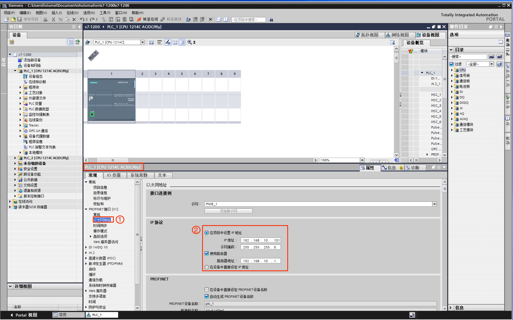
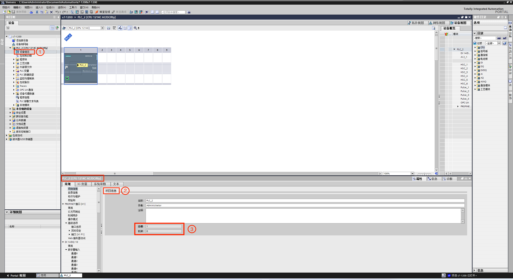
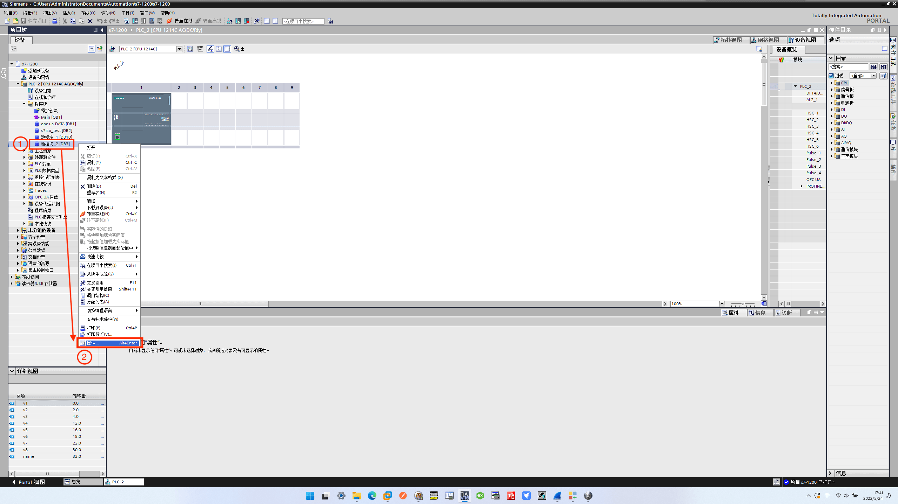
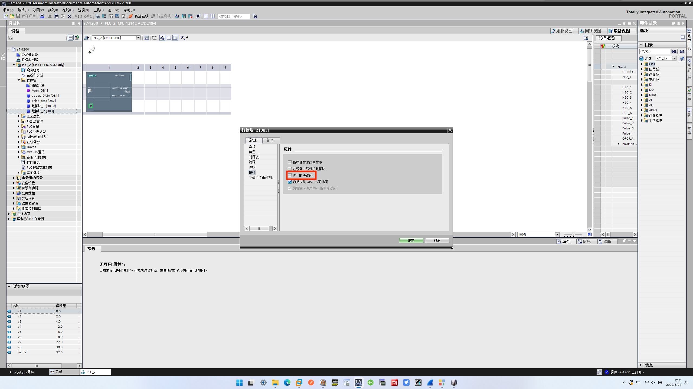
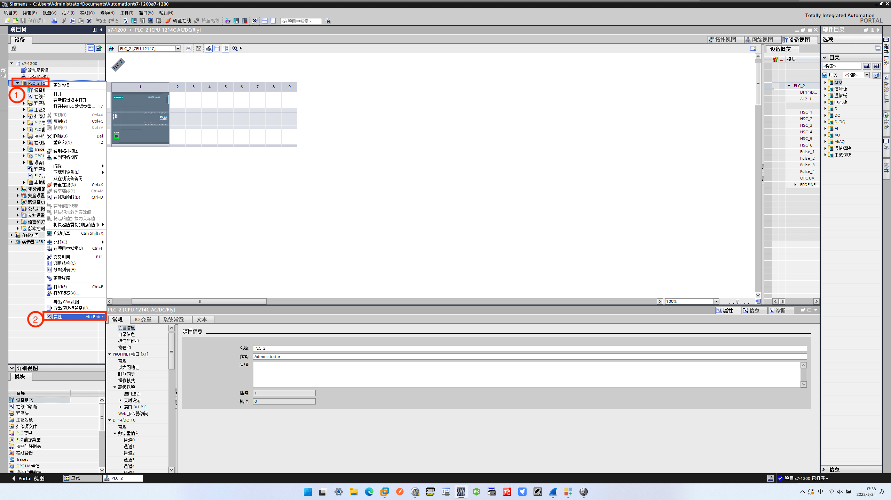
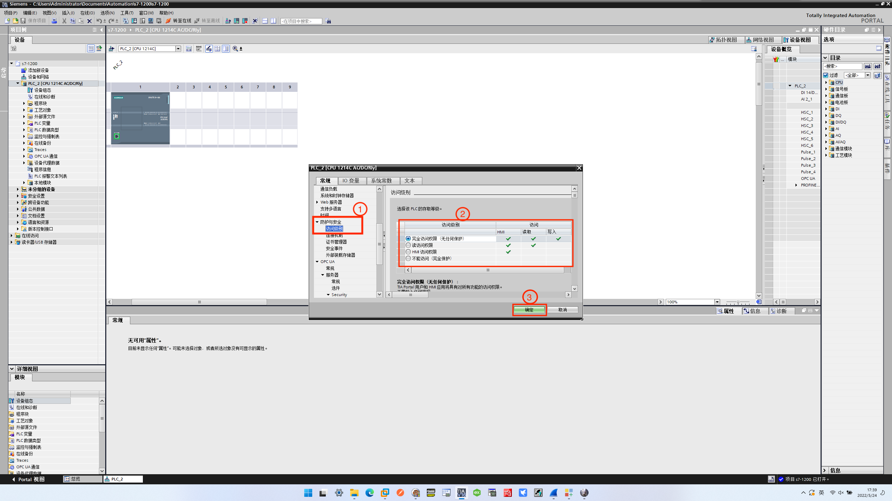
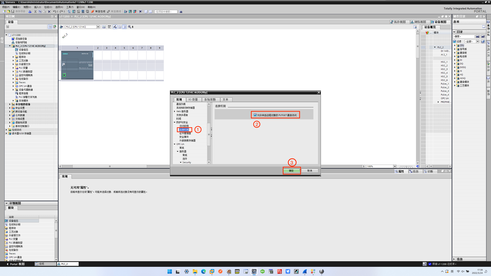

# 配置 Siemens S7-1200/1500

当使用 Siemens S7 ISOTCP 插件连接S7 1200/1500 PLC 时，应进行如下设置：

* **优化块访问**必须被关闭。
* **访问级别**必须是**完全**，**连接机制**必须允许 GET/PUT。

本节将使用 TIA Portal V16 演示如何进行相关配置。

## 连接 S7-1200/1500

首先，应进行连接设备设置，如下图所示。

1. 在设备名称下，双击**设备组态**，在**接口**目录下选择**以太网网络**。
2. 对应填写 PLC 连接的网络的 IP 地址，完成连接设置。

## 查看机架号与插槽号

在软件与设备正确连接的条件下，在**设备组态**页面下，选择**常规** -> **项目信息**，查看对应的机架号和插槽号，如下图所示。

## 配置 S7-1200/1500

在访问 S7 1200/1500 PLC 时，还需要进行以下设置。

### 关闭优化块访问

右键单击要使用的 DB 块，在弹出的会话框中选择**属性**，如下图所示。

在弹出的会话框中，取消勾选**优化的块访问**，如下图所示。

### PLC 安全设置

右键单击设备名称，在弹出的会话框中选择**属性**，如下图所示。

首先，设置**访问级别**，根据需求设置读取与写入的权限，如下图所示。

再设置**连接机制**，勾选**允许来自远程对象的 PUT/GET 通信访问**，如下图所示。

