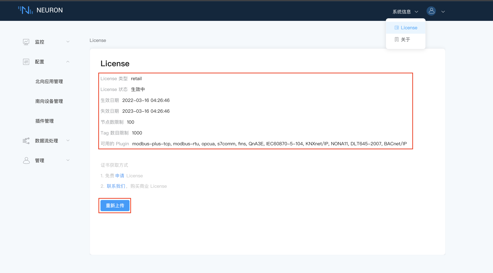

# 安装 License

## 第一步，安装许可证

在未上传 License 或者 License 过期时，商业版的插件是无法使用的，用户需要在界面申请有效的 License，如下图所示。

* 在页面右上角`系统信息`下拉框中选择 License。

* 用户可以从我们的官方网站 [https://www.emqx.com/zh/apply-licenses/neuron](https://www.emqx.com/zh/apply-licenses/neuron) 申请免费试用的 License，也可以联系我们销售代表获取正式的 License。在收到 License 后，点击`上传`按键，上传 License 文件。

## 第二步，查看许可证详细信息

在 License 成功上传后，页面将展示 License 信息，如下图所示。

* 失效日期，Neuron 可使用的截止日期，如果 License 过期，您必须重新获取 License，`重新上传`上传 License；
* 节点数限制，Neuron 可创建节点数的最大值，一个节点指的是一个南向设备或者是一个北向应用；
* 节点下 Tag 数目限制，Neuron 可创建的所有标签总和的最大值；
* 可用的 Plugin，Neuron 已授权的插件。
