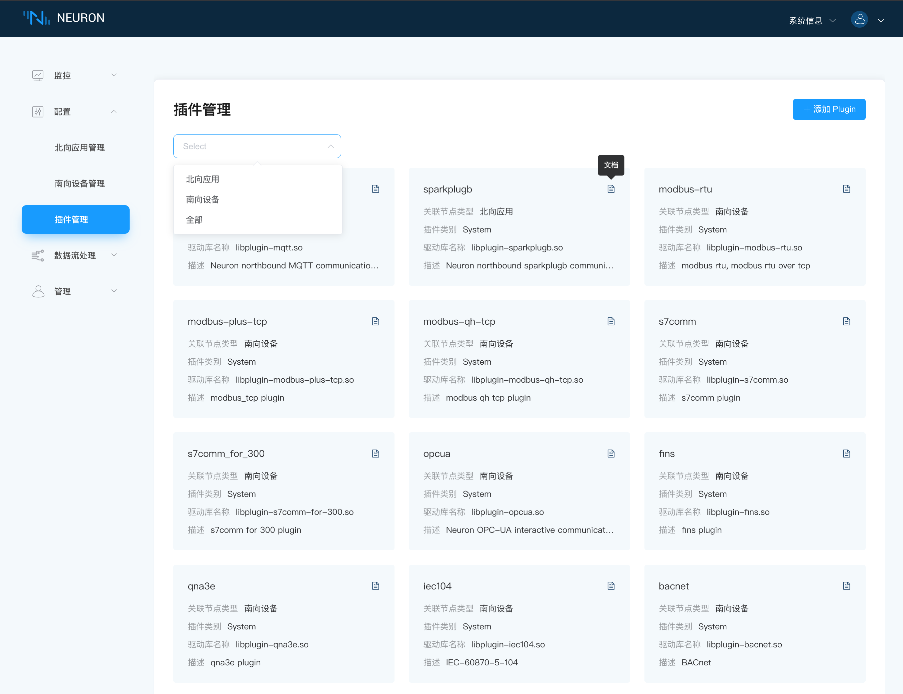
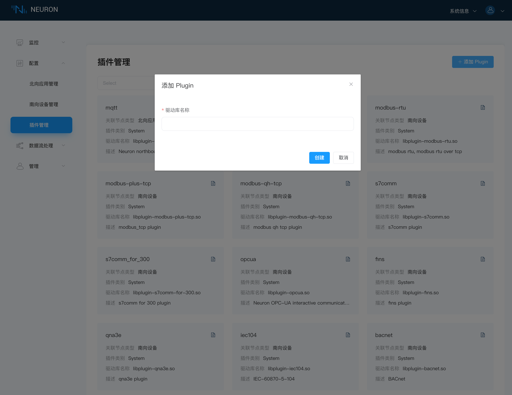

# 插件模块管理

插件管理界面展示已经支持的所有插件信息，包含插件的名称、关联节点类型、插件类别和驱动库名称。其中插件类型包含下面三种：

* Static：不可删除
* System：不可删除，是软件自带的
* Custom：可删除，用户自己开发或者是定制开发的

在显示的插件过多时，用户可下拉框筛选出北向应用/南向设备的插件，如下图所示。

在开源版本中，用户可以点击右上角的`添加Plugin`按钮，手动添加自己编写的插件，如下图所示。

:::tip
请确保已将自己编写的插件 .so 文件放置在 neuron/build 目录底下。
:::
