# 配置

## 北向应用管理

北向应用管理界面展示用户添加的所有的北向应用，包含每个应用的名称，工作状态和连接状态。目前工作状态分为五种：初始化、配置中、准备好、运行中和停止。添加北向应用后进入初始化状态，设置该应用时进入配置状态，配置完成后进入准备状态，用户可点击工作状态的开关按钮，选择运行/停止该设备。

北向应用管理界面还可进行`添加应用`操作，每个应用都可以单独地进行配置及删除操作，点击应用卡片的任意空白处，即可进入应用底下的订阅界面，如下图所示。

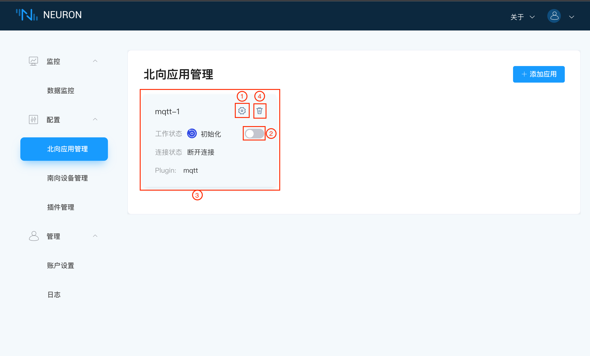

用户可点击右上角的`添加应用`按钮，进行添加应用的操作，需要填写应用名称，下拉选择北向应用插件，如下图所示。

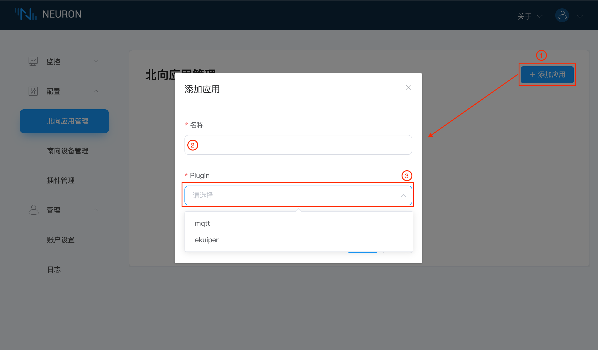

当点击`应用配置`按钮时，进入到该应用的配置界面，带有 “ * ” 的是必填项，每个字段后面都有一个信息提示键，将鼠标放置在这个键上方，将会出现该字段的说明，如下图所示。

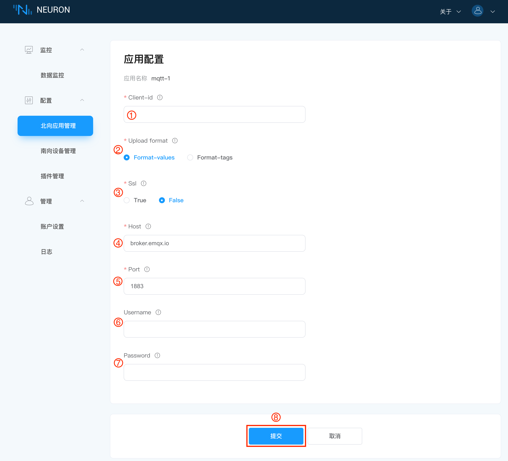

当点击卡片空白处时，即可进入订阅界面，如下图所示。

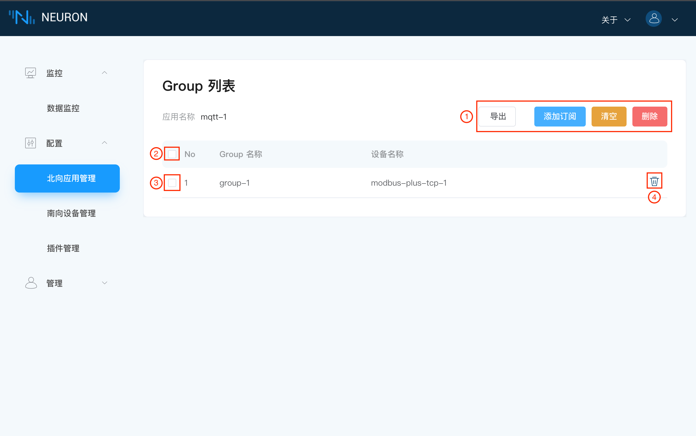

在订阅界面中，用户可查看对应应用名称底下订阅的所有Group列表，也可在界面进行添加/删除订阅等操作：

- `导出`按钮可将订阅的Group列表以Excel表格形式导出；
- `添加订阅`按钮可进行添加订阅的操作，如下图所示，下拉框选择所有订阅的南向设备及对应的Group；

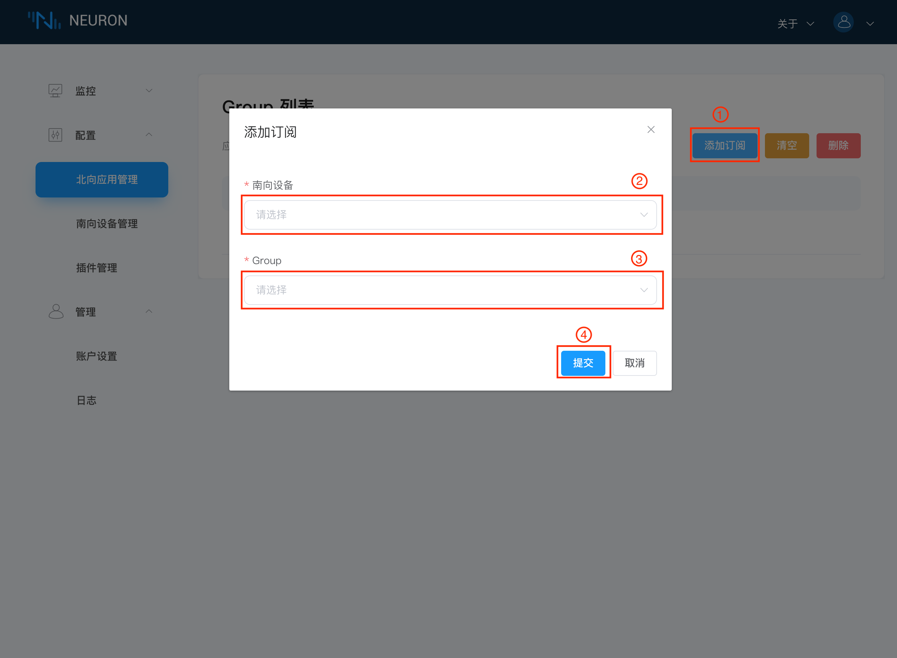

- `清空`按钮可一键删除所有订阅的操作；
- `删除`按钮，当选择全选时，再点击`删除`按钮，效果等同于`清空`，可将所有订阅全部删除。当单选某些Group时，再点击`删除`按键，可快捷批量删除选择的Groups的订阅；

## 南向设备管理

南向设备管理界面展示用户添加的所有的南向设备，包含每个设备的名称，工作状态和连接状态，其中工作状态同北向应用的工作状态。

南向设备管理界面还可进行`添加设备`操作，每台设备都可以单独地进行配置及删除操作，点击设备卡片的任意空白处，即可进入到Group列表界面，如下图所示。

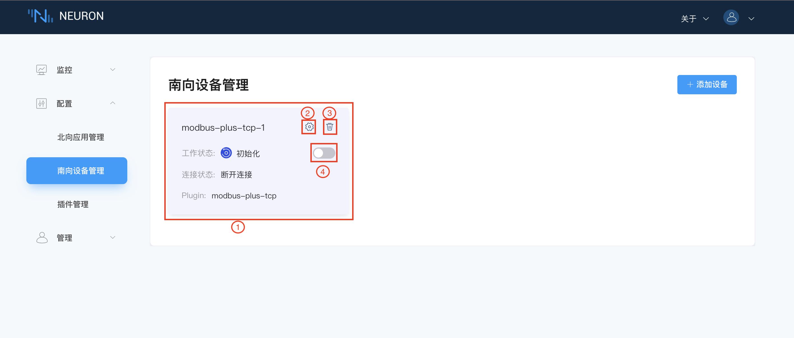

同北向应用，用户需点击右上角的`添加设备`按钮，进行添加设备的操作，需要填写设备名称，下拉选择南向设备插件，如下图所示。

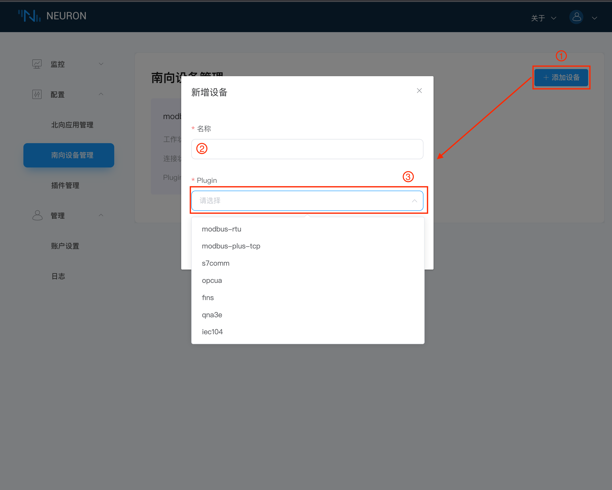

当点击`设备配置`按钮时，进入该设备的配置界面,带有 ” * ” 的是必填项，每个字段后面都有一个信息提示键，将鼠标放置在这个键上方，将会出现该字段的说明，如下图所示。

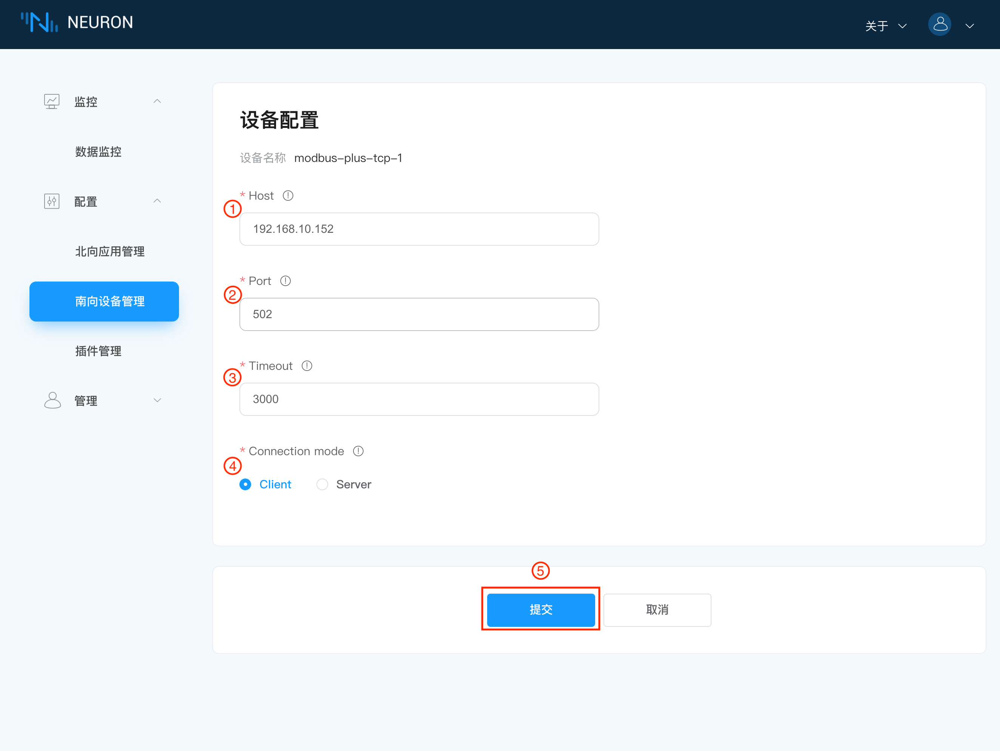

当点击卡片空白处时，即可进入该设备底下的Group列表界面，如下图所示。

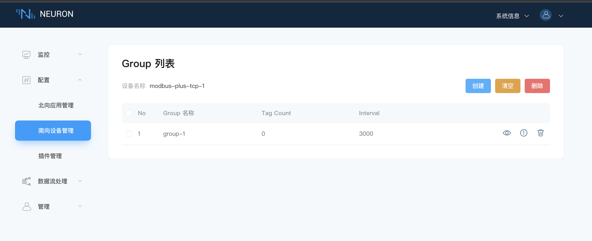

在Group列表界面中，用户可查看对应设备底下的所有Group列表，也可在界面进行添加/删除Group等操作：

- `导出`按钮可将Group列表信息以Excel表格形式导出；
- `创建`按钮可进行添加Group的操作，如下图所示，填写Group信息，创建Group，用户可利用编辑按钮修改Group配置；

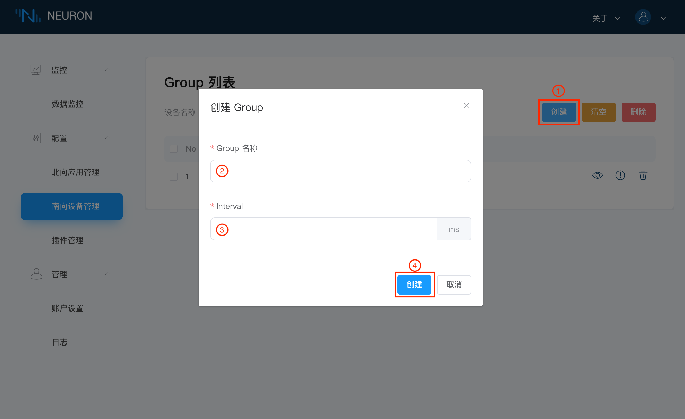

- `清空`按钮可一键删除所有创建的Group；
- `删除`按钮，在选择全选时，在点击`删除`按钮，效果等同于`清空`，可将所有Group全部删除。当单选某些Group时，再点击`删除`按键，可快捷批量删除选择的Groups；

在Group列表界面点击某个Group底下的tag列表，将会进入到Tag列表界面，如下图所示。

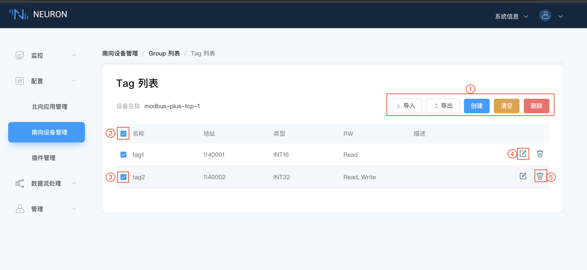

在Tag列表界面中，用户可查看所在的设备名称，也可在界面进行创建/删除tag的操作，本页面还可以利用Excel批量导入tags；

- `导入`按钮，将鼠标放置在`导入`按钮上方，将会出现导入的Excel模版，用户可通过Excel批量导入tags；
- `创建`按钮可进行添加Tags的操作，如下图所示，填写Tag的名称，驱动地址，属性和类型创建Tag，当然，还可以通过下方的`添加`按钮一次添加多个tag。目前属性提供读、写、订阅三种属性，Tag类型根据插件里提供的数据类型来定，如下图所示。

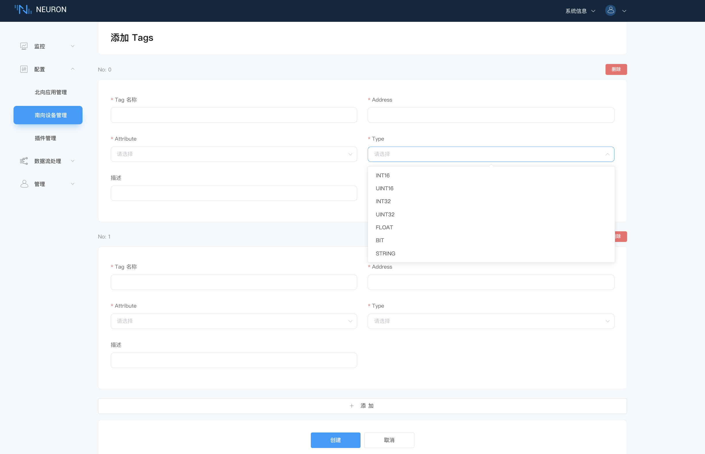

- `清空`按钮可一键删除所有创建的Tag；
- `删除`按钮，在选择全选时，点击`删除`按键，效果等同于`清空`，将删除所有Tag。当单选某些Tag时，再点击`删除`按键，可快捷批量删除选择的Tags；

## 插件管理

插件管理界面展示用户添加的所有插件信息，包含插件的名称、关联节点类型、插件类别和驱动库名称，如下图所示。其中插件类型包含下面三种：

- Static：不可删除
- System：不可删除，是软件自带的
- Custom：可删除，用户自己开发或者是定制开发的

在添加的插件过多时，用户可下拉框筛选出北向应用/南向设备的插件，如下图所示。

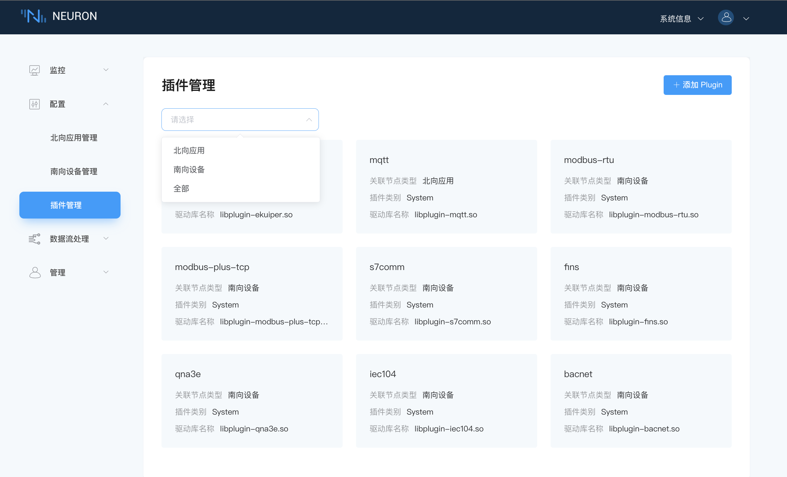

用户可根据右上角的`添加Plugin`按钮，进行添加插件的操作，如下图所示，手动添加已加在build目录底下的.so文件的文件名称。

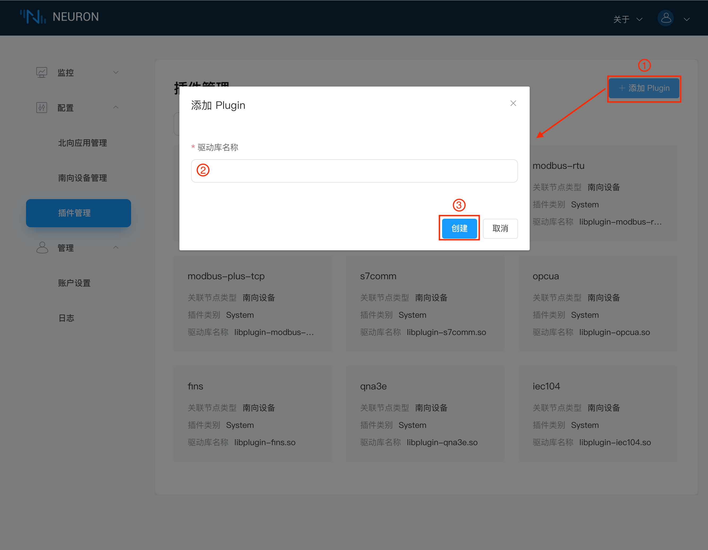
