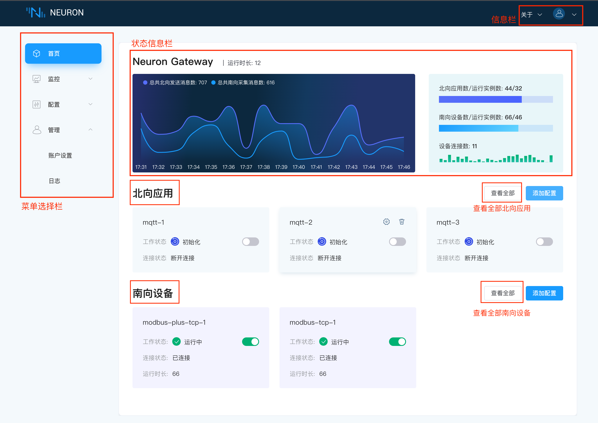
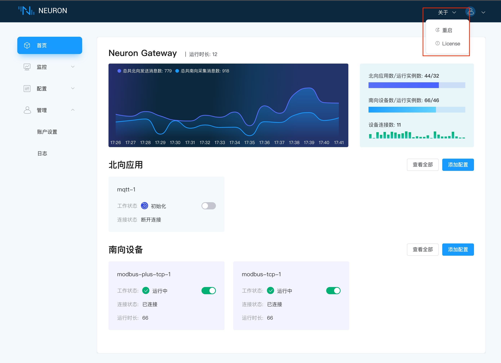
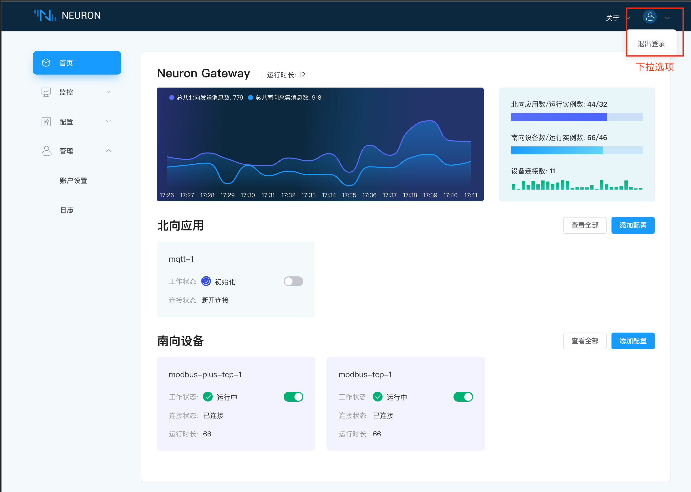

# 首页

成功登录之后将会进到首页面，该页面将会展示Neuron配置的基本信息，该界面主要分为四块，菜单选择栏，状态信息栏，信息栏和南北向配置栏如下图所示。

## 菜单选择栏

如上图所示，左侧为菜单选择栏，可快速进入首页面，数据监控界面，配置界面及账户管理界面，后面会对这些界面进行详细的说明。

## 信息栏

页面右上角为信息栏，可进行上传License和退出登录等操作，如下图所示。

## 状态信息栏

该板块暂时还未启用。

## 南北向配置栏

该板块展示了北向应用和南向设备的配置情况，首页面最多只展示三个应用或三台设备。用户可通过点击`查看全部`按钮快速进入到北向应用/南向设备的配置界面，也可以在`首页`通过`添加配置`按钮快速配置。
