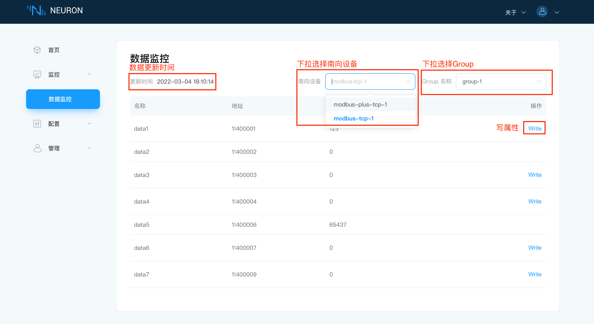
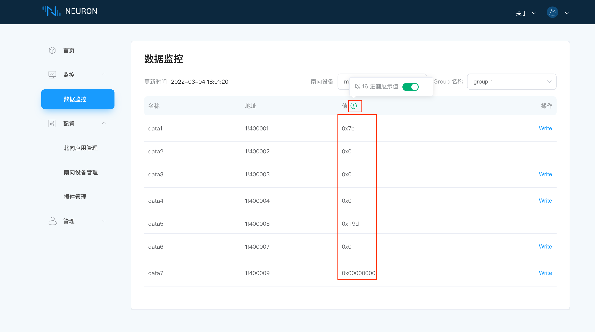
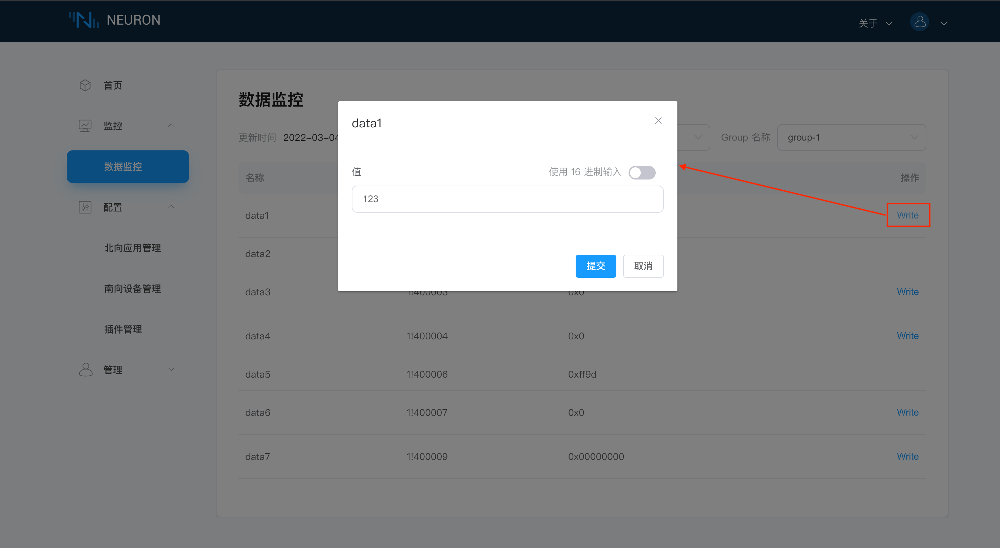

# 监控

## 数据监控

该界面展示数据的监控情况，用户可根据需求下拉选择设备及想要查看的Group(一般Group可以理解为该设备底下连接的某类传感器，例如温度传感器类，当然用户也可根据自己需求定义Group)。

界面展示数据的更新时间，用户选择的Group底下的所有tag信息，包含每个tag的名称，驱动地址，值及是否可进行写操作，如下图所示。

在数据监控界面还提供了以十六进制显示数值的功能，用户需要将鼠标放置在`值`旁边的绿色提示标志上，将会自动弹出`以16进制显示值`的字样，将开关打开，数据将会如下图所示，以十六进制的方式展示。

操作栏展示该tag是否具有写操作的功能，当某个tag的属性设置了写属性时，操作栏就会出现`Write`的写操作按钮，点击该按钮将会有弹窗弹出，用户可改写该tag的数值，如下图所示。

