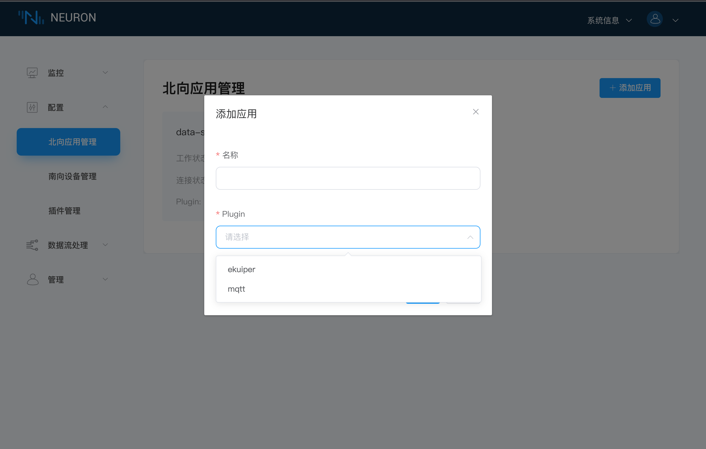
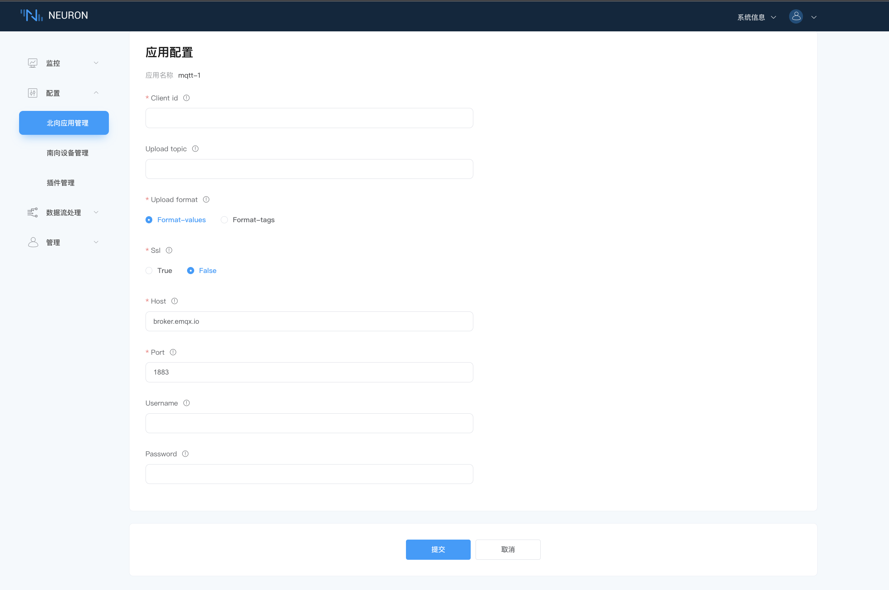
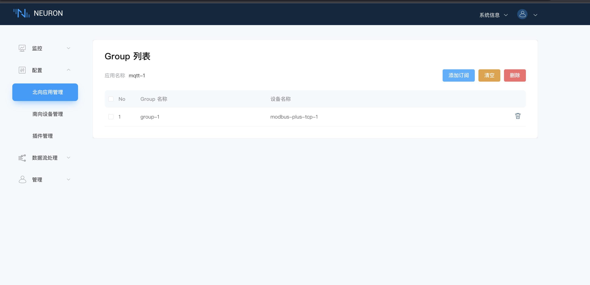
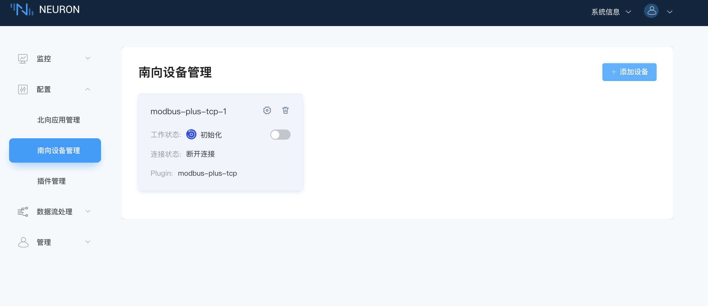
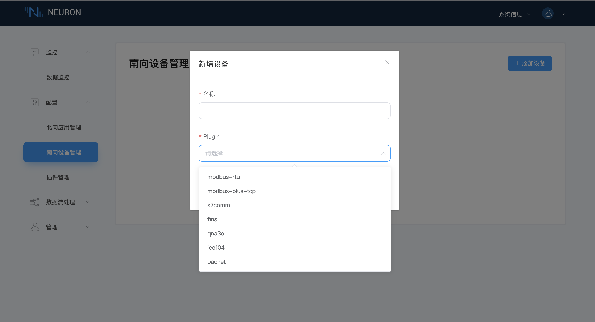
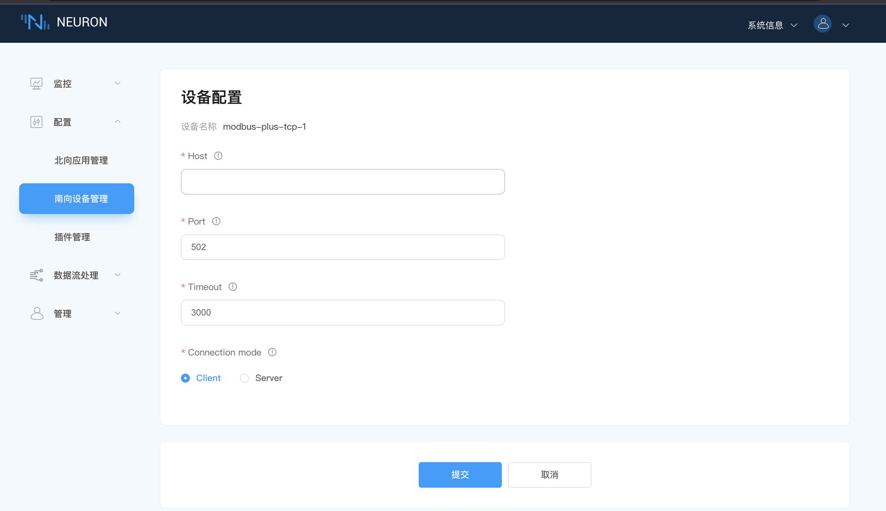
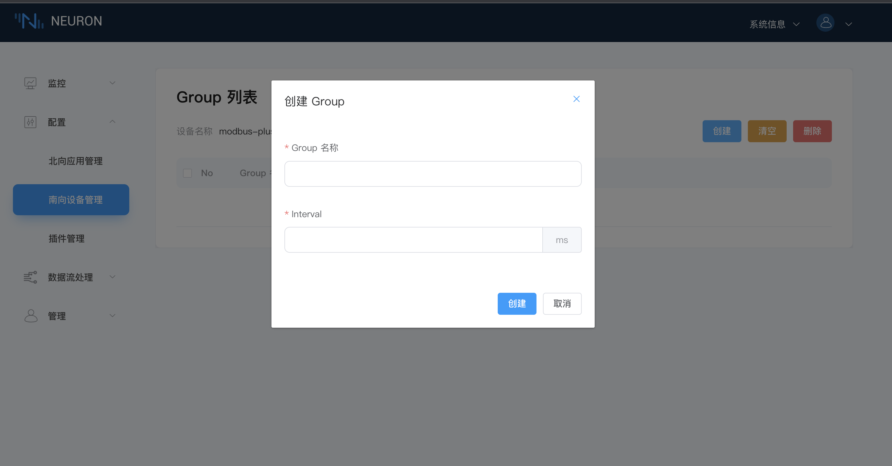
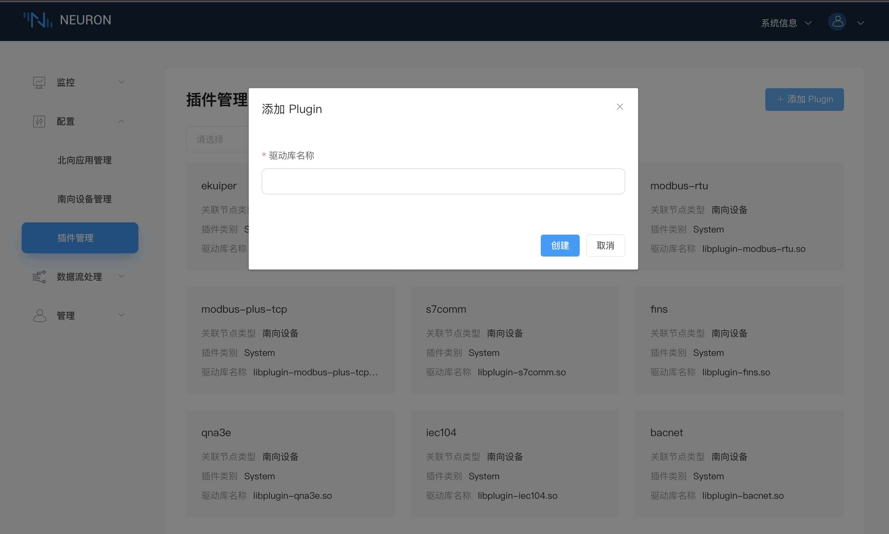

# 配置

本文只对界面做较为详细的介绍，使用用例请参考[快速开始](../getting-started/quick_start.md)。

## 北向应用管理

北向应用管理界面展示用户添加的所有北向应用节点卡片，每个应用节点卡片包含应用名称，应用配置，工作状态，连接状态和插件名称，点击卡片任意空白处，可进入订阅 Group 界面，如下图所示。目前工作状态分为五种：

* 初始化：首次添加北向应用卡片后，进入初始化状态；
* 配置中：进行应用配置时，进入到配置中的状态；
* 准备好：成功配置应用后，进入到准备好的状态；
* 运行中：手动打开工作状态，进入到运行状态，neuron 连接到北向应用，进行传输数据；
* 停止：手动关闭工作状态，进入到停止状态，neuron 断开与北向应用的连接，停止传输数据；

### 添加应用

点击右上角的`添加应用`按钮后，在弹窗中，填写应用名称，下拉选择北向应用插件，添加应用，如下图所示。

### 应用配置

点击`应用配置`按钮，进入该应用的配置界面，每个应用的配置参数不一样，但带有 “ * ” 的是必填项，每个字段后面都有一个信息提示键，将鼠标放在提示键上方，将显示该字段的说明，如下图所示。

### 订阅 Group

点击应用节点卡片任意空白处，即可进入订阅界面。在该界面，用户可查看该应用所有已订阅的 Group，也可进行添加/删除订阅等操作，如下图所示。

* `添加订阅`按钮，在弹框中，下拉框选择需要订阅的已创建的南向设备及 Group，进行添加订阅；

* `清空`按钮，一键删除所有订阅；
* `删除`按钮，当选择全选时，再点击`删除`按钮，效果等同于`清空`，可将所有订阅全部删除。当单选某些 Group 时，再点击`删除`按键，可快捷批量取消所选择的 Group 的订阅；

## 南向设备管理

南向设备管理界面展示用户添加的所有的南向设备，每个设备卡片包含每个设备的名称，设备配置，工作状态和连接状态，点击卡片任意空白处，可进入 Group 列表，如下图所示。目前工作状态分为五种：

* 初始化：首次添加南向设备卡片后，进入初始化状态；
* 配置中：进入设备配置中，进行设备配置时，进入到配置中的状态；
* 准备好：成功配置设备后，进入到准备好的状态；
* 运行中：手动打开工作状态，进入到运行状态，在添加 Group 和 Tag 后，Neuron 连接到设备采集数据；
* 停止：手动关闭工作状态，进入到停止状态，neuron 断开与设备的连接，停止采集数据；

### 添加设备

点击右上角的`添加设备`按钮后，在弹窗中，填写设备名称，下拉选择南向设备插件，创建南向设备卡片，每台设备都可以单独地进行配置及删除等操作，如下图所示。

### 设备配置

点击`设备配置`按钮，进入到该设备的配置界面，每台设备的配置参数不一样，但带有 ” * ” 的是必填项，每个字段后面都有一个信息提示键，将鼠标放在提示键上方，将显示该字段的说明，如下图所示。

### Group 列表

点击设备卡片空白处，可进入该设备底下的 Group 列表界面。该界面可进行`创建`，`清空`和`删除`的操作，并且展示所有已创建的所有 Group，每个 Group 都可以查看 Group 配置和 Group 下的 Tag 列表及删除该 Group。如下图所示。

* 点击`创建`按钮，在弹窗中填写 Group 名称及时间间隔，创建 Group，如下图所示；

:::tip

* interval 设置的是 neuron 从设备采集数据的时间间隔及将数据上报到 MQTT 的时间间隔。最小可设置 100ms，但在采集的数据较多时，如果数据监控界面报点位值失效的错误，可以适当调大 interval 的值。
* 暂时不支持 Group 配置信息的修改功能。
:::

* `清空`按钮可一键删除所有创建的 Group；
* `删除`按钮，在选择全选时，再点击`删除`按钮，效果等同于`清空`，可删除所有 Group。当单选某些 Group 时，再点击`删除`按键，可快捷批量删除选择的 Group；

### Tag 列表

点击某个 Group 底下的 Tag 列表，进入到 Tag 列表界面。该界面支持手动创建 tag，支持使用 Excel 表格批量添加 tag，同样支持以 Excel 的格式导出已经创建的 tag，并且展示了用户已经创建的所有 tag，每个 tag 可进行重新编辑和删除操作，如下图所示。

* `导入`按钮，将鼠标放置在`导入`按钮上方，将会出现导入的 Excel 模版，用户可通过 Excel 批量导入 tag；
* `导出`按钮，将已经创建的 tag 以 Excel 的格式导出；
* `创建`按钮，手动添加 tag。在添加 Tags 界面，填写 Tag 名称，驱动地址，属性和类型，创建 Tag。当然，还可以通过下方的`添加`按钮一次添加多个 tag。目前属性只支持读和写，Tag 类型根据插件里提供的数据类型来定，如下图所示。

* `清空`按钮，一键删除所有已创建的 Tag；
* `删除`按钮，在选择全选时，点击`删除`按键，效果等同于`清空`，将删除所有 Tag。当单选某些 Tag 时，再点击`删除`按键，可快捷批量删除选择的 Tags；

## 插件管理

插件管理界面展示已经支持的所有插件信息，包含插件的名称、关联节点类型、插件类别和驱动库名称。其中插件类型包含下面三种：

* Static：不可删除
* System：不可删除，是软件自带的
* Custom：可删除，用户自己开发或者是定制开发的

在显示的插件过多时，用户可下拉框筛选出北向应用/南向设备的插件，如下图所示。

在开源版本中，用户可以点击右上角的`添加Plugin`按钮，手动添加自己编写的插件，如下图所示。

:::tip
请确保已将自己编写的插件 .so 文件放置在 neuron/build 目录底下。
:::
